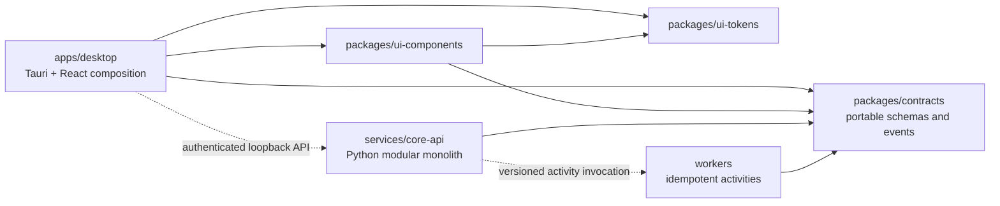

# Repository architecture map

This page is the implementation-facing map of the Architecture Baseline 1.3.
Accepted records in [`../adr/`](../adr/) supersede affected baseline decisions.
[`architecture-boundaries.json`](../../architecture-boundaries.json) is the
machine-checked dependency matrix; it does not replace the full
[`systems-design.md`](source/systems-design.md).

## Runtime shape

Dashed arrows are runtime interactions through stable interfaces, never source
imports. Solid arrows are the allowed production source dependencies. All other
production dependency directions are denied unless the contract and, when
material, an accepted ADR change first.

## Repository areas

| Area | Purpose |
|---|---|
| `apps/` | User-facing composition roots; currently the desktop only. |
| `services/` | Application composition and replaceable adapter implementations. |
| `workers/` | Isolated CPU, GPU, and I/O activities. |
| `packages/` | Dependency-neutral contracts and reusable presentation libraries. |
| `packaging/` | Platform delivery inputs; Windows is release-authoritative first. |
| `tests/` | Foundation, contract, desktop, end-to-end, and packaging qualification. |
| `tools/` | Repository automation; never a product runtime dependency. |
| `planning/` | Work and approval authority; never product runtime state. |
| `docs/` | Product, architecture, governance, automation, and ADR authority. |
| `design/` | Approved experience and workflow contracts. |
| `evaluation/` | Versioned benchmark registries, golden outputs, schemas, cases, and baseline approvals; support-only, never product runtime state. |
| `artifacts/` | Committed approval/validation evidence; scratch output is ignored. |

## Dependency rules

- `packages/contracts` is portable and imports no application, UI, worker, or
  infrastructure implementation.
- The desktop imports contracts, tokens, and reusable UI components. It launches
  and calls the Core API but never imports Python internals or workers.
- The Core API owns application composition and depends on portable contracts,
  not presentation code.
- Workers implement activity contracts; they do not import the Core API
  composition root.
- UI components may consume contracts and tokens, while tokens remain the lower
  dependency-free presentation layer.
- Packaging consumes built artifacts. It does not create a reverse product-code
  dependency.
- Tests may cross the boundaries they verify. Product modules cannot depend on
  tests, tools, planning state, documentation, evaluation assets, or evidence artifacts.

The exhaustive allowed and prohibited pairs, module purposes, and stable
interface owners live in the JSON contract and are enforced by
`python tools/architecture_check.py --repo .`.

Changes to protected module or interface paths also require an indexed ADR in
the same change set; see [`../adr/README.md`](../adr/README.md) and
`python tools/adr_check.py --repo . --base <merge-base> --head HEAD`.

## One client, three project-home profiles

| Profile | Authority and boundary | Delivery state |
|---|---|---|
| Local | Packaged Core API is the sole local project authority; loopback-only capability-authenticated API, SQLite, encrypted objects, and local workers. | W0-W5, first release authority |
| University | One institution-controlled remote project home is authoritative; the desktop is a cached OIDC/PKCE client, never a multi-master replica. | Deferred to W10 gate |
| Cloud | One regional tenant data plane is authoritative; content-opaque control plane, isolation, residency, metering, and policy-aware egress. | Deferred to W11 gate |

University and cloud implementation paths remain absent during the local-first
waves. Earlier tasks may define compatible interfaces and conformance fixtures,
but cannot smuggle server infrastructure into the repository.

## Stable interfaces

The protected seams are portable domain/API/event contracts, the authenticated
desktop-to-Core loopback API, worker activity contracts, the Academic Minimal
design contract, and the portable project-bundle format. Breaking semantics,
profile exposure, transport/authentication changes, or execution-substrate
changes require compatibility evidence and the ADR workflow established by
CAP-00.S02.T03.

The W1 local project package and classified storage contract are documented in
[`project-package.md`](project-package.md) and governed by ADR-0012.
