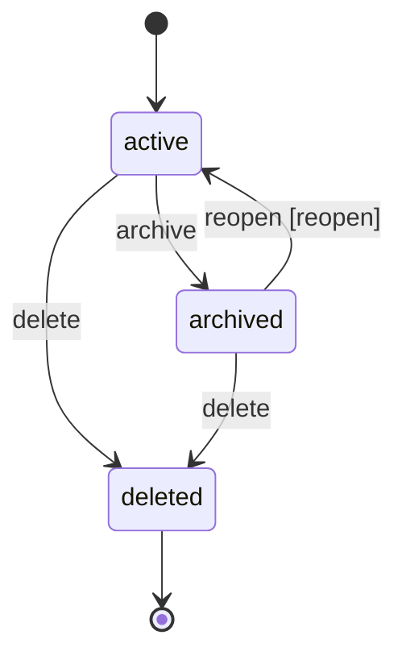
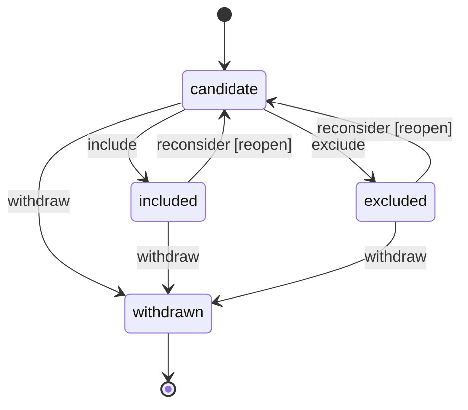
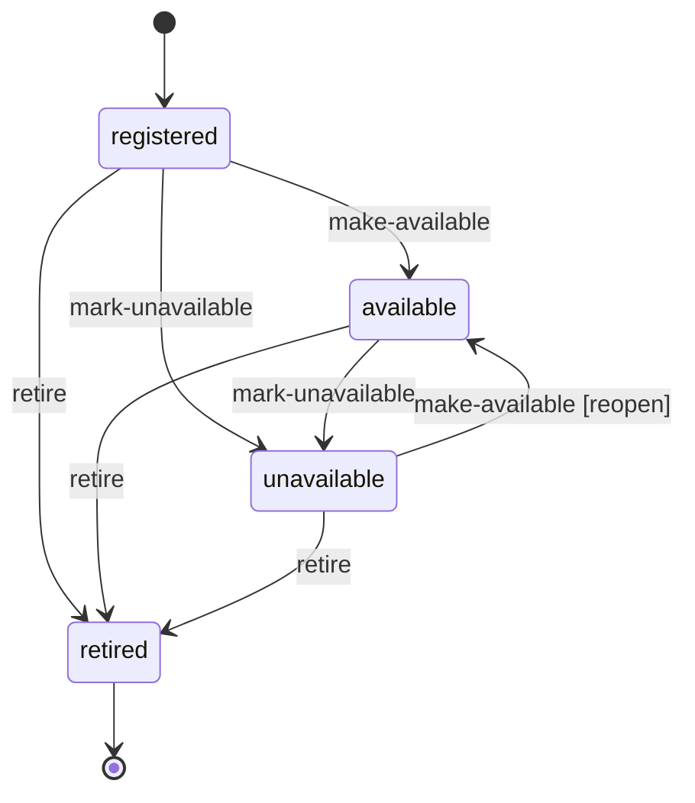
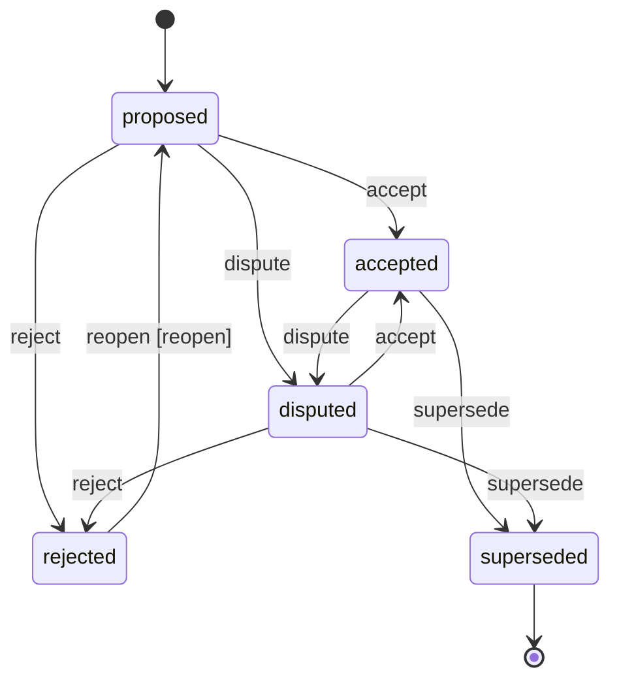
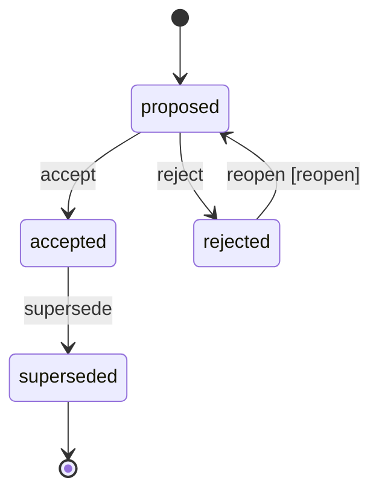
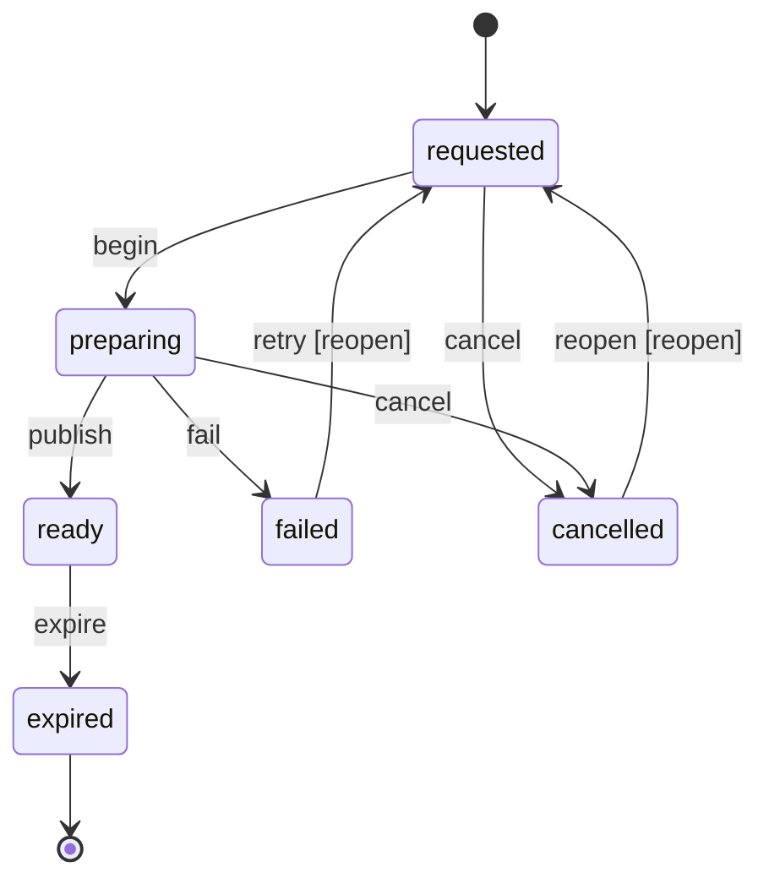

# Domain lifecycle boundary

`CAP-03.S01.T02` defines one portable lifecycle profile for projects, corpus
items, documents, evidence records, decisions, tasks, dossiers, and exports.
The language-neutral authorities are
`packages/contracts/domain/domain-lifecycle.schema.json` and
`domain-lifecycle.v1.json`. The checked-in Python and TypeScript validators are
generated from those exact bytes.

The lifecycle subject vocabulary is deliberately separate from T01's common
`CoreAggregate.aggregateKind` envelope. A lifecycle subject may later be
composed with one or more domain aggregates, but it must not be silently mapped
onto an unrelated aggregate kind merely to reuse an enum value.

## Trusted transition boundary

A caller supplies the current immutable lifecycle snapshot and a strict command.
The command identifies the same UUIDv7 aggregate, expected revision, command,
actor, reason, canonical UTC instant, and idempotency key. It never supplies the
destination state. The validator selects exactly one destination from the
versioned profile and emits an owned immutable transition whose revision is
exactly the prior revision plus one.

`apply_lifecycle_transition` and `applyLifecycleTransition` prepare the
transition before invoking the persistence callback. Invalid shape, unknown
state, illegal command, subject mismatch, or optimistic-concurrency conflict
therefore calls no persistence authority. Persistence remains an adapter duty;
the portable transition contains no path, connection, framework, or UI object.

Every transition retains a bounded actor and reason. Terminal states accept no
ordinary transition. A closed state can advance only through a transition
marked `reopen`; an irreversible terminal has no outbound rule. A process restart
uses the committed `toState` and `revision` as the next snapshot and replays the
same profile bytes.

## Lifecycle diagrams

### Project



### Corpus item



### Document



### Evidence record



### Decision



### Task

```mermaid
stateDiagram-v2
  [*] --> pending
  pending --> ready: make-ready
  ready --> in-progress: start
  ready --> blocked: block
  in-progress --> blocked: block
  blocked --> ready: resume [reopen]
  in-progress --> completed: complete
  pending --> cancelled: cancel
  ready --> cancelled: cancel
  in-progress --> cancelled: cancel
  blocked --> cancelled: cancel
  completed --> ready: reopen [reopen]
  cancelled --> ready: reopen [reopen]
```

### Dossier

```mermaid
stateDiagram-v2
  [*] --> draft
  draft --> in-review: submit
  in-review --> changes-requested: request-changes
  changes-requested --> draft: revise [reopen]
  in-review --> approved: approve
  approved --> draft: reopen [reopen]
  approved --> superseded: supersede
  superseded --> [*]
```

### Export



## Failure and compatibility rules

- Validation errors are stable content-free codes; input values, actor identity,
  reasons, research text, paths, and secrets are never copied into a failure.
- Unknown fields fail closed. Actor IDs and idempotency keys use bounded portable
  vocabularies; reason text rejects control characters.
- State and command names have no fallback. Adding a state or transition requires
  a new compatible profile version and the T03 compatibility policy; existing
  meanings are never repurposed.
- A revision conflict returns `lifecycle-revision-conflict`; the caller must reload
  current state and make a new authorized judgment rather than overwriting it.
- A snapshot already at the maximum portable safe revision returns
  `lifecycle-revision-exhausted` before persistence. The contract is not widened
  and no runtime may emit a revision that its schema or another runtime cannot
  represent exactly.
- Transition creation is deterministic. Persistence, provenance/outbox emission,
  and aggregate-specific invariant checks compose around this validation boundary
  in their owning slices.
