# Research Observatory Systems Design

<table>
<colgroup>
<col style="width: 100%" />
</colgroup>
<thead>
<tr class="header">
<th><strong>Architecture thesis<br />
</strong>One signed desktop application serves as both a complete local system and a secure client for remote project homes. A shared domain core, typed workflow contracts, canonical provenance model, and replaceable infrastructure adapters preserve functional parity across all deployments.</th>
</tr>
</thead>
<tbody>
</tbody>
</table>

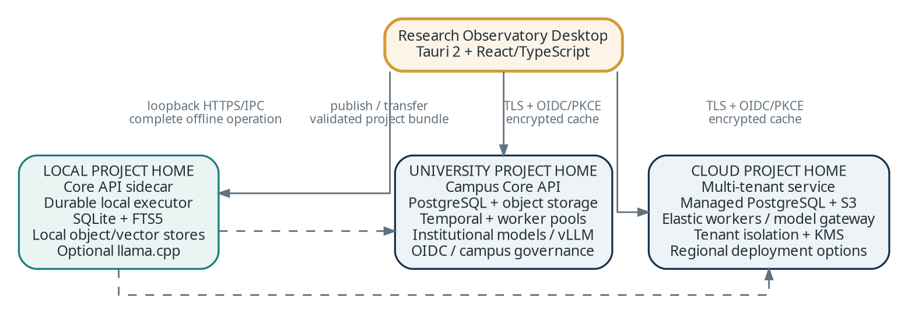

Figure 1. One client, three project-home deployment modes.

Companion to: Research Observatory Vision for an AI Research Development and Literature Analysis Platform 1.3 \| Status: Architecture Baseline 1.3 \| August 7, 2026

Document role: accepted ADRs and this baseline govern architecture. The Vision governs product intent; the YAML backlog governs work state and release gates; the project Automation Guide governs repository operation. The Document Governance and Repository/Architecture Setup Guide defines conflict resolution and the initial versus target repository distinction.

DOCUMENT CONTROL

# Architecture baseline and decision record

| **Field**        | **Value**                                                                                                                                                                          |
|------------------|------------------------------------------------------------------------------------------------------------------------------------------------------------------------------------|
| Document purpose | Define the core technical architecture, deployment topology, data model, interfaces, security model, and implementation sequence for Research Observatory.                         |
| Scope            | Desktop local use and lab workstations first; university and cloud profiles later through explicit release gates; common desktop user interface.                                   |
| Status           | Architecture Baseline 1.3 for implementation planning and design-science prototyping. Selected defaults remain behind stable interfaces; benchmark-dependent choices require ADRs. |
| Primary audience | Product and research leads, architects, developers, university IT and security teams, research librarians, infrastructure operators, and evaluation teams.                         |
| Decision horizon | Initial product through institutional and cloud scale. Service extraction and infrastructure specialization occur only when measurable thresholds are crossed.                     |
| Related artifact | Research Observatory Vision 1.3; Planning Baseline 1.3; Project Automation Guide 1.3; Document Governance and Repository/Architecture Setup Guide.                                 |

## Executive architecture decisions

1\. Use one cross-platform desktop codebase built with Tauri 2 and React/TypeScript. Windows x64 is implemented and released first; W6 qualifies Apple Silicon macOS, Linux x86_64, and Linux ARM64. In local mode the desktop launches the application core and workers as platform-appropriate signed, notarized, or verifiable sidecars; in connected mode it authenticates to a university or cloud project home and maintains an encrypted local cache.

2\. Implement the application core as a modular monolith with explicit domain modules and a separate worker fabric. This provides strong transactional consistency and fast evolution while preserving interfaces for later service extraction.

4\. Use SQLite with FTS5 locally and PostgreSQL on servers. Keep vector retrieval behind a replaceable port. Select the local adapter only after a Windows benchmark and ADR; Qdrant local/edge is the leading candidate, while Qdrant service is the server baseline and pgvector remains a simpler fallback.

5\. Prefer native JATS/TEI/XML/HTML. Use a pinned Docling baseline for local document understanding and a server pool combining GROBID and Docling where benchmark evidence supports it. Parser replacements require fixture benchmarks, page-anchor regression, packaging analysis, and an ADR.

6\. Define workflows once as typed, versioned plans. Execute them with a durable SQLite-backed local executor on PCs. Activate Temporal or an equivalent durable server workflow substrate only in the university/cloud profiles, with conformance against the same workflow contracts.

6\. Define workflows once as typed, versioned plans. Execute them with a durable SQLite-backed local executor on PCs and Temporal in university/cloud deployments. Activities are idempotent, checkpointed, and observable.

7\. Route AI through a provider-neutral model gateway. Support local inference through llama.cpp, private inference through vLLM, and approved external providers. Every model call is policy-checked, versioned, costed, and linked to evidence.

8\. Give each project one authoritative project home. Remote projects use cached projections and an offline command queue; the design deliberately avoids transparent multi-master database replication.

9\. Enforce OIDC/PKCE for remote identity, project-scoped RBAC/ABAC, row-level security, rights-aware egress, encrypted objects, signed updates, and complete audit/provenance records.

10\. Instrument technical and scholarly quality together. OpenTelemetry covers operations; an evaluation registry tracks retrieval, extraction, entailment, graph, novelty, and human-adjudication performance.

## Baseline technology profile

| **Concern**        | **Desktop default**                                            | **University / cloud default**                         | **Reason**                                                                                                                             |
|--------------------|----------------------------------------------------------------|--------------------------------------------------------|----------------------------------------------------------------------------------------------------------------------------------------|
| Desktop shell      | Tauri 2 + React/TypeScript                                     | Same signed desktop client                             | Small native shell, sidecar support, restricted capabilities, and signed updates \[T1-T2\].                                            |
| Core API           | Python + FastAPI + Pydantic                                    | Same package in containers                             | ML/AI ecosystem, typed schemas, OpenAPI, and generated clients \[T3\].                                                                 |
| Canonical state    | SQLite WAL + FTS5 + ADR-selected protected database profile    | PostgreSQL with RLS                                    | Low-friction local use and robust multi-user transactions \[T4,T6\].                                                                   |
| Objects            | Encrypted content-addressed directory                          | S3-compatible object storage                           | Stable object identities, rights metadata, lifecycle controls, and encryption.                                                         |
| Semantic retrieval | Replaceable embedded adapter selected by Windows benchmark/ADR | Qdrant service; pgvector fallback                      | Hybrid search and scalable ANN behind a replaceable port; Qdrant local/edge is a candidate, not a presumption \[T5,T7\].               |
| Workflow execution | Durable local executor                                         | Temporal or conformant durable server executor (W10/W11) | Long-running work, retries, human gates, and recovery \[T8\].                                                                          |
| Document parsing   | Native formats + pinned Docling                                | Native formats + GROBID + Docling                      | Local packaging practicality plus server-grade scholarly/layout extraction, with replacement governed by benchmark and ADR \[T9-T10\]. |
| Model serving      | llama.cpp and/or approved APIs                                 | vLLM, institutional endpoints, approved APIs           | Hardware-flexible local inference and high-throughput GPU service \[T11-T12\].                                                         |
| Observability      | Local logs and OTEL traces                                     | OpenTelemetry collectors and standard backends         | Vendor-neutral traces, metrics, and logs \[T13\].                                                                                      |
| Identity           | Local OS identity; OIDC for remote                             | Institutional/cloud OIDC; optional Keycloak broker     | No server-owned password system; standards-based federation \[T14,T19\].                                                               |

<table>
<colgroup>
<col style="width: 100%" />
</colgroup>
<thead>
<tr class="header">
<th><strong>Most important architectural boundary<br />
</strong>The platform owns the scholarly domain model, provenance, rights, human decisions, opportunity ontology, novelty protocol, and evaluation logic. It integrates replaceable databases, parsers, models, scholarly feeds, and infrastructure products.</th>
</tr>
</thead>
<tbody>
</tbody>
</table>

CONTENTS

# Systems design structure

1 Purpose, scope, and system context

2 Architecture drivers and quality attributes

3 Architecture style and cross-cutting decisions

4 Unified deployment model

5 Logical component architecture

6 Desktop and laboratory architecture

7 University-hosted architecture

8 Cloud architecture and tenancy

9 Data, graph, and provenance architecture

10 Ingestion and document-processing architecture

11 Retrieval, screening, and search architecture

12 AI, model, and agent architecture

13 Workflow execution, events, and recalculation

14 Opportunity generation and adversarial novelty

15 Collaboration, synchronization, and offline operation

16 API, plugin, and interoperability design

17 Security, privacy, rights, and governance

18 Reliability, observability, performance, and cost

19 Delivery, testing, and operational lifecycle

20 Implementation roadmap, ADRs, and open decisions

Appendix A Component catalog

Appendix B Core data entities

Appendix C API and event summary

Appendix D Deployment configuration baselines

Appendix E Technology references

Section breaks are optimized for readability. Tables and diagrams are normative design guidance unless marked as a planning assumption or future option.

SYSTEM BOUNDARY

# 1. Purpose, scope, and system context

This document turns the vision’s evidence-first scholarly environment into an implementable architecture that operates consistently on one PC, across a research laboratory, on university infrastructure, and as a cloud service.

## 1.1 Relationship to the vision

The vision defines three durable representations: a bibliographic and semantic field graph; a claim-evidence-context-assumption graph; and an opportunity and decision ledger. The design treats these as one versioned domain model with different projections, not isolated features. Search, extraction, analysis, novelty assessment, and monitoring all read and write through the same provenance-aware application core.

The architecture preserves evidence before prose, multiple granularities of scholarship, separation of opportunity generation from challenge, bounded novelty, contestable AI judgments, mode-sensitive authority, uncertainty visibility, durable research memory, and selective recalculation when inputs change.

## 1.2 In-scope product surfaces

| **Surface**            | **Primary responsibilities**                                                                                                                                                      | **Out of scope for first release**                                                                 |
|------------------------|-----------------------------------------------------------------------------------------------------------------------------------------------------------------------------------|----------------------------------------------------------------------------------------------------|
| Desktop application    | Project creation, search, corpus work, screening, evidence inspection, graph/opportunity workspaces, novelty audit, synthesis, exports, local execution, and remote connectivity. | A separate feature-complete browser application; a limited administrator web console may be added. |
| Local application core | Canonical local state, ingestion, local search, workflow state, model routing, evidence/provenance, exports, and remote cache/queue.                                              | A public network service or inbound connections beyond loopback.                                   |
| University service     | Shared projects, institutional identity, licensed-source governance, GPU/parser services, collaboration, workflows, backups, and administration.                                  | Replacing library systems, identity providers, or enterprise data platforms.                       |
| Cloud service          | Multi-tenant project homes, elastic workers, managed storage, tenant policy, metering, regional hosting, and support operations.                                                  | Claiming universal novelty or redistributing content beyond applicable licenses.                   |

## 1.3 Actors and external systems

• Researchers, doctoral students, research assistants, librarians, review methodologists, research administrators, and institutional platform administrators.

• Open scholarly metadata and graph sources; licensed databases; publisher/repository systems; institutional link resolvers; reference managers; local file systems; and private collections.

• Local, university, commercial, or open-source model endpoints; embedding/reranking services; OCR/document parsers; security services; and export destinations.

• Institutional identity providers, directory groups, key-management systems, object storage, observability backends, backup systems, and research-computing environments.


Figure 2. Deployment-neutral system context and authoritative project homes.

## 1.4 Planning envelopes

These envelopes guide partitioning and performance tests; they are not product guarantees. Release gates should revise them using measured corpus sizes, document complexity, model workloads, and institutional usage.

| **Profile**             | **Planning envelope**                                                                                 | **Typical workload**                                                              |
|-------------------------|-------------------------------------------------------------------------------------------------------|-----------------------------------------------------------------------------------|
| Individual local        | Up to 100,000 metadata records, 10,000 full-text documents, and 2-50 GB of permitted content.         | One user; local/external models; hours-long jobs that survive restart.            |
| Laboratory workstations | Multiple local or remote projects; optional GPU workstations; 1-20 active users across PCs.           | Shared university project home with selected local compute and concurrent coding. |
| University service      | Initial target 1-10 million metadata records, 100,000-1 million full texts, 100-500 concurrent users. | Multiple centers; monitoring; parser/GPU pools; licensed data.                    |
| Cloud service           | Many isolated tenants, horizontal regional scale, and dedicated data planes when required.            | Bursty ingestion/AI, metered providers, residency and contractual controls.       |

## 1.5 Explicit boundaries

• The platform supports scholarly judgment; it does not certify that no prior work exists or replace accountable authorship.

• The desktop does not silently upload local projects. Every external connector/model request is governed by project policy and visible egress status.

• Search indexes and graph projections are accelerators, not sources of record; canonical state remains reconstructable without them.

• The first implementation and production release are Windows-first. W6 requires separate macOS Apple Silicon, Linux x86_64, and Linux ARM64 packaging, security, recovery, and end-to-end qualification before research-production or hosted delivery is considered complete.

DESIGN CONSTRAINTS

# 2. Architecture drivers and quality attributes

The architecture is driven by epistemic accountability as much as by performance, security, and availability.

## 2.1 Prioritized quality attributes

| **Priority** | **Attribute**               | **Required response**                                                                                                                         | **Acceptance signal**                                                         |
|--------------|-----------------------------|-----------------------------------------------------------------------------------------------------------------------------------------------|-------------------------------------------------------------------------------|
| 1            | Traceability                | Every derived record, graph edge, synthesis statement, and opportunity resolves to sources, passages, transformations, models, and decisions. | Accepted citations/opportunities require complete lineage.                    |
| 2            | Data sovereignty and rights | Projects declare location, rights, retention, and allowed model destinations; policy is enforced at all egress points.                        | Restricted content cannot reach a disallowed provider or collaborator.        |
| 3            | Reproducibility             | Search manifests, pinned models, schemas, prompts, snapshots, and decisions are versioned/exportable.                                         | A frozen workflow remains explainable after models/indexes change.            |
| 4            | Portability                 | A common domain core and interfaces run locally, at universities, and in cloud infrastructure.                                                | Project bundles import without semantic loss.                                 |
| 5            | Recoverability              | Long work is checkpointed, idempotent, retryable, and resumable.                                                                              | Restart does not duplicate evidence or lose reviewed progress.                |
| 6            | Security and isolation      | Least privilege, OIDC, encryption, project/tenant authorization, signed software, and auditable administration.                               | Cross-project/tenant tests fail closed; local services bind only to loopback. |
| 7            | Search quality              | Hybrid exact, semantic, citation, and graph signals with preserved search paths.                                                              | Known seminal and nearest-prior works meet declared recall.                   |
| 8            | Usability and agency        | Source-first disclosure, reversible AI suggestions, uncertainty, and adjudication.                                                            | Users inspect and contest consequential outputs.                              |
| 9            | Performance and cost        | Interactive work is responsive; expensive work is asynchronous, budgeted, cached, and scalable.                                               | Cost and latency are attributable to workflow/output.                         |
| 10           | Evolvability                | Models, parsers, indexes, ontologies, and infrastructure change behind stable contracts.                                                      | Components can be replaced without rewriting project history.                 |

## 2.2 Architectural constraints

• Local installation must not require Docker, Kubernetes, a database server, or a Java service. Optional compute packs may add advanced parsers/models.

• University deployment must support existing identity, network, storage, backup, licensed-data, and air-gap policies.

• Cloud deployment must support tenant isolation, regional placement, provider restrictions, cost limits, and dedicated-tenancy options.

• Copyright/license state accompanies documents and derived records; source storage, indexing, modeling, sharing, and export are separately governed.

• Human decisions and memos are first-class records; models never overwrite them in place.

• Frontier opportunity and critical-analysis functions are feature-gated by evaluation thresholds and human review.

## 2.3 Design rules

| **Rule**                                     | **Normative interpretation**                                                                         |
|----------------------------------------------|------------------------------------------------------------------------------------------------------|
| Evidence first                               | Generation consumes accepted or explicitly provisional evidence records, not arbitrary model memory. |
| One authoritative project home               | Structured state is authoritative locally, at a university service, or in the cloud.                 |
| Canonical state before indexes               | Relational state, objects, rights, and provenance are authoritative; indexes are projections.        |
| Immutable derivations, versioned corrections | Evidence/model results are appended; corrections create new versions and supersession links.         |
| Explicit workflow state                      | Long research tasks have typed steps, checkpoints, human gates, and failure states.                  |
| No ambient agent authority                   | Agents have named roles, tool allowlists, evidence budgets, and cost limits.                         |
| Generator-challenger separation              | The novelty challenger receives a sealed candidate and independent retrieval instructions.           |
| Policy at every egress boundary              | Rights/classification are checked before external search, models, export, or sharing.                |
| Rebuildable analytics                        | Topic, vector, graph, and dashboard projections regenerate from canonical records.                   |
| Measure before decomposing                   | A module becomes a service only for demonstrated scaling, security, ownership, or release reasons.   |

ARCHITECTURE BASELINE

# 3. Architecture style and cross-cutting decisions

Research Observatory uses a modular-monolith application core, a separate worker fabric, ports-and-adapters infrastructure, and an append-only provenance ledger. This is the best balance of rigor, portability, and product velocity for the deployment range.

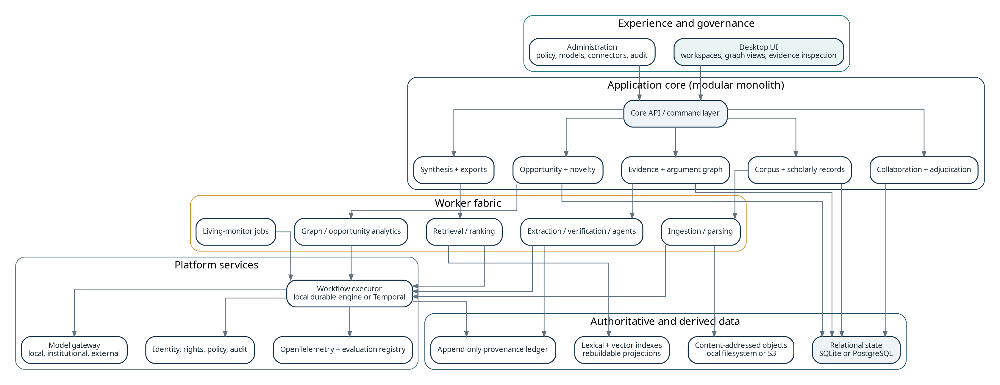

Figure 3. Layered logical architecture and data authority.

## 3.1 Why a modular monolith

Corpus records, evidence, graph relations, human decisions, opportunities, novelty audits, and rights are tightly connected and frequently changed together. Early microservices would distribute transactions, duplicate authorization, complicate local installation, and weaken provenance. The application therefore begins as one deployable Core API with enforced module boundaries and transactional outbox events.

CPU-, GPU-, and I/O-heavy functions run as workers outside the API process. Workers scale independently by queue even while the domain core remains cohesive. A module may later be extracted when measurements show a stable boundary, divergent scaling, security isolation, or independent release ownership.

## 3.2 Internal architecture pattern

<table>
<colgroup>
<col style="width: 100%" />
</colgroup>
<thead>
<tr class="header">
<th><strong>Recommended backend package structure<br />
research_observatory/<br />
domain/ # entities, value objects, policies, domain events<br />
application/ # commands, queries, workflow plans, authorization<br />
modules/<br />
scholarly_records/ corpus_search/ documents/ screening/<br />
evidence_graph/ opportunities/ novelty_audits/<br />
synthesis_exports/ monitoring/<br />
ports/ # storage, search, models, parsers, workflow, identity<br />
adapters/ # SQLite/PostgreSQL, local/S3, vector adapters, APIs, OIDC<br />
workers/ # idempotent resource-specific activities<br />
api/ # REST/SSE endpoints and OpenAPI contract<br />
evaluation/ # benchmarks, calibration, regression gates</strong></th>
</tr>
</thead>
<tbody>
</tbody>
</table>

## 3.3 Cross-deployment abstraction ports

| **Port**         | **Local adapter**                                                  | **University / cloud adapter**                | **Domain guarantee**                                                                                   |
|------------------|--------------------------------------------------------------------|-----------------------------------------------|--------------------------------------------------------------------------------------------------------|
| CanonicalStore   | SQLite with ADR-selected protection profile                        | PostgreSQL                                    | Transactions, optimistic versions, immutable derivations, and project checks.                          |
| ObjectStore      | Encrypted content-addressed files                                  | S3-compatible object storage                  | Stable object hash, rights, encryption, and retention state.                                           |
| LexicalIndex     | SQLite FTS5                                                        | PostgreSQL FTS; optional OpenSearch           | Fielded/exact search and stable query manifest.                                                        |
| VectorIndex      | ADR-selected embedded adapter; Qdrant local/edge leading candidate | Qdrant service; pgvector fallback             | Dense/sparse retrieval, filters, exact-search fallback, index provenance, and complete rebuildability. |
| WorkflowExecutor | Durable local executor                                             | Temporal                                      | Same workflow plan/activity contracts on different substrates.                                         |
| ModelGateway     | llama.cpp and approved APIs                                        | vLLM, institutional endpoints, approved APIs  | Capability routing, policy, structured output, cost, evaluation metadata.                              |
| DocumentParser   | Native parsing + pinned Docling                                    | Native + GROBID + Docling pool                | Canonical document IR with coordinates, quality status, parser lineage, and benchmarked replacement.   |
| IdentityProvider | OS-local identity and project key                                  | OIDC/groups/optional broker                   | Stable actor IDs, assurance, group claims, audit identity.                                             |
| TelemetrySink    | Local files and optional OTLP                                      | OpenTelemetry collector and approved backends | Trace IDs link workflow, model, evidence, and operation.                                               |

## 3.4 Data consistency model

• Commands modify canonical state and append domain/audit events through an outbox in the same transaction.

• Workers are at-least-once. Idempotency keys, content hashes, and derivation identities prevent semantic duplicates.

• Search and graph projections are eventually consistent; the UI displays freshness and can use canonical fallback paths.

• Researcher decisions use optimistic concurrency; consequential conflicts are never silently resolved.

• Derived outputs name exact dependency versions; a resolver marks only affected outputs stale when inputs change.

DEPLOYMENT ARCHITECTURE

# 4. Unified deployment model

The same desktop client selects a project home. The project home determines authority, storage, workflow execution, identity, collaboration, and data-egress policy—not the scholarly feature set.

## 4.1 Project-home contract

| **Capability**    | **Local project home**                  | **University project home**                        | **Cloud project home**                          |
|-------------------|-----------------------------------------|----------------------------------------------------|-------------------------------------------------|
| Authority         | Local Core API/database                 | Campus Core API/institutional database             | Regional tenant data plane                      |
| Authentication    | OS session plus project key             | Institutional OIDC/groups/MFA                      | Cloud or federated OIDC                         |
| Canonical storage | SQLite and local objects                | PostgreSQL and institutional objects               | Managed PostgreSQL and S3 objects               |
| Execution         | Local executor/worker                   | Temporal and campus workers                        | Temporal and elastic workers                    |
| Models            | Local and approved external endpoints   | Institutional GPU/endpoints plus approved external | Managed/dedicated endpoints under tenant policy |
| Collaboration     | Single user; bundle handoff             | Project teams, roles, adjudication                 | Tenant teams; policy-governed sharing           |
| Offline behavior  | Complete except external sources/models | Cached reading/memos/queued edits                  | Cached reading/memos/queued edits               |
| Administration    | Desktop settings/project manifest       | University policy/admin service                    | Tenant admin and service operations             |

## 4.2 Feature parity and intentional differences

Project-home adapters preserve the same domain semantics, status model, provenance, opportunity dossier, and export formats. Differences are allowed in scale, collaboration, parser quality tier, model availability, backup, monitoring, and administration. A local project is not a lite data model; it is fully portable with lower infrastructure capacity.

<table>
<colgroup>
<col style="width: 100%" />
</colgroup>
<thead>
<tr class="header">
<th><strong>No hidden cloud dependency<br />
</strong>A local project remains usable without an account or internet after installation. External scholarly sources and hosted models are optional capabilities, not requirements for opening, reading, coding, querying, or exporting local data.</th>
</tr>
</thead>
<tbody>
</tbody>
</table>

## 4.3 Deployment artifacts

| **Artifact**               | **Purpose**                                                                        | **Packaging**                                                                                                                |
|----------------------------|------------------------------------------------------------------------------------|------------------------------------------------------------------------------------------------------------------------------|
| Desktop application        | Research UI, local process launch, remote connectivity, cache, updater.            | Signed installer/MSIX; Tauri shell; version-matched sidecars.                                                                |
| Core service image         | University/cloud API and commands.                                                 | Immutable OCI image; Compose/Podman reference pilot; Helm only when selected by institutional/cloud ADR.                     |
| Worker images              | Ingestion, parsing, retrieval, extraction, graph, opportunity, monitoring, export. | Separate images or queue-specific entry points; activate server images in W10 and cloud variants in W11.                       |
| Parser images              | GROBID and Docling with pinned versions/models for hosted profiles.                | Isolated internal services; local W0-W5 uses the packaged Docling sidecar rather than containers.                            |
| Model gateway              | Provider routing, policy, quota, schemas, invocation ledger.                       | Stateless replicas; platform-managed secrets.                                                                                |
| Project bundle             | Validated transfer between project homes.                                          | Archive with manifest, hashes, schema versions, rights, signatures.                                                          |
| Server deployment profiles | Repeatable institutional/cloud deployment selected by topology ADR.                | Compose/Podman is the university pilot baseline; Kubernetes/Helm is optional for clustered institutional or cloud operation. |

APPLICATION STRUCTURE

# 5. Logical component architecture

The logical architecture separates scholarly domain responsibilities while keeping the initial transactional core cohesive.


Figure 4. Application modules, worker fabric, platform services, and data stores.

## 5.1 Domain modules

| **Module**         | **Owned state and behavior**                                                              | **Published events**                                         |
|--------------------|-------------------------------------------------------------------------------------------|--------------------------------------------------------------|
| Project/governance | Intent, modes, ontologies, classification, roles, policy, lifecycle.                      | ProjectConfigured, PolicyChanged, ProjectArchived.           |
| Scholarly records  | Canonical works/versions, authors, venues, identifiers, corrections, source observations. | WorkCanonicalized, WorkVersionAdded, RetractionChanged.      |
| Corpus/search      | Corpora, search runs/branches, discovery paths, snapshots, coverage.                      | RecordDiscovered, CorpusSnapshotCreated, SearchRunCompleted. |
| Documents          | Assets, rights, locations, parse attempts, document IR, elements, references.             | DocumentAcquired, DocumentParsed, RightsChanged.             |
| Screening          | Protocols, queues, decisions, reasons, conflicts, audits, stopping.                       | ScreeningDecisionRecorded, ConflictOpened, ScreeningStopped. |
| Evidence/graph     | Schemas, evidence, entities, typed relations, verification, disputes, adjudication.       | EvidenceRecorded, RelationChanged, AdjudicationCompleted.    |
| Opportunities      | Detector runs, candidates, evidence packets, score vectors, status.                       | OpportunityProposed, Classified, Rejected.                   |
| Novelty audits     | Facets, adversarial searches, prior-work threats, bounded statements.                     | AuditStarted, ThreatAdded, AuditAccepted.                    |
| Synthesis/export   | Evidence tables, narratives, citation audits, disclosures, manifests.                     | SynthesisPublished, ExportCompleted.                         |
| Monitoring         | Saved searches, graph conditions, triage, impact, stale alerts.                           | MonitoringHit, DependencyInvalidated, ReviewReopened.        |

## 5.2 Worker pools

Workers consume typed activity requests rather than directly mutating domain tables. Results return through application commands so authorization, idempotency, provenance, and validation remain centralized. Servers allocate queue-specific pools; desktop uses one or a few resource-limited processes.

| **Pool**                    | **Work characteristics**                           | **Scaling signal**                  | **Isolation rationale**                 |
|-----------------------------|----------------------------------------------------|-------------------------------------|-----------------------------------------|
| Connector/ingestion         | Network-heavy, rate-limited, credential-sensitive. | Pending tasks and provider limits.  | Credentials and licensed-source policy. |
| Document/parser             | CPU/RAM-heavy; OCR/GPU; untrusted inputs.          | Pages, parse time, memory pressure. | Sandboxing and large dependencies.      |
| Retrieval/indexing          | CPU/memory/storage I/O; batch updates.             | Index lag, query latency, queue.    | Rebuildable and index-specific.         |
| AI extraction/verification  | GPU/external API; expensive and variable.          | Token/GPU backlog, budget, latency. | Model access, egress, cost controls.    |
| Graph/opportunity analytics | Batch CPU/memory; project-scoped.                  | Graph queue, corpus size, runtime.  | Large memory and feature gates.         |
| Monitoring/exports          | Scheduled, bursty, lower priority.                 | Schedule backlog/deadline priority. | Cheaper capacity class.                 |

## 5.3 Service-extraction criteria

A module stays inside the Core API until it shows sustained independent scaling, materially different availability, required security/licensing isolation, a distinct data boundary, independent release ownership, or unacceptable deployment size. Likely first extractions are connectors, parsers, model gateway, and large-scale search—not evidence or adjudication.

LOCAL EXECUTION

# 6. Desktop and laboratory architecture

The desktop edition is a complete local research environment and the standard UI for remote editions. It must install, update, recover, and protect data like a desktop product—not like a miniature data center.

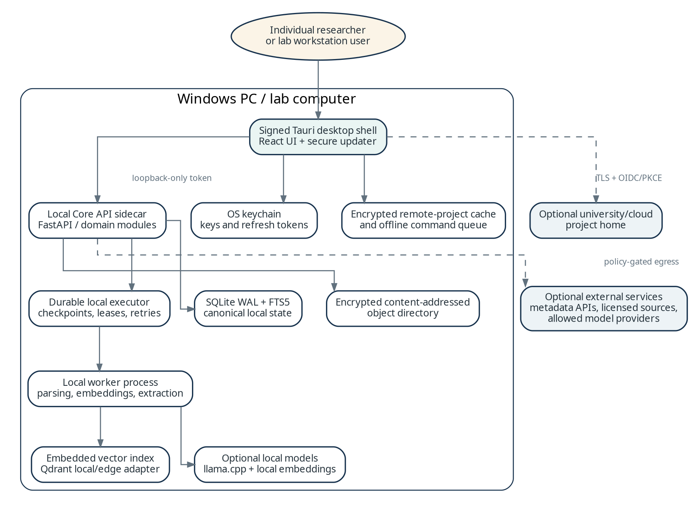

Figure 5. Desktop process and storage topology.

## 6.1 Process model

| **Process**    | **Responsibilities**                                                                  | **Trust and lifecycle**                                       |
|----------------|---------------------------------------------------------------------------------------|---------------------------------------------------------------|
| Tauri shell    | Windowing, native dialogs, updater, keychain, session selection, sidecar supervision. | Small privileged surface; signed and capability-restricted.   |
| React UI       | Workspaces, state, source inspection, accessibility, local view cache.                | No direct filesystem/process access except declared commands. |
| Local Core API | Commands/queries, authorization, workflow planning, storage, exports, loopback API.   | 127.0.0.1 ephemeral port with per-launch bearer token.        |
| Local executor | Workflow plans, step state, leases, checkpoints, retries, human waits.                | Restarts independently and resumes after crash/reboot.        |
| Local worker   | Parsing, indexing, embeddings, extraction, verification, analytics, local models.     | Resource-limited; risky parsing isolated in subprocesses.     |

## 6.2 Local data layout

<table>
<colgroup>
<col style="width: 100%" />
</colgroup>
<thead>
<tr class="header">
<th><p><strong>Reference Windows data layout</strong></p>
<p>%LOCALAPPDATA%/ResearchObservatory/<br />
app/ # signed sidecars and runtime metadata<br />
profiles/&lt;profile-id&gt;/<br />
settings.json # no secrets<br />
secrets.ref # references into Windows credential storage<br />
projects/&lt;project-id&gt;/<br />
project.db # SQLite canonical/workflow state<br />
objects/aa/bb/&lt;hash&gt; # encrypted content-addressed objects<br />
search/ # vector index and manifests<br />
cache/ exports/ logs/</p></th>
</tr>
</thead>
<tbody>
</tbody>
</table>

SQLite uses WAL, foreign keys, integrity checks, and application migrations. Each project may use a distinct encryption key protected by the OS credential store. Object filenames are content hashes; metadata records rights, encryption, media type, and retention. Temporary parser files use a restricted directory and are wiped by policy.

## 6.3 Local search and graph execution

• SQLite FTS5 provides exact, phrase, fielded, and ranked lexical retrieval; the compiler stores the user and executed query.

• An embedded vector adapter stores dense/sparse passage vectors. Qdrant local/edge is the preferred candidate after Windows reliability and recovery benchmarks; an exact-search fallback serves small corpora.

• Canonical entity/relation tables stay in SQLite. Projected graph snapshots load into local analytics for communities, paths, bridges, and opportunity algorithms.

• Index manifests record record versions, embedding model, dimensions, quantization, analyzer, filters, and build time. Missing/corrupt indexes are rebuilt.

## 6.4 Local AI profiles

| **Profile**           | **Expected hardware**                           | **Routing behavior**                                                                   |
|-----------------------|-------------------------------------------------|----------------------------------------------------------------------------------------|
| Connected standard    | 16 GB RAM, modern 4+ core CPU, no discrete GPU. | Local embeddings/light classifiers; approved hosted/university model for larger tasks. |
| Private CPU           | 32 GB RAM recommended.                          | Quantized local LLM through llama.cpp; slower batch; no egress.                        |
| AI workstation        | 32-64 GB RAM and supported GPU.                 | Local embedding, reranking, extraction, and selected generation.                       |
| Remote compute client | Standard PC with university/cloud connection.   | UI/cache local; parsers/models execute at project home.                                |

## 6.5 Installation, update, and recovery

• Install as signed per-user or managed-machine package; enterprise deployment supports silent install, pinned channels, proxies, and controlled model packs.

• The updater verifies signed manifests/artifacts. Shell and sidecars are version-matched; incompatible combinations do not start.

• Database migrations are transactional and preceded by a snapshot. Failure rolls back the application version and preserves project state.

• The shell detects unclean shutdown, validates SQLite/object manifests, reclaims expired leases, and creates a content-minimized diagnostic bundle.

• Backup exports an encrypted project bundle; scheduled copies may target a chosen institutional location without using it as a live database.

## 6.6 Laboratory use

Lab computers run the same desktop distribution. A laboratory may use local projects, a university project home, or later mixed compute where approved activities execute on enrolled workstations. Mixed compute requires device enrollment, signed capabilities, short-lived task credentials, bounded jobs, and explicit disclosure of local content caching.

INSTITUTIONAL DEPLOYMENT

# 7. University-hosted architecture

The university edition is an institution-controlled project home that integrates with campus identity, storage, research computing, licensed content, security, and backup while retaining the desktop research experience.

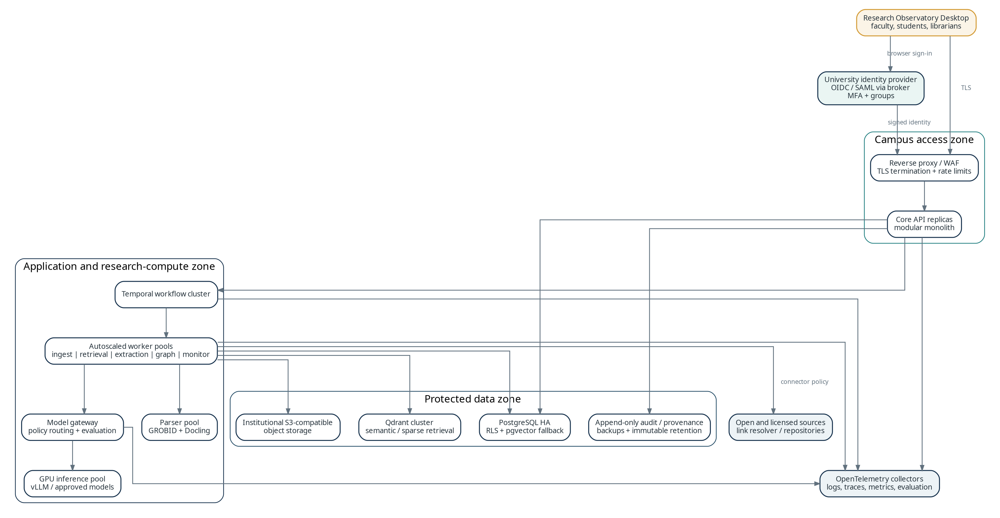

Figure 6. Reference university deployment topology.

## 7.1 Deployment tiers

| **Tier**              | **Use**                                         | **Topology**                                                                                                                                                                                                            |
|-----------------------|-------------------------------------------------|-------------------------------------------------------------------------------------------------------------------------------------------------------------------------------------------------------------------------|
| Development           | Developer/integration testing.                  | Local containers or namespace; test data; reduced parser/model set.                                                                                                                                                     |
| Pilot                 | One laboratory/center.                          | Single-server OCI Compose/Podman reference profile with PostgreSQL backups and shared/external models; a small Kubernetes namespace is allowed only through the institutional topology ADR.                             |
| Production            | Institution-wide or multi-center.               | Hardened Compose/Podman or Kubernetes according to the institutional topology ADR; add redundant API/workflow, PostgreSQL HA, object storage, worker pools, OTEL, and DR only where measured requirements justify them. |
| Restricted/air-gapped | Sensitive unpublished/contract-restricted work. | Private network, internal models/snapshots, controlled import/export, no external telemetry.                                                                                                                            |

7.2 Institutional deployment reference profiles

## • Reference pilot: hardened OCI containers on one institution-controlled server, deployed through Compose or Podman, with TLS ingress, institutional OIDC, PostgreSQL, S3-compatible objects, durable server workflows, and separated worker roles.

• The Core API remains stateless above canonical storage. Pilot capacity begins with one instance; replicas and high availability are added only when measured requirements justify them.

• PostgreSQL is institution-managed or externally managed where possible. Row-level security is defense in depth in addition to application authorization.

• Parser, model, connector, and general workers use distinct identities, queues, resource limits, and network policy. GPU/parser pools may be remote institutional services.

• Kubernetes/Helm is an optional clustered profile, not the universal baseline. It is introduced only through an institutional topology ADR covering platform ownership, HA, ingress, secrets, storage, backup, observability, and cost.

• OpenTelemetry exports approved metrics, traces, and logs with content-bearing attributes disabled by default; backup/restore and disaster-recovery drills are required for either topology.

• OpenTelemetry exports approved metrics, traces, and logs with content-bearing attributes disabled by default.

## 7.3 Identity and access

The service accepts institutional OIDC tokens. If the institution exposes SAML or LDAP without suitable OIDC, Keycloak may broker identity without becoming a password source. Directory groups can seed roles, while project owners manage membership within policy. Service accounts use workload identity or short-lived credentials.

| **Role**                      | **Typical scope**   | **Key permissions**                                                                                    |
|-------------------------------|---------------------|--------------------------------------------------------------------------------------------------------|
| Institution administrator     | Deployment          | Configure identity, storage, models, connectors, retention, quotas, audit; no content read by default. |
| Library/source administrator  | Licensed connectors | Configure credentials/entitlements and usage, not scholarly interpretations.                           |
| Research center administrator | Center workspace    | Create projects, assign owners, allocate quota, configure approved packs.                              |
| Project owner                 | One project         | Membership, intent, sources, allowed models, exports, archive.                                         |
| Researcher/reviewer           | Assigned project    | Search, screen, code, inspect, contest, adjudicate by role.                                            |
| Auditor                       | Defined audit scope | Read immutable audit/configuration evidence without source content unless authorized.                  |

## 7.4 Licensed-source architecture

• Connector credentials stay in the institutional secret manager and are used only by connector workers.

• Each source observation records database, query, time, entitlement, and whether full text may be stored, indexed, modeled, shared, or exported.

• Link-resolver/proxy integrations resolve access per authorized user; one user’s entitlement is not assumed for all members.

• Where redistribution is prohibited, retain permitted metadata/evidence and secure source links while requiring source reauthentication.

• Connector-specific throttling and usage reporting are visible to library administrators.

## 7.5 Availability and disaster recovery

The initial institutional target is high recoverability rather than zero downtime for every analytical job. API and identity paths are redundant; workflow/worker outages queue or pause work without corrupting state. PostgreSQL, object storage, workflow history, and key material are backed up. Search/vector indexes are rebuildable and outside the strict RPO.

MANAGED SERVICE

# 8. Cloud architecture and tenancy

The cloud edition reuses the same domain core and desktop client while adding a shared control plane, regional tenant data planes, elastic operations, metering, and tiered isolation.

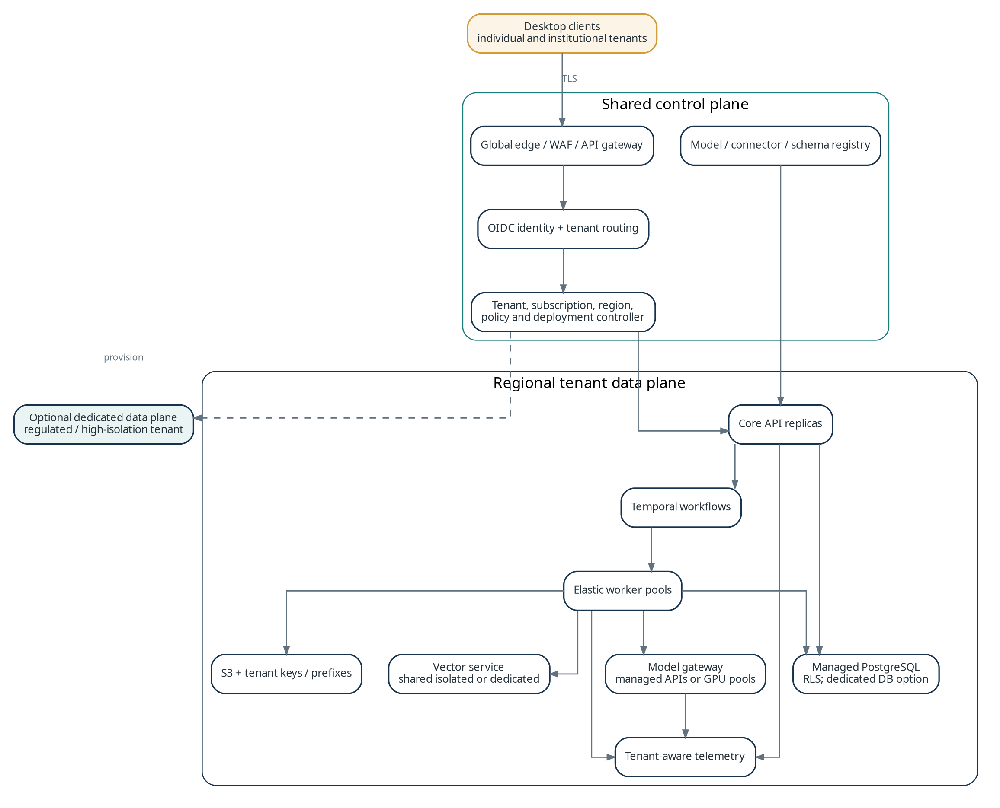

Figure 7. Cloud control plane and regional tenant data plane.

## 8.1 Control-plane responsibilities

• Tenant provisioning, identity federation, subscription/quota state, region selection, feature entitlements, connector/model catalog, policy templates, and deployment lifecycle.

• No routine access to tenant documents or evidence; control-plane events reference opaque identifiers and operational metadata.

• Provision shared-isolated, database-isolated, or dedicated data-plane resources according to contract and risk tier.

• Coordinate releases, security posture, evaluation-gate status, incidents, and support-access workflows.

## 8.2 Tenant isolation tiers

| **Tier**      | **Data isolation**                                                                                             | **Compute isolation**                                         | **Use case**                                                |
|---------------|----------------------------------------------------------------------------------------------------------------|---------------------------------------------------------------|-------------------------------------------------------------|
| Standard      | Shared PostgreSQL with tenant key on every row, RLS, tenant object prefixes/keys, isolated vector collections. | Shared API/workers with tenant quotas and workload identity.  | Individuals and small teams with ordinary research data.    |
| Institutional | Dedicated database/schema option, dedicated object bucket/key hierarchy, tenant retention/region.              | Shared or reserved capacity; dedicated model optional.        | Universities and centers with contractual controls.         |
| Dedicated     | Dedicated regional data plane and optionally dedicated cloud account/project.                                  | Dedicated API, workflow, worker, parser, and model resources. | Sensitive, regulated, or high-volume institutional tenants. |

## 8.3 Data residency and provider policy

The tenant selects allowed regions and model providers. Source content, embeddings, prompts, outputs, logs, backups, and support artifacts remain in the permitted region unless an explicit egress rule states otherwise. The gateway rejects routing that conflicts with tenant policy, source rights, or project classification. Customer-managed keys should be offered for institutional and dedicated tiers.

## 8.4 Cloud elasticity

| **Resource**     | **Scaling behavior**                                          | **Protection**                                                       |
|------------------|---------------------------------------------------------------|----------------------------------------------------------------------|
| Core API         | Horizontal replicas based on concurrency and latency.         | Stateless design, rate limits, circuit breakers, tenant concurrency. |
| Workflow service | Managed or HA Temporal, partitioned by namespace/region.      | History retention, visibility policy, task-queue isolation.          |
| Workers          | Scale by queue depth/age, GPU availability, and budget class. | Tenant quotas, priorities, preemption rules, idempotent activities.  |
| Parser pool      | Scale by pages/memory; isolate OCR-heavy jobs.                | File/page limits, sandboxing, malware quarantine.                    |
| Model inference  | External API, shared GPU pools, or dedicated endpoints.       | Token/GPU budgets, no-retention contracts, evaluation allowlists.    |
| Indexes          | Shard by tenant/corpus as scale requires.                     | Canonical state independent; index rebuild/versioning.               |

## 8.5 Service operations and support access

Support personnel receive no standing project-content access. Diagnostics use time-bounded, purpose-bound elevation approved by tenant or security policy, with session recording and immutable audit. Operational dashboards use redacted identifiers and avoid prompts, passages, titles, or memos unless content-level investigation is authorized.

DURABLE RESEARCH MEMORY

# 9. Data, graph, and provenance architecture

The data architecture is deliberately relational and provenance-centered. The scholarly graph is a first-class domain representation, but graph databases and search indexes are projections rather than authorities.

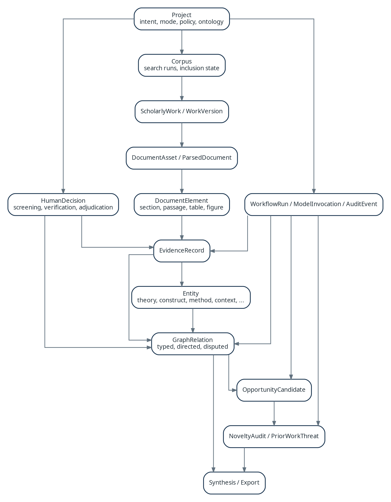

Figure 8. High-level domain relationships.

## 9.1 Canonical entity groups

| **Group**         | **Representative entities**                                                                               | **Versioning rule**                                                              |
|-------------------|-----------------------------------------------------------------------------------------------------------|----------------------------------------------------------------------------------|
| Governance        | Tenant, workspace, project, research intent, mode, policy, ontology pack, member, role.                   | Configuration changes append versions and effective dates.                       |
| Scholarly record  | ScholarlyWork, WorkVersion, author, venue, source observation, identifier, retraction/correction.         | A canonical work groups observed versions; merge/split decisions are reversible. |
| Document          | DocumentAsset, lawful location, rights, ParsedDocument, DocumentElement, reference, citation context.     | Original assets immutable; parse products content/parser addressed.              |
| Review process    | Corpus, SearchRun, SearchBranch, ScreeningProtocol/Decision, audit sample, stopping assessment.           | Decisions append; corrections supersede with rationale.                          |
| Evidence/argument | ExtractionSchema, EvidenceRecord, Entity, GraphRelation, Verification, Interpretation, Adjudication.      | Every item names source/derivation; competing alternatives coexist.              |
| Opportunity       | DetectorRun, OpportunityCandidate, score vector, evidence packet, NoveltyAudit, PriorWorkThreat, dossier. | Candidate/audit versions sealed before challenge and acceptance.                 |
| Operations        | WorkflowRun, ActivityRun, ModelInvocation, ConnectorCall, AuditEvent, EvaluationResult, MonitoringRule.   | Append-only invocation/event history under retention policy.                     |

## 9.2 Identifier and version conventions

• Use globally unique, sortable identifiers such as ULIDs; external identifiers are attributes, not primary keys.

• Every mutable aggregate has an integer revision for optimistic concurrency and immutable audit/event history.

• Derivation identity hashes input versions, normalized parameters, schema/prompt/model/parser versions, and activity code version; equivalent completed derivations may be reused.

• Objects use cryptographic content hashes and separate rights, encryption, media type, source, and retention state.

• Timestamps are UTC and paired with actor, client, workflow, and trace identifiers.

## 9.3 Evidence status and disputed knowledge

| **Status**  | **Meaning**                                                  | **System behavior**                                            |
|-------------|--------------------------------------------------------------|----------------------------------------------------------------|
| Observed    | Text, table, figure, metadata, or explicit source statement. | May support evidence subject to quality and rights.            |
| Extracted   | Machine-structured coding from observed content.             | Carries confidence, extractor, schema, verification.           |
| Inferred    | Analytical relation not directly stated.                     | Always labeled; never represented as direct evidence.          |
| Verified    | Independent model or human confirms entailment/mapping.      | Eligible for higher-confidence synthesis/analysis.             |
| Disputed    | Competing extraction, relation, interpretation, or evidence. | Alternatives remain visible; synthesis preserves disagreement. |
| Adjudicated | Researcher records decision and rationale.                   | Used by accepted outputs; alternatives remain auditable.       |
| Stale       | Dependency changed or was invalidated.                       | Blocked from reproducible reuse until recomputed/waived.       |

## 9.4 Provenance and selective recalculation

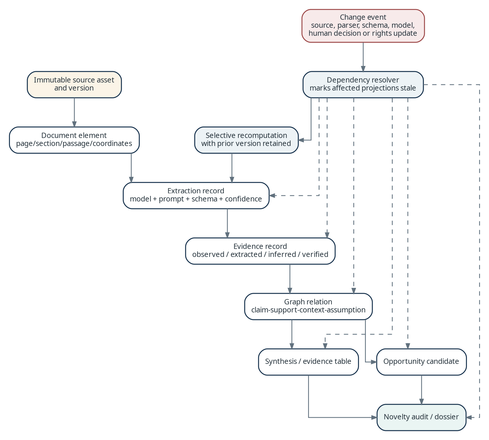

Figure 9. Dependency lineage, stale propagation, and selective recomputation.

The system does not fully event-source application state. It maintains relational current state, immutable scholarly derivation versions, and an append-only provenance/audit ledger. A dependency table records exact consumed versions. Change events mark affected projections stale and schedule selective recomputation. Prior versions remain available according to retention so published results stay explainable.

## 9.5 Graph representation

The canonical graph uses typed entity and relation tables with relation type, direction, source/target versions, status, confidence, creator, and evidence links. Relation types are ontology-versioned. A relation may carry competing interpretations and multiple evidence records. The design works in SQLite/PostgreSQL, supports rights-aware joins, and keeps adjudication transactional.

• Interactive neighborhoods and paths use relational indexes and cached adjacency projections.

• Graph algorithms materialize project-scoped snapshots into an analytics engine; manifests record filters and relation versions.

• Neo4j, Memgraph, RDF, or property-graph projections may be added for large interactive workloads or interoperability, but remain disposable.

• Original author terminology remains beside normalized entities. Ontology mappings are provenance-bearing claims, not destructive renames.

## 9.6 Storage implementation matrix

| **Data class**             | **Desktop**                | **University / cloud**              | **Backup / rebuild**                               |
|----------------------------|----------------------------|-------------------------------------|----------------------------------------------------|
| Transactional domain state | SQLite                     | PostgreSQL                          | Strict backup and migration testing.               |
| Source/generated objects   | Encrypted filesystem       | S3-compatible encrypted objects     | Strict backup by rights/retention; hash integrity. |
| Lexical index              | SQLite FTS5                | PostgreSQL FTS; optional OpenSearch | Rebuildable from canonical records.                |
| Vector/sparse index        | Embedded adapter           | Qdrant service; pgvector fallback   | Rebuildable with pinned embedding models.          |
| Graph analytics projection | Local files/memory         | Worker cache or graph service       | Rebuildable from canonical relations.              |
| Workflow history           | SQLite executor tables     | Temporal persistence                | Strict for active work; retention for completed.   |
| Telemetry                  | Rotating local logs/traces | OTEL pipeline                       | Operational retention and redaction.               |

SOURCE TO EVIDENCE

# 10. Ingestion and document-processing architecture

Ingestion is a rights-aware, provenance-preserving pipeline. It prefers native structured scholarly content, uses an ensemble for difficult documents, and never detaches derived evidence from source coordinates and parser versions.

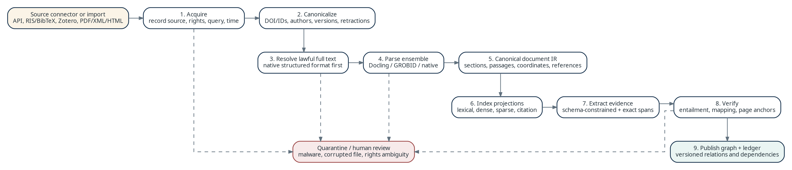

Figure 10. Ingestion, parsing, indexing, extraction, and verification pipeline.

## 10.1 Connector architecture

Connectors implement a narrow contract: authenticate, declare capabilities/rights fields, compile source-specific queries, page results, normalize source observations, fetch allowed assets, honor rate limits, and record request/response metadata. They do not decide canonical identity, inclusion, or scholarly relevance.

| **Connector type**     | **Examples**                                                         | **Special controls**                                                    |
|------------------------|----------------------------------------------------------------------|-------------------------------------------------------------------------|
| Open metadata          | OpenAlex, Crossref, Semantic Scholar, Unpaywall, repositories.       | Caching, rate limits, attribution, API-version tracking.                |
| Licensed bibliographic | Institutional databases and publisher APIs.                          | Secret manager, entitlement, terms, source-specific export/model rules. |
| Reference manager      | Zotero API, RIS, BibTeX, CSL JSON, DOI lists.                        | Round-trip IDs, attachment rights, duplicate provenance.                |
| Local import           | PDF, DOCX, HTML, XML/JATS/TEI, TXT, archives, review exports.        | Malware scan, type validation, size/page limits, privacy.               |
| Institutional/private  | Repositories, lab drives, internal reports, unpublished manuscripts. | Classification, project-only access, retention, prohibited providers.   |

## 10.2 Canonicalization and deduplication

1\. Create a source observation for every retrieved record, including exact source query/branch and retrieval time.

2\. Normalize identifiers, titles, authors, venue, dates, and reference fingerprints without discarding original values.

3\. Resolve exact identifiers first; then use conservative probabilistic clustering for ambiguity.

4\. Represent preprint, accepted manuscript, publication, correction, and retraction as related versions rather than indiscriminate duplicates.

5\. Auto-merge only high-confidence exact cases; ambiguous clusters require reversible human review and recorded signals.

## 10.3 Parser selection and canonical document IR

| **Input condition**                       | **Primary path**                                                                  | **Fallback / enrichment**                                |
|-------------------------------------------|-----------------------------------------------------------------------------------|----------------------------------------------------------|
| JATS, TEI, publisher XML, structured HTML | Native parser preserves hierarchy, references, tables, formulas, IDs.             | Docling may enrich layout/figures.                       |
| Born-digital scholarly PDF on desktop     | Docling document understanding and coordinate extraction.                         | Metadata/reference normalization; optional server parse. |
| Born-digital scholarly PDF on server      | GROBID for scholarly structure/references plus Docling for layout/tables/figures. | Reconciler retains both outputs/confidence.              |
| Scanned/image-heavy PDF                   | Docling OCR/layout with explicit OCR status.                                      | Human quality flag; page images where permitted.         |
| Office documents/technical reports        | Docling/native parser.                                                            | Reference/section normalization and preview.             |

The canonical Document IR contains pages, regions, sections, paragraphs, sentences, tables/cells, figures/captions, equations, footnotes, references, and citation contexts. Each element stores source asset, parser run, page/coordinate anchors, normalized text, and parent/order relationships. Parser disagreements remain alternatives until reconciliation.

## 10.4 Extraction and verification

• Extraction schemas are JSON-Schema-compatible, ontology-versioned, and project-scoped; fields support not reported, unclear, inferred, and not applicable.

• Extractors return exact source element references or coordinate-backed spans. Unsupported records are rejected or explicitly labeled.

• Verifiers independently check entailment, field/schema fit, page anchors, and unsupported inference; high-consequence fields may require humans.

• Comparability features—construct, population, context, time, measure, method, outcome—precede contradiction or gap analysis.

• Extraction/verification are batchable, restartable, and re-runnable while retaining previous results.

## 10.5 Quarantine and failure behavior

| **Failure**                      | **Response**                                                           | **User-visible state**                     |
|----------------------------------|------------------------------------------------------------------------|--------------------------------------------|
| Corrupt/encrypted asset          | Stop repeated retries; request password/replacement; retain metadata.  | Unavailable with actionable reason.        |
| Malware/suspicious archive       | Quarantine outside project objects; alert under policy.                | Blocked; no parsing/model access.          |
| Parser crash/resource exhaustion | Checkpoint pages; bounded retry/alternate parser; retain diagnostics.  | Partial or failed parse with quality tier. |
| Rights ambiguity                 | Store metadata only; block acquisition/model/export until adjudicated. | Rights review required.                    |
| Low OCR/parse quality            | Allow source view; mark evidence low-confidence; queue review.         | Warnings on document/downstream output.    |

DISCOVERY AND CORPUS CONSTRUCTION

# 11. Retrieval, screening, and search architecture

Retrieval is an auditable ensemble rather than one opaque similarity function. Exact terminology, scientific semantics, citation structure, graph relationships, and project-specific relevance contribute distinct, logged signals.

## 11.1 Query plan

1\. Parse research intent into facets while retaining original wording.

2\. Compile source-specific structured queries and document each translation.

3\. Run lexical/fielded retrieval for reproducibility and exact terminology.

4\. Run dense and sparse semantic retrieval over abstracts and permitted passages.

5\. Expand through references, citations, co-citation, coupling, authors, venues, datasets, and ontology synonyms.

6\. Fuse candidates with a declared ensemble and apply a cross-encoder or evaluated LLM reranker after broad retrieval.

7\. Persist the plan, model/index versions, scores by signal, filters, and discovery path as a SearchRun version.

## 11.2 Retrieval layers

| **Layer**       | **Purpose**                                                   | **Implementation**                                                            |
|-----------------|---------------------------------------------------------------|-------------------------------------------------------------------------------|
| Fielded lexical | Phrases, Boolean logic, IDs, authors, dates, venues, methods. | SQLite FTS5 locally; PostgreSQL FTS server; OpenSearch only after thresholds. |
| Dense semantic  | Conceptual similarity across terminology/disciplines.         | Embeddings through gateway; embedded adapter or Qdrant service.               |
| Sparse semantic | Learned lexical expansion with term contributions.            | Sparse-vector collection when supported.                                      |
| Citation/graph  | Lineage, related work, neighborhoods, bridges.                | Canonical citations plus source graph APIs/projections.                       |
| Reranking       | Project-specific relevance and facet coverage.                | Cross-encoder/evaluated LLM on bounded candidates.                            |
| Diversity/audit | Reduce vocabulary and active-learning blind spots.            | Uncertainty/random audits, cluster diversity, citation-neighbor recovery.     |

## 11.3 Search-index authority and freshness

Indexes carry manifests and build watermarks. Results disclose index age and exclusions. Newly ingested records use a transactional recent-records path until indexing completes. If an index is unavailable, the platform degrades to canonical metadata search and clearly disables unsupported semantic features rather than returning silently incomplete results.

## 11.4 Screening architecture

• The screening queue records the feature/model version used for prioritization while human decisions remain separate.

• Active learning changes order but cannot rewrite decisions or silently stop a review.

• Stopping recommendations combine marginal discovery, uncertainty, random audits, citation-neighbor checks, and known-item coverage appropriate to mode.

• Dual screening and conflict adjudication are configurable; reviewers may be blinded to each other until submission.

• Every exclusion retains an explicit reason and protocol version.

## 11.5 When to add specialized search infrastructure

| **Trigger**                                                           | **Default response**                               | **Potential specialization**                        |
|-----------------------------------------------------------------------|----------------------------------------------------|-----------------------------------------------------|
| Tens of millions of passages and PostgreSQL lexical p95 misses target | Tune/partition/cache stable queries.               | Add OpenSearch as derived lexical projection.       |
| Vector concurrency/collections exceed service capacity                | Shard, quantize, separate hot/cold indexes.        | Dedicated Qdrant or tenant vector service.          |
| Graph latency dominates                                               | Optimize relation indexes/project snapshots.       | Add rebuildable graph/RDF projection.               |
| Cross-project global metadata search becomes central                  | Separate shareable metadata from private overlays. | Institutional metadata index with project overlays. |

MODEL-GOVERNED REASONING

# 12. AI, model, and agent architecture

AI is a governed infrastructure capability, not a collection of unrestricted chat agents. Models are selected by task, evidence requirements, data policy, evaluation status, latency, and cost.

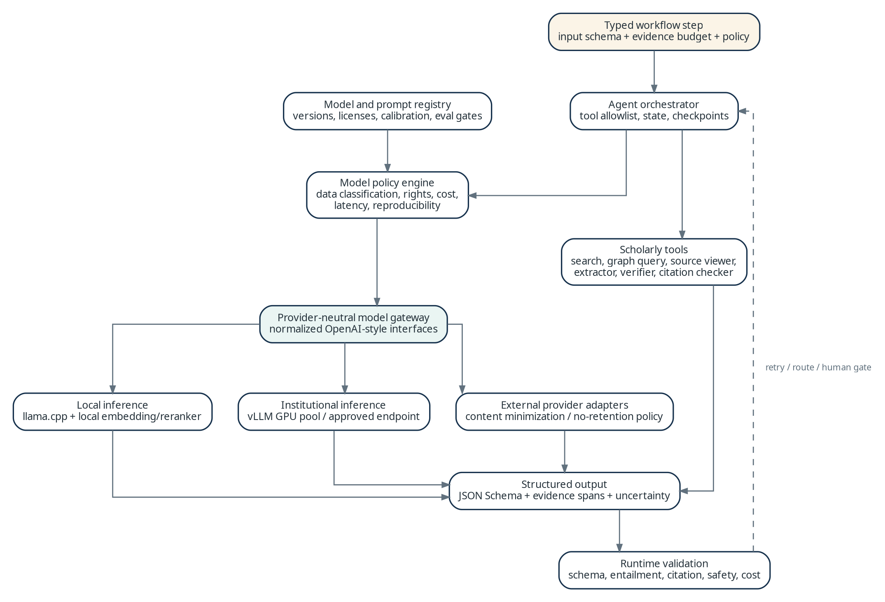

Figure 11. Model gateway, agent orchestration, policy, and validation.

## 12.1 Model capability classes

| **Capability**       | **Typical tasks**                                                 | **Required output / evaluation**                              |
|----------------------|-------------------------------------------------------------------|---------------------------------------------------------------|
| Embedding            | Paper/passage representation, clustering, novelty facets.         | Model/dimension; retrieval benchmarks; drift.                 |
| Sparse encoder       | Semantic term expansion and hybrid retrieval.                     | Terms/weights and contribution logs.                          |
| Reranker             | Relevance, facet coverage, prior-work threat ranking.             | Candidate score/calibration; known-item recall.               |
| Classifier/NLI       | Screening, citation stance, entailment, contradiction candidates. | Distribution, evidence pair, calibrated threshold, errors.    |
| Structured extractor | Methods, contexts, measures, findings, claims, assumptions.       | JSON schema with exact spans and not-reported states.         |
| Verifier             | Entailment, mapping quality, citation support.                    | Independent verdict and typed rationale category.             |
| Generative reasoner  | Query strategy, synthesis, mechanisms, counterarguments.          | Evidence-bound structure, citations, uncertainty, tool trace. |
| Document/vision      | Tables, figures, OCR correction, layout.                          | Coordinate-backed elements and quality score.                 |

## 12.2 Model gateway routing policy

All inference passes through a gateway even when local. The gateway resolves a capability request to an allowed endpoint, minimizes content, validates structured output, records usage, and enforces evaluation gates. Application modules never call provider SDKs directly.

| **Routing factor**    | **Examples of policy behavior**                                                                                  |
|-----------------------|------------------------------------------------------------------------------------------------------------------|
| Classification/rights | Restricted full text may be local/institutional only; metadata-only prompts may be externally allowed.           |
| Task quality tier     | Novelty/evidence verification requires models that passed task evaluation and may require dual confirmation.     |
| Reproducibility       | Frozen runs pin model, parameters, prompt, tools, schema, and retrieval snapshot; dynamic routing is disallowed. |
| Latency               | Interactive suggestions use fast models; batch extraction/challenge uses queued high-quality routes.             |
| Cost/quota            | Project/tenant budgets constrain tokens/GPU; workflows pause for approval.                                       |
| Availability          | Fallback only to an allowed model, with explicit run change and approval for frozen work.                        |

## 12.3 Inference backends

• llama.cpp provides local OpenAI-compatible inference for quantized models; the desktop installs signed model manifests, not arbitrary executable code.

• vLLM provides high-throughput OpenAI-compatible serving for approved university/cloud GPU models behind the private gateway.

• External adapters declare retention, training, region, content limits, structured output, and contract state; projects may disable them.

• Embedding, reranking, NLI, extraction, and generation may use specialized models; one model is not assumed best for all tasks.

## 12.4 Agent roles and execution constraints

| **Role**              | **Allowed actions**                                                  | **Mandatory constraints**                                     |
|-----------------------|----------------------------------------------------------------------|---------------------------------------------------------------|
| Search Strategist     | Propose facets, vocabulary, queries, adjacent fields, branches.      | Cannot silently execute/change scope; alternatives visible.   |
| Corpus Scout          | Run approved retrieval, follow citations, find duplicates/full text. | Source/query provenance; connector rights/limits.             |
| Evidence Extractor    | Read approved elements and create candidate evidence.                | Schema-constrained, exact spans, no unsupported completion.   |
| Evidence Verifier     | Compare evidence to source/ontology.                                 | Independent context/model where feasible; typed errors.       |
| Field Mapper          | Create candidate clusters/relations.                                 | Relations provisional until evidence/status thresholds.       |
| Opportunity Generator | Run detector ensemble and draft mechanism.                           | Cannot approve novelty; output sealed before challenge.       |
| Novelty Challenger    | Search to defeat/narrow sealed candidate.                            | Independent expansion, threat ranking, counterevidence first. |
| Synthesis Curator     | Assemble accepted evidence/decisions.                                | Citations resolve; disagreement/uncertainty preserved.        |
| Monitor               | Compare new work to accepted outputs.                                | May mark stale/reopen; cannot alter decisions.                |

## 12.5 Structured-output contract

<table>
<colgroup>
<col style="width: 100%" />
</colgroup>
<thead>
<tr class="header">
<th><p><strong>Illustrative evidence output</strong></p>
<p>{<br />
"schema_id": "evidence.claim.v3",<br />
"source_element_ids": ["01J..."],<br />
"status": "extracted",<br />
"claim_text": "...",<br />
"normalized_entities": [{"id": "...", "mapping": "candidate"}],<br />
"uncertainty": {"extraction": "medium", "comparability": "not_assessed"},<br />
"not_reported_fields": ["sample_attrition"],<br />
"model_run_id": "01J..."<br />
}</p></th>
</tr>
</thead>
<tbody>
</tbody>
</table>

## 12.6 Model lifecycle and evaluation gates

• Registry entries include artifact/provider version, license, locations, task eligibility, limits, privacy state, calibration, evaluations, and retirement.

• New models run shadow evaluations on versioned corpora before production eligibility; gates are domain- and mode-specific.

• Model changes do not rewrite accepted evidence. New derivations are compared and dependent outputs become stale only under approved policy.

• LLM-as-judge is supplementary; objective checks and human expert samples prevent evaluation circularity.

DURABLE ANALYTICAL WORK

# 13. Workflow execution, events, and recalculation

Literature analysis is long-running, interruptible, partly human-gated, and expensive to repeat. The workflow layer therefore persists intent and state independently of UI sessions, process lifetimes, and model providers.

## 13.1 One workflow contract, two durable executors

Domain workflows are defined as versioned state machines with typed inputs, activities, human tasks, compensation rules, and outputs. A local executor implements the contract inside the desktop runtime; university and cloud deployments bind the same contract to Temporal. Workflow definitions do not depend on a specific queue or scheduler API.

| **Concern** | **Desktop / laboratory**                                                             | **University / cloud**                                                                |
|-------------|--------------------------------------------------------------------------------------|---------------------------------------------------------------------------------------|
| Persistence | SQLite workflow, activity, lease, timer, and command tables in the project database. | Temporal workflow history with canonical project references in PostgreSQL.            |
| Execution   | Signed local worker processes with bounded concurrency and OS-aware resource limits. | Task-queue workers separated by activity class, data policy, region, and accelerator. |
| Durability  | Transactional checkpoints after each activity and before external side effects.      | Workflow event history, activity retries, heartbeats, and durable timers.             |
| Human gates | Pending human task stored in project state; desktop notifications resume it.         | Temporal signal/update plus application task record and role authorization.           |
| Scheduling  | Local scheduler runs while the application or optional background service is active. | Always-on schedules for monitors, refreshes, retention, and maintenance.              |
| Conformance | Shared workflow fixtures replay expected transitions against both executors.         | Same fixtures plus failure-injection and versioning tests in staging.                 |

<table>
<colgroup>
<col style="width: 100%" />
</colgroup>
<thead>
<tr class="header">
<th><strong>Executor portability rule<br />
</strong>Workflow business logic may call only versioned activity ports and project repositories. It may not import Temporal, SQLite queue internals, desktop IPC, or cloud-provider SDKs. This preserves behavioral parity across editions.</th>
</tr>
</thead>
<tbody>
</tbody>
</table>

## 13.2 Activity semantics

• Activities are assumed to execute at least once. Every side-effecting activity therefore receives a stable idempotency key derived from workflow, activity, and logical attempt identity.

• External connector calls write a request ledger before execution and store provider request IDs, rate-limit state, response hashes, and retry disposition.

• Large outputs are written to immutable object storage first; the canonical database commits only after checksum and rights metadata validation.

• Long parsing, embedding, and inference activities heartbeat progress and honor cooperative cancellation between documents, pages, or batches.

• Typed failures distinguish retryable infrastructure errors, provider throttling, invalid inputs, rights blocks, policy denials, quality failures, budget exhaustion, and human-review requirements.

• Retries use bounded exponential backoff with jitter and activity-specific ceilings. A dead-letter state is visible in the project rather than hidden in an operations queue.

• Activities declare deterministic resource estimates and may be admitted, delayed, split, or escalated based on memory, accelerator, token, page, and tenant budgets.

## 13.3 Event and outbox architecture

Canonical transactions append domain events to a transactional outbox. A dispatcher publishes versioned event envelopes after commit. In local mode, the event log and consumers share SQLite; on servers, events are delivered through the workflow/event backbone. Consumers must be idempotent, and event replay must be safe because projections are rebuildable.

| **Event family** | **Representative events**                                                         | **Primary consumers**                                            |
|------------------|-----------------------------------------------------------------------------------|------------------------------------------------------------------|
| Corpus           | WorkObserved, WorkMerged, VersionLinked, RightsChanged, WorkIncluded.             | Search, graph, monitoring, export, staleness.                    |
| Document         | AssetAcquired, ParseCompleted, ElementChanged, ParseQualityFailed.                | Evidence extraction, passage index, page viewer, reprocessing.   |
| Evidence         | EvidenceExtracted, VerificationCompleted, RelationDisputed, AdjudicationRecorded. | Argument graph, synthesis, opportunity detectors, metrics.       |
| Workflow         | RunStarted, ActivityRetried, HumanTaskOpened, RunFrozen, RunCompleted.            | UI status, notifications, audit, operations, budget accounting.  |
| Opportunity      | CandidateSealed, ChallengeStarted, PriorWorkThreatAdded, CandidateAccepted.       | Novelty room, dossier, portfolio, monitoring.                    |
| Governance       | PolicyChanged, MembershipChanged, ModelEligibilityChanged, RetentionApplied.      | Authorization cache, stale analysis, disclosure, security audit. |

## 13.4 Dependency graph and selective recalculation

Every derived object records direct dependencies on input versions, schemas, models, code, and human decisions. The platform computes transitive impact through a derivation graph; it does not indiscriminately rerun an entire project when one source or interpretation changes.

1\. An authoritative input changes or a new version is accepted.

2\. The transaction appends the domain event and identifies direct derivations whose fingerprints no longer match.

3\. A staleness planner traverses downstream dependencies and assigns reason codes, severity, and recomputation options.

4\. Low-cost, policy-approved projections may rebuild automatically; expensive or consequential analyses await budget and researcher approval.

5\. Recomputed outputs are stored as new versions and compared with the prior version; accepted human decisions are never silently overwritten.

6\. The UI presents affected syntheses, dossiers, exports, and claims with before/after evidence and a complete audit trail.

| **Staleness reason** | **Typical impact**                                               | **Default response**                                                              |
|----------------------|------------------------------------------------------------------|-----------------------------------------------------------------------------------|
| SOURCE_VERSION       | Passage anchors, extraction, claims, synthesis.                  | Reparse/reanchor; review evidence whose source span changed.                      |
| RIGHTS_POLICY        | Model routing, sharing, export, cached assets.                   | Block noncompliant uses; purge derived content only under declared policy.        |
| SCHEMA_VERSION       | Extraction records and graph mappings.                           | Migrate compatible fields; selectively re-extract changed semantics.              |
| MODEL_OR_PROMPT      | Machine derivations, not source observations or human decisions. | Regression-test first; rerun only by project policy or explicit upgrade.          |
| ONTOLOGY_MAPPING     | Normalized entities, comparison sets, detectors.                 | Preserve original wording; rebuild affected projections and expose mapping delta. |
| HUMAN_DECISION       | Corpus membership, accepted interpretation, opportunity status.  | Propagate impact immediately; require review of consequential downstream outputs. |

## 13.5 Freeze, cancellation, and reproducible replay

• A frozen run pins corpus snapshot, query plan, indexes, schema, workflow code, model routes, prompts, parameters, and policy decisions. It is read-only except for annotations.

• Cancellation stops future activities and cooperatively interrupts active work; completed immutable outputs remain available and are labeled incomplete.

• Workflow versioning uses explicit migration or continuation-as-new rules. Running workflows are not forced through incompatible code paths.

• Replay verifies workflow decisions and activity references; nondeterministic external responses are read from stored results rather than called again.

• A reproducibility export contains manifests and evidence references, but it never bypasses source licensing or institutional access controls.

DIFFERENTIATING ANALYTICAL ENGINE

# 14. Opportunity generation and adversarial novelty

The opportunity engine treats “gap” as a family of contestable hypotheses. It assembles evidence, explains the mechanism of potential contribution, and then transfers a sealed candidate to an independently configured challenger whose objective is to narrow or defeat it.

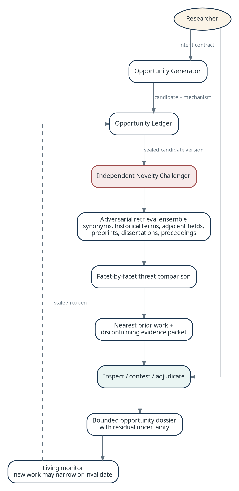

Figure 12. Generator–challenger sequence and human acceptance gate.

## 14.1 Detector ensemble

| **Detector family**            | **Primary computation**                                                                                                          | **Required safeguards**                                                                               |
|--------------------------------|----------------------------------------------------------------------------------------------------------------------------------|-------------------------------------------------------------------------------------------------------|
| Explicit-gap language          | Section-aware extraction of limitations, open questions, future work, and uncertainty statements.                                | Boilerplate classifier; publication-date monitoring; source passage and later-work search.            |
| Coverage / tensor sparsity     | Density over theory, construct, context, population, method, measure, outcome, and time dimensions.                              | Only normalized comparable cells; importance/mechanism review; missing-data diagnostics.              |
| Contradiction / qualification  | Claim normalization, comparability clustering, NLI/stance, effect direction, and citation context.                               | Human confirmation of construct, measure, sample, level, and temporal comparability.                  |
| Boundary condition             | Compare stated claim scope with empirical support and observed contexts.                                                         | Distinguish theoretical propositions from empirical generalization; retain qualifications.            |
| Measurement variation          | Map construct definitions and operationalizations to finding sensitivity.                                                        | Permit legitimate construct variants; preserve author language and mapping disputes.                  |
| Replication / robustness       | Assess centrality against data diversity, controls, baselines, ablations, and external validation.                               | Require substantive or theoretical leverage beyond simple repetition.                                 |
| Bridge / fragmentation         | Semantic proximity, bibliographic separation, entity overlap, and sparse cross-citation.                                         | Test whether fields share a phenomenon/mechanism rather than surface vocabulary.                      |
| Temporal / institutional shift | Concept drift and claims predating material technology, regulatory, organizational, or social change.                            | Demand a plausible mechanism by which the change affects the claim.                                   |
| Critical problematization      | Evidence-linked coding of assumptions, authority, dependency, stakeholder absence, benefits, burdens, and excluded alternatives. | Present competing readings; prohibit autonomous normative adjudication; human interpretive authority. |

## 14.2 Comparison-set normalization

Before any absence, conflict, or weakness is promoted, the system creates a comparison-set specification: construct meanings, units and levels of analysis, populations, settings, time periods, measures, methods, outcomes, and evidence standards. A candidate retains the records that were excluded from the comparison set and the reason, because a seemingly clean pattern may be an artifact of normalization choices.

## 14.3 Candidate evidence packet

• Candidate identity, opportunity type, detector/version, status, and project research-intent contract.

• Source-grounded positive signals, including exact passages, graph structures, density calculations, and detector uncertainty.

• Closest studies inside and outside the comparison set, with facet overlap and reasons for inclusion or exclusion.

• Disconfirming or significance-reducing studies and unresolved evidence or coding disputes.

• Coverage diagnostics by database, discipline, year, language, geography, venue, document type, open-access status, and full-text availability.

• Proposed contribution mechanism, theoretical/substantive leverage, alternative explanations, ethical constraints, and feasible study options.

• Multi-objective score vector and uncertainty decomposition; no opaque aggregate is authoritative.

## 14.4 Sealed generator output

When the researcher elects to challenge a candidate, the platform seals the generator version: evidence packet, facets, score vector, search scope, prompts, models, and human edits. The challenger receives the candidate and source scope but cannot modify generator evidence or optimize toward acceptance. Later generator refinements create a new candidate version and require a new challenge.

## 14.5 Adversarial novelty retrieval protocol

1\. Decompose the candidate into phenomenon, mechanism, constructs, intervention or method, setting, outcome, contribution type, and claimed differentiators.

2\. Generate synonyms, acronym expansions, historical vocabulary, author communities, theoretical traditions, neighboring disciplines, and plausible alternative framings.

3\. Run structured, semantic, citation, entity, author, venue, dissertation, proceedings, preprint, report, patent, or policy searches allowed by the project mode.

4\. Use diversity-aware fusion to prevent one terminology family or source from dominating the threat set.

5\. Rerank candidates by facet overlap and threat level; require source-grounded explanations of exactly which facets overlap, narrow, or invalidate the claim.

6\. Follow references and citations of the highest-threat studies and explicitly search for reviews or later work that absorbs the proposed contribution.

7\. Stop only under the declared protocol: source/branch completion, marginal threat discovery, known-neighbor recovery, and researcher approval.

8\. Produce a bounded novelty statement, residual uncertainty, search manifest, nearest-prior table, and required revisions to the proposed contribution.

## 14.6 Human acceptance states

| **State**                  | **Meaning**                                                                                 | **Allowed language**                                                              |
|----------------------------|---------------------------------------------------------------------------------------------|-----------------------------------------------------------------------------------|
| Unsupported                | Search/evidence is insufficient or the candidate lacks a consequential mechanism.           | Do not assert a research opportunity.                                             |
| Apparent                   | The opportunity is visible under current vocabulary/corpus but not adequately challenged.   | Candidate for further search only.                                                |
| Bounded                    | Prior work exists, but a theoretically meaningful facet, condition, or resolution remains.  | State the precise bounded difference and closest prior work.                      |
| Integrative                | The contribution connects fragmented concepts or mechanisms rather than filling an absence. | Frame as integration and specify what becomes explainable.                        |
| Contradiction-resolving    | Comparable evidence conflicts and the project can distinguish explanations.                 | State comparability limits and resolution design.                                 |
| Assumption-challenging     | The project interrogates an organizing assumption, exclusion, or framing.                   | Attribute interpretations and preserve alternatives; avoid “unstudied” shorthand. |
| Provisionally corroborated | Nearest work, counterevidence, corpus limits, and human adjudication are complete.          | Use the bounded novelty template with cutoff and residual uncertainty.            |

## 14.7 Isolation and independence controls

• Generator and challenger use distinct workflow identities, prompts, tool allowlists, retrieval branches, and result stores even when they share underlying infrastructure.

• For high-consequence audits, the challenger should use at least one different retrieval strategy and, where practical, a different model family from the generator.

• The challenger sees accepted source facts but not hidden persuasive rationales or generator confidence that could anchor its search.

• Challenge completion is a human gate. The generator cannot automatically relabel a candidate as novel, and the challenger cannot reject it without evidence.

• All revisions prompted by challenge are represented as explicit candidate deltas, not silent editing of the historical record.

ONE AUTHORITATIVE PROJECT HOME

# 15. Collaboration, synchronization, and offline operation

The platform supports individual ownership, laboratory collaboration, and institution-scale teams without introducing a brittle multi-master database. Each project has one authoritative home; desktop clients keep rights-aware caches and queue explicit offline commands.

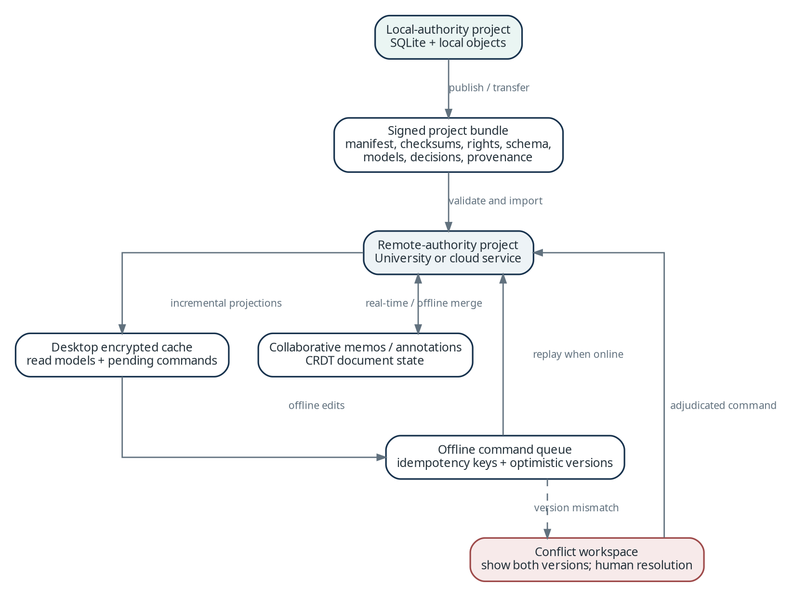

Figure 13. Authoritative project home, desktop cache, and offline command flow.

## 15.1 Project authority model

| **Project home** | **Authoritative state**                                                  | **Desktop behavior**                                                                  |
|------------------|--------------------------------------------------------------------------|---------------------------------------------------------------------------------------|
| Local            | Encrypted local project database and object store.                       | Full read/write; local workflows and models; optional backups/exports.                |
| University       | University API, PostgreSQL, object storage, workflow and model services. | Secure client; metadata/evidence cache; offline review queue; institutional policies. |
| Cloud            | Regional tenant data plane.                                              | Secure client; bounded cache; offline review queue; tenant policies and quotas.       |

A project UUID is globally stable, but only one deployment is writable for that project generation. This avoids divergence in corpus membership, graph relations, rights, and provenance. Copies for analysis or archiving are snapshots with lineage, not peers that silently reconcile databases.

## 15.2 Remote-project desktop cache

• The cache stores project shell, assigned work, canonical metadata, accepted evidence snippets, thumbnails, and user-selected permitted documents; sensitive content may be disabled by policy.

• Every cached aggregate has an authoritative revision and cache policy. A delta stream updates changed aggregates and invalidates local views.

• Queries against incomplete caches are labeled local/offline and cannot be presented as corpus-complete.

• Logout, membership removal, rights changes, device revocation, or retention policy can revoke keys and purge cache classes.

• The desktop never exposes server credentials to plugins or renderer code; all synchronization flows through the signed core service.

## 15.3 Offline command queue

Offline work is represented as commands, not database-row replication. Each command includes project generation, aggregate revision, actor, device, idempotency key, creation time, and an operation-specific payload. On reconnection, the server authorizes and validates commands in order and returns accepted versions or typed conflicts.

| **Command class**                       | **Offline support**                            | **Conflict behavior**                                                                    |
|-----------------------------------------|------------------------------------------------|------------------------------------------------------------------------------------------|
| Screening decision                      | Yes, for assigned records and cached protocol. | Append decision; flag if record/protocol changed; adjudication never auto-resolved.      |
| Annotation / memo                       | Yes.                                           | CRDT merge for text/anchors where allowed; deleted/moved sources become orphan warnings. |
| Evidence correction                     | Limited, if source and schema cached.          | Optimistic concurrency; competing extraction retained as a disputed alternative.         |
| Ontology edit                           | Proposal only.                                 | Requires server validation/governance; may fork a project-specific pack.                 |
| Corpus/query changes                    | Draft only.                                    | Revalidate connector/source policy and execute online.                                   |
| Novelty acceptance / final adjudication | No by default.                                 | Consequential gate requires current threat set, coverage, and policy online.             |

## 15.4 CRDT scope

A CRDT library such as Automerge is appropriate for human-authored memos, notes, and selected annotations because concurrent text edits are expected and reversibility is valuable. CRDTs are not used for corpus membership, screening adjudications, evidence status, rights, graph-edge acceptance, budgets, or workflow state; those domains require explicit command semantics, authorization, and audit.

## 15.5 Project transfer and promotion

| **Scenario**                              | **Protocol**                                                                                                                                                 | **Result**                                                                           |
|-------------------------------------------|--------------------------------------------------------------------------------------------------------------------------------------------------------------|--------------------------------------------------------------------------------------|
| Local to university/cloud                 | Freeze local generation; validate export manifest; upload permitted objects; reconcile identity/rights/models; server creates next authoritative generation. | Remote home becomes writable; local becomes cache/archive until explicitly detached. |
| University/cloud export to local          | Create rights-filtered snapshot and portable manifest; exclude institutional-only connectors/content where required.                                         | New local project or read-only snapshot with recorded provenance.                    |
| University to cloud / cloud to university | Administrator-assisted encrypted transfer, mapping identities, policies, object keys, connector entitlements, and model routes.                              | New authoritative generation after integrity and acceptance checks.                  |
| Fork for alternate interpretation         | Create child project from a frozen snapshot with inherited lineage and copied permissible objects.                                                           | Independent decisions/workflows; no hidden merge back.                               |
| Archive                                   | Freeze all versions, stop monitors, apply retention/rights policy, create integrity manifest.                                                                | Read-only or deleted according to policy.                                            |

## 15.6 Team collaboration and adjudication

• Assignments distinguish search, screening, coding, verification, critical reading, novelty challenge, adjudication, and administration.

• Blind dual-review is supported without hiding audit metadata from authorized methodologists after the blind is lifted.

• Comments and discussions attach to stable domain objects and versions, not screen coordinates.

• Consensus, majority, designated adjudicator, and unresolved plurality are explicit outcomes; the system does not force disagreement into one machine-generated value.

• Presence and lightweight notifications use real-time channels, but canonical edits always pass through versioned commands.

• External collaborators receive project-scoped, time-bounded roles; source entitlements are reevaluated for each participant rather than inherited from the owner.

STABLE DOMAIN BOUNDARIES

# 16. API, plugin, and interoperability design

The desktop, institutional deployment, cloud service, integrations, and future research prototypes share one versioned application API and event vocabulary. Interfaces expose scholarly domain objects rather than storage-engine details.

## 16.1 Application API conventions

• HTTPS REST with OpenAPI 3.1 is the normative command/query interface. The local desktop uses the same routes over authenticated loopback transport.

• Long-running commands return an operation resource with state, progress, human tasks, costs, warnings, and result links rather than holding a request open.

• Server-Sent Events deliver operation and project deltas; WebSocket is reserved for presence or high-frequency collaborative interaction that requires bidirectionality.

• Write requests require Idempotency-Key and, for aggregate changes, If-Match or expectedRevision. The API returns typed conflict information.

• Public paths are major-versioned. Schemas evolve additively within a major version, and clients advertise supported capabilities.

• Pagination uses stable opaque cursors. Bulk exports are asynchronous and checksummed. Every response includes trace ID and authoritative revision where applicable.

• Errors use problem-details documents with stable application codes, human-safe messages, retryability, policy/rights context, and optional field-level violations.

## 16.2 Primary resources

| **Resource family**   | **Representative routes**                                                         | **Notes**                                                                |
|-----------------------|-----------------------------------------------------------------------------------|--------------------------------------------------------------------------|
| Projects / governance | /projects, /research-intents, /memberships, /policies, /ontology-packs            | Project generation, mode, source scope, autonomy, retention, and roles.  |
| Corpus / search       | /corpora, /search-runs, /search-branches, /works, /screening-decisions            | Query plans and discovery paths are immutable versions.                  |
| Documents / evidence  | /document-assets, /parsed-documents, /elements, /evidence-records, /verifications | Source access mediated; evidence always references stable elements.      |
| Graph / analysis      | /entities, /relations, /comparison-sets, /detector-runs                           | Graph queries return evidence/status and never only unqualified triples. |
| Opportunity / novelty | /opportunity-candidates, /novelty-audits, /prior-work-threats, /dossiers          | Candidate is sealed before challenge; acceptance is a human command.     |
| Workflow / operations | /operations, /human-tasks, /budgets, /model-runs, /exports                        | Progress, cancellation, freeze, retry, costs, and disclosures.           |
| Monitoring            | /monitoring-rules, /monitoring-events, /impact-assessments                        | Differential ingestion and stale-output impact.                          |

## 16.3 Illustrative asynchronous command

<table>
<colgroup>
<col style="width: 100%" />
</colgroup>
<thead>
<tr class="header">
<th><p><strong>API example</strong></p>
<p>POST /api/v1/projects/{projectId}/novelty-audits<br />
Idempotency-Key: 01J...<br />
If-Match: "candidate-rev-7"<br />
<br />
{<br />
"candidate_version_id": "01J...",<br />
"protocol_version": "novelty.challenge.v2",<br />
"source_scope_id": "01J...",<br />
"budget": {"max_usd": 35, "max_gpu_minutes": 120},<br />
"freeze_dependencies": true<br />
}<br />
<br />
202 Accepted<br />
Location: /api/v1/operations/01J...</p></th>
</tr>
</thead>
<tbody>
</tbody>
</table>

## 16.4 Plugin and adapter model

Plugins are signed packages that declare type, version, permissions, network domains, data classes, runtime, and compatibility. They execute outside the desktop renderer and outside the core API process. An adapter SDK supplies narrow contracts, test fixtures, rate-limit helpers, provenance envelopes, and rights metadata. University and cloud administrators control allowlists; local users receive strong warnings and per-project approval for third-party packages.

| **Plugin type**            | **Contract**                                                                                        | **Security boundary**                                                                     |
|----------------------------|-----------------------------------------------------------------------------------------------------|-------------------------------------------------------------------------------------------|
| Scholarly source connector | Search, metadata fetch, citation expansion, lawful-location resolution, optional entitled download. | Credential broker; domain allowlist; rate limit; entitlement and license result required. |
| Parser / OCR               | Immutable asset in; normalized document package and quality report out.                             | Sandboxed process/container; no network by default; file/page/resource limits.            |
| Model provider             | Capability request in; structured response/usage/policy metadata out.                               | Model gateway only; content classification and region/retention checks.                   |
| Ontology / method pack     | Versioned types, constraints, schemas, mappings, comparability rules, detector configuration.       | Declarative by default; executable extensions isolated and signed.                        |
| Exporter                   | Canonical snapshot in; declared artifact bundle out.                                                | Rights-filtered view; no direct object-store enumeration.                                 |
| Evaluation pack            | Benchmark fixtures, metrics, thresholds, error taxonomy.                                            | Read-only test corpus and isolated results.                                               |

## 16.5 Interoperability and export formats

• References: RIS, BibTeX, CSL JSON, DOI/identifier lists, Zotero-compatible synchronization, and citation-style output.

• Review process: CSV/JSON screening decisions, extraction tables, PRISMA-compatible flow data, protocols, and exclusion manifests.

• Knowledge representation: JSON-LD and documented graph tables; optional RDF/OWL mappings for institutions that require semantic-web integration.

• Documents: original permitted files, normalized TEI/JATS-like structure, page images, coordinate anchors, and parse-quality reports under rights policy.

• Research outputs: evidence matrices, structured dossiers, DOCX/LaTeX/PDF reports, disclosure statements, audit manifests, and checksums.

• Portability: a signed project package contains canonical records, versions, policies, provenance, dependency manifests, and permitted objects; indexes are optional and rebuildable.

## 16.6 Compatibility policy

The desktop supports the current and previous server API major versions during a published overlap window. Servers expose minimum client version and feature flags. Project packages declare schema and ontology versions and use forward-only migrations with reversible pre-migration backups. Unknown fields are preserved on round trip whenever possible.

POLICY-ENFORCED SCHOLARLY INFRASTRUCTURE

# 17. Security, privacy, rights, and governance

The highest-risk assets are unpublished ideas and manuscripts, licensed full text, institutional credentials, human decisions, and the evidence chain that supports scholarly claims. Security controls are therefore content-aware and enforced at every data egress boundary.

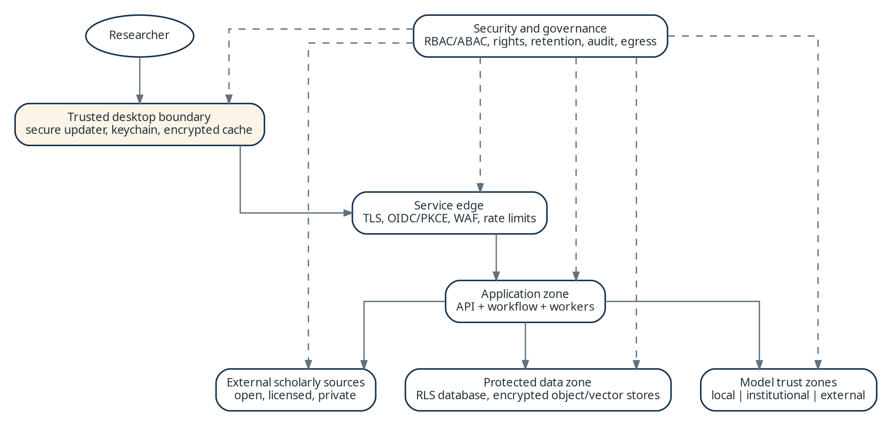

Figure 14. Trust zones and policy-enforced egress paths.

## 17.1 Threat priorities

| **Threat**                      | **Primary consequence**                                    | **Core controls**                                                                                                |
|---------------------------------|------------------------------------------------------------|------------------------------------------------------------------------------------------------------------------|
| Malicious or malformed document | Code execution, data exfiltration, resource exhaustion.    | Quarantine, content-type validation, malware scan, sandboxed parsing, no parser network, limits.                 |
| Desktop renderer compromise     | Access to tokens, files, or privileged commands.           | Tauri capabilities, strict CSP, no remote UI code, narrow IPC, signed updates, core-side authorization.          |
| Credential/token theft          | Source, project, or administration compromise.             | System credential vault, short-lived tokens, PKCE, sender constraints where possible, device/session revocation. |
| Cross-tenant access             | Disclosure or corruption of research data.                 | Tenant keys, RLS, workload identity, object/vector isolation, negative authorization tests, dedicated tiers.     |
| Prompt injection in papers/web  | Unauthorized tool use, data egress, false analysis.        | Treat content as data, not instructions; tool allowlists; typed workflow; egress policy; evidence verification.  |
| Model-provider leakage          | Confidential or licensed content leaves approved boundary. | Classification, minimization, local/private routes, provider contract metadata, deny-by-default routing.         |
| Supply-chain compromise         | Tampered desktop, plugin, model, container, or dependency. | Signing, SBOM, provenance, dependency scanning, pinned artifacts, staged rollout, rapid revocation.              |
| Insider/support misuse          | Unauthorized inspection or alteration.                     | Least privilege, no standing content access, just-in-time approval, immutable audit, session recording.          |
| Audit/provenance tampering      | Undermined reproducibility and scholarly defensibility.    | Append-only events, hashes, restricted writers, backups, external integrity checkpoints where required.          |

## 17.2 Desktop security boundary

• The webview contains no database, source, model, or filesystem credentials. It calls only allowlisted commands in the signed native shell.

• The local Core API binds to loopback on a random port, requires an ephemeral capability token, validates Origin/Host, and rejects remote interfaces. Where supported, a named pipe or domain socket is preferable.

• Project keys and OAuth refresh tokens are stored through the operating-system credential service; decrypted keys live only in locked process memory where practical.

• The sidecar and model binaries are signed and hash-verified. The updater validates signatures and supports staged rollout and rollback; development endpoints are absent in production builds.

• Third-party plugins, parsers, and local models run in separate processes with explicit filesystem and network grants. Arbitrary Python packages are not imported into the core runtime.

• The desktop uses the system browser and authorization-code flow with PKCE for remote sign-in; embedded credential collection is prohibited.

## 17.3 Identity and authorization

University and cloud servers use OpenID Connect federation, with SAML bridged through the institution identity provider when necessary. Authentication establishes a user and session; authorization is evaluated from tenant, project, role, assignment, resource classification, source entitlement, operation, and environmental policy. PostgreSQL row-level security provides defense in depth, not the sole policy layer.

| **Role class**              | **Typical permissions**                                                                          | **Explicit exclusions**                                                   |
|-----------------------------|--------------------------------------------------------------------------------------------------|---------------------------------------------------------------------------|
| Researcher / owner          | Create projects, configure modes, approve sources/models, adjudicate evidence and opportunities. | Cannot bypass tenant source, egress, retention, or legal policy.          |
| Reviewer / coder            | Access assigned corpus/evidence and submit decisions.                                            | No administration, policy change, or unrestricted export.                 |
| Librarian / methodologist   | Configure connectors/protocols, audit coverage, manage review governance.                        | No automatic access to private memos or unrelated projects.               |
| Lab / project administrator | Manage membership, assignments, budgets, project settings.                                       | No standing tenant security or raw credential access.                     |
| Tenant administrator        | Federation, policy templates, retention, connector/model catalog, audit.                         | No project content by default; elevated access requires purpose/approval. |
| Service workload            | Perform one activity class for authorized project/task queue.                                    | No interactive login, broad tenant enumeration, or unrelated secrets.     |
| Support operator            | Operational diagnostics under approved elevation.                                                | No standing content access; no unlogged impersonation.                    |

## 17.4 Encryption and key management

| **Asset / channel**       | **Desktop**                                                                                                                 | **University / cloud**                                                                                               |
|---------------------------|-----------------------------------------------------------------------------------------------------------------------------|----------------------------------------------------------------------------------------------------------------------|
| Network                   | Loopback capability channel; TLS for all remote services.                                                                   | TLS 1.3 preferred; service identity/mTLS for sensitive east–west paths.                                              |
| Canonical database        | Encrypted project container or field/object envelope encryption for sensitive content; OS full-disk encryption recommended. | Managed/dedicated encrypted volumes plus application envelope encryption for sensitive fields/tenant keys.           |
| Objects                   | Content-addressed encrypted files with project key and authenticated metadata.                                              | S3-compatible server-side encryption; tenant/dedicated keys or customer-managed keys by tier.                        |
| Backups / exports         | Encrypted archive with recovery key, manifest, and checksum.                                                                | Encrypted, access-controlled, region-bound, retention-tested; export uses recipient-specific encryption when needed. |
| Secrets                   | OS credential vault.                                                                                                        | Secrets manager/HSM/KMS; workload identity and automatic rotation.                                                   |
| Search/vector projections | Encrypted storage; purge/rebuild from canonical state.                                                                      | Encrypted service storage, tenant isolation, and deletion/rebuild verification.                                      |

## 17.5 Data classification and egress policy

| **Class**          | **Examples**                                                       | **Default egress**                                                                                      |
|--------------------|--------------------------------------------------------------------|---------------------------------------------------------------------------------------------------------|
| PUBLIC_METADATA    | DOI, public bibliographic metadata, open taxonomy.                 | Approved external scholarly APIs/models subject to terms.                                               |
| LICENSED_METADATA  | Database-enriched fields under contract.                           | Only destinations allowed by license; export restrictions retained.                                     |
| OPEN_FULL_TEXT     | Lawfully open article content with license.                        | Allowed routes compatible with license and project policy.                                              |
| LICENSED_FULL_TEXT | Subscribed or individually entitled documents.                     | Local/institutional processing unless contract explicitly permits provider use.                         |
| PRIVATE_RESEARCH   | Memos, ideas, proposals, unpublished manuscripts/data.             | Deny external provider by default; explicit project/tenant approval and no-training/no-retention route. |
| RESTRICTED         | Sensitive human data, contractual/government restriction, embargo. | Dedicated approved boundary only; may prohibit AI processing entirely.                                  |

Every document, passage, prompt fragment, embedding, generated output, export, and log inherits or derives a classification and rights record. The policy decision point evaluates destination, purpose, provider, model, region, user, project, and license before data moves. A denial is a visible, typed result—not a fallback to a different provider.

## 17.6 Prompt-injection and agent safety

• Source text, websites, PDFs, citations, and retrieved passages are untrusted content. Models are told and structurally constrained not to treat them as instructions.

• Agents receive only purpose-specific tools; tools validate project scope and policy independently of model text. There is no general shell, filesystem, email, or arbitrary URL tool in research workflows.

• External URLs are fetched by a controlled connector with SSRF protections, content limits, redirects/domain policy, and a complete request ledger.

• Model outputs are parsed against schemas, checked for unsupported identifiers/actions, and never directly executed as SQL, graph queries, code, or connector requests.

• High-consequence actions—source purchase, broad export, project transfer, ontology publication, novelty acceptance, and destructive retention—require explicit human authorization.

## 17.7 Rights and license enforcement

• Rights observations store source, license/contract identifier, entitlement basis, retrieval date, permitted purposes, sharing group, expiry, and machine/model restrictions.

• The platform separates bibliographic indexes and derived metadata from source files so permitted discovery can continue when full-text sharing is restricted.

• Document access is checked at view, download, model invocation, collaboration, export, and backup restore—not only at acquisition.

• A rights change can revoke access and mark derived artifacts restricted or stale. Deletion of derived data follows policy and is recorded without falsely claiming that published factual decisions never existed.

• Institutional connectors use brokered credentials or user delegation; passwords and database session tokens are not stored in project records.

## 17.8 Audit, disclosure, retention, and governance

• Append-only audit events cover authentication, authorization decisions, source access, policy changes, model egress, exports, support elevation, destructive operations, and human adjudication.

• Operational logs avoid prompts and passages by default. Content-level diagnostics require a separately classified artifact and restricted retention.

• Retention is class- and tenant-specific. Legal hold, project archive, user departure, and source-license expiry are explicit lifecycle states.

• Deletion erases canonical/private data, objects, caches, indexes, vector entries, queued work, and applicable backups under a documented schedule; tombstones preserve non-sensitive audit proof where lawful.

• Each export can include an AI-use disclosure enumerating search, screening, extraction, synthesis, ideation, models/versions, validation, and human responsibility.

• Ontology packs, model eligibility, detector releases, and source connectors follow governance workflows with owner, reviewers, evaluation evidence, effective dates, rollback, and deprecation.

OPERATIONAL QUALITY

# 18. Reliability, observability, performance, and cost

The system must remain trustworthy when connectors throttle, parsers fail, models drift, indexes lag, devices disconnect, or budgets are exhausted. Operational telemetry is therefore linked to scholarly provenance without routinely exposing scholarly content.

## 18.1 Observability architecture

OpenTelemetry provides vendor-neutral traces, metrics, and logs across desktop core, API, workflow, activities, connectors, parsers, models, indexes, and exports. A trace context follows each user command through workflow and derivation records; the canonical ModelInvocation and ConnectorCall remain the durable audit records, while telemetry is operational and retention-bounded.

| **Signal**                   | **Required dimensions**                                                                                              | **Examples**                                                                                |
|------------------------------|----------------------------------------------------------------------------------------------------------------------|---------------------------------------------------------------------------------------------|
| Traces                       | deployment, tenant/project opaque ID, operation, workflow/activity, model/connector, policy decision, result class.  | Search branch, parse job, extraction batch, novelty threat retrieval.                       |
| Metrics                      | latency, throughput, queue age, saturation, retries, failures, cache/index age, budget, quality, audit completeness. | p95 API latency; pages/hour; GPU utilization; stale outputs; citation-entailment pass rate. |
| Logs                         | structured event code, trace ID, component, severity, typed error, remediation; no content by default.               | PROVIDER_RATE_LIMITED, PARSE_OOM, RIGHTS_DENIED, REVISION_CONFLICT.                         |
| Quality telemetry            | benchmark version, model/schema/parser version, domain/mode, metric, calibration band.                               | Extraction F1, retrieval recall, page-anchor error, verifier disagreement.                  |
| Business/scholarly telemetry | privacy-preserving workflow outcomes and human actions.                                                              | Time to adjudication; candidates defeated; decisions reopened after new evidence.           |

## 18.2 Initial service objectives

These are architecture targets for production planning, not contractual commitments. They require validation under representative corpora, connectors, and hardware.

| **Objective**                  | **Initial target**                                                                                   | **Measurement / scope**                                                                    |
|--------------------------------|------------------------------------------------------------------------------------------------------|--------------------------------------------------------------------------------------------|
| Core API availability          | 99.9% monthly for university/cloud, excluding declared maintenance.                                  | Successful eligible requests at regional ingress; desktop measured by crash-free sessions. |
| Durable command acceptance     | 99.99% of acknowledged commands survive process restart.                                             | Fault-injection and recovery tests; no acknowledgement before durable commit.              |
| Interactive project navigation | p95 ≤ 800 ms for cached metadata/evidence views; p95 ≤ 2 s for uncached server views.                | Representative project sizes; excludes source PDF download.                                |
| Hybrid search response         | First ranked page p95 ≤ 3 s for indexed project corpora.                                             | Warm service, declared corpus tier; source connector retrieval reported separately.        |
| Operation status freshness     | p95 ≤ 2 s from workflow event to connected desktop.                                                  | SSE/delta path; offline clients explicitly excluded.                                       |
| Index freshness                | 95% of eligible changes searchable within 5 min server / 60 s desktop.                               | Watermark from canonical commit to projection visibility.                                  |
| Cloud/university recovery      | RPO ≤ 15 min and RTO ≤ 4 h baseline; stricter tiers configurable.                                    | Quarterly restore exercises across database, objects, workflow, keys, and manifests.       |
| Evidence traceability          | 100% of material generated claims resolve to accepted evidence or are labeled inference/unsupported. | Automated export audit plus sampled human review.                                          |

## 18.3 Failure and graceful degradation

| **Failure**                   | **Degraded behavior**                                                                           | **Recovery / user communication**                                              |
|-------------------------------|-------------------------------------------------------------------------------------------------|--------------------------------------------------------------------------------|
| Scholarly source unavailable  | Search other approved sources; retain branch as incomplete; never infer zero results.           | Retry respecting provider rules; show coverage hole and last successful state. |
| Parser failure                | Metadata/source viewer remains; alternate parser or partial pages may proceed at lower quality. | Quarantine diagnostics; quality tier blocks high-confidence extraction.        |
| Vector service unavailable    | Lexical, fielded, and citation retrieval continue; semantic features disabled.                  | Rebuild/reconnect projection; banner identifies affected functions.            |
| Graph projection unavailable  | Canonical relation tables and evidence remain; advanced graph exploration disabled.             | Rebuild from canonical events/manifests.                                       |
| Model endpoint unavailable    | Use only policy-approved fallback; otherwise queue/pause without changing task semantics.       | Show route change and reproducibility impact; frozen runs require approval.    |
| Workflow engine interruption  | Accepted work resumes from durable history/checkpoint.                                          | Automatic recovery; dead-letter state visible after bounded retry.             |
| Object store unavailable      | Metadata commands may proceed; document/evidence operations requiring bytes pause.              | No partial canonical commit; checksum verification after recovery.             |
| Budget/quota exhausted        | Pause new billable activities; completed work and human review remain accessible.               | Explain estimate, incurred cost, and approval path.                            |
| Identity provider unavailable | Existing short-lived sessions may continue under policy; new sign-in fails closed.              | No local password fallback on institutional/cloud deployments.                 |

## 18.4 Performance and capacity strategy

• Partition work into document, page, passage, record, or candidate batches with bounded memory. Backpressure begins at admission, not after a worker is exhausted.

• Cache immutable source metadata, parse products, embeddings, and deterministic derivations by content/version fingerprint; never cache an authorization decision beyond its safe policy TTL.

• Keep interactive paths separate from batch queues. User commands, viewing, and small searches receive reserved capacity; bulk parsing, embedding, and monitoring use budgeted background queues.

• Use PostgreSQL partitioning and read replicas only after measured need. Add OpenSearch or a graph engine as a projection when query profiles justify operational cost.

• Quantize and batch local models within quality gates; allow CPU fallback for small tasks, but do not silently substitute a lower-quality model for consequential verification or novelty analysis.

• Precompute project-level graph summaries, coverage cubes, and cluster layouts with explicit freshness while retaining drill-through to canonical evidence.

• Capacity tests use realistic distributions: long PDFs, scanned documents, high-citation works, large systematic reviews, many concurrent lab users, and bursty monitoring updates.

## 18.5 Workload classes and admission control

| **Class**          | **Examples**                                               | **Admission controls**                                                   |
|--------------------|------------------------------------------------------------|--------------------------------------------------------------------------|
| Interactive        | Open project, inspect passage, save decision, query graph. | Reserved concurrency; short timeout; no accelerator monopolization.      |
| Search / connector | Database query, citation expansion, OA resolution.         | Provider token bucket, fair queue, query budget, circuit breaker.        |
| Document compute   | Download, malware scan, parse, OCR, table extraction.      | Bytes/pages/memory limits; sandbox slots; quarantine.                    |
| Model batch        | Embedding, extraction, verification, reranking.            | Tokens/GPU minutes, model eligibility, tenant/project quota, batching.   |
| Analytical batch   | Clustering, detector ensemble, novelty challenge.          | Corpus-size estimate, reproducibility freeze, explicit budget, priority. |
| Maintenance        | Index rebuild, backup, retention, evaluation.              | Scheduled windows, rate caps, preemption by interactive work.            |

## 18.6 Cost attribution and controls

Every activity records normalized units—records, pages, bytes, tokens, accelerator seconds, connector calls, storage and egress—plus monetary cost when known. Costs roll up by project, workspace, tenant, capability, model, and workflow. Estimates are shown before large runs; hard and soft budgets can pause work; cached reuse is disclosed so cost comparisons remain meaningful.

• Desktop: emphasize local CPU/RAM/disk estimates, optional model download size, and external API spend; no artificial per-paper metering.

• University: expose shared infrastructure utilization, chargeback tags, GPU queue use, and licensed connector limits without disclosing project content to operations dashboards.

• Cloud: tenant quotas and metering are enforced in the data plane; billing receives aggregated usage, not prompts, passages, or titles.

• Quality is not automatically traded for cost. A lower-cost route must meet the task’s evaluation gate and data policy, or the system asks the user to change scope/budget.

BUILD AND RUN DISCIPLINE

# 19. Delivery, testing, and operational lifecycle

## 19.1 Release sequence

| Wave | Architecture focus | Gate |
|---|---|---|
| W0 | Repository, ADR and boundary checks, capability-campaign task control, fixtures, approved UI/workflow reference | G0 |
| W1-W5 | Complete Windows local product from runtime through scholarly reasoning, novelty, packaging, security, recovery, and pilot | G1-G5 |
| W6 | macOS Apple Silicon, Linux x86_64, Linux ARM64 builds; platform security; sidecars; GPU/model adapters; project portability; release packages | G6 |
| W7 | Production critical/hermeneutic support, study-design domain, protocol workflows, article blueprint and venue-profile foundation | G7 |
| W8 | Technical-report/result ingestion, source-grounded manuscript production, reviewer simulation, revision and response | G8 |
| W9 | Advanced plural opportunity detectors, transparent portfolio ranking, convergence monitoring, and living research-intelligence preview | G9 |
| W10 | University-hosted services, identity, collaboration, licensed sources, and operations | G10 |
| W11 | Managed cloud tenancy, metering, regional isolation, and operations | G11 |

No W10/W11 infrastructure is scaffolded during W0-W8 except stable deployment-neutral ports required by active desktop tasks. Cross-platform desktop qualification is a release gate, not a best-effort portability promise.

## 19.2 Continuous integration and release artifacts

Fast CI validates formatting, typing, unit tests, schemas, architecture direction, backlog/campaign state, experience-reference hashes, and supply-chain policy. Windows desktop CI is required through G5. W6 adds Apple Silicon macOS and Linux x86_64/ARM64 build, package, installer, sidecar, credential-store, migration, backup/restore, offline, accessibility, and end-to-end matrices. W7-W8 add study-design, result, manuscript, and reviewer benchmark profiles. Server and cloud pipelines activate only in W10 and W11.

Every release emits application, sidecar, parser/model bundle where applicable, installer/package, SBOM, dependency/license report, provenance/build manifest, hashes, upgrade/rollback instructions, and qualification evidence. Platform signing differs, but release identity, project compatibility, and analytical behavior remain common.

## 19.3 Platform support baseline

- **Windows x64:** primary W1-W5 implementation and release baseline.
- **macOS Apple Silicon:** notarized package, Keychain integration, sidecar lifecycle, file permissions, local model/parser/vector compatibility, update and recovery qualification in W6.
- **Linux x86_64:** supported Ubuntu-compatible desktop package(s), Secret Service or approved equivalent, sidecar/system dependency checks, GPU/CPU fallback, update and recovery qualification in W6.
- **Linux ARM64:** supported Ubuntu-compatible ARM64 package with native sidecars and dependencies. NVIDIA DGX Spark-class lab systems are a required representative profile when available; the implementation must not assume x86_64 and must detect rather than presume CUDA/GPU capability.

NVIDIA documents DGX Spark as an ARM64 Grace Blackwell system running DGX OS/Ubuntu-based software; the platform therefore treats it as a Linux ARM64 target with optional NVIDIA acceleration rather than a separate product fork. See NVIDIA DGX Spark system overview, DGX OS release notes, and porting guide: https://docs.nvidia.com/dgx/dgx-spark/ ; https://docs.nvidia.com/dgx/dgx-os-7-user-guide/release_notes.html ; https://docs.nvidia.com/dgx/dgx-spark-porting-guide/

# 20. Version 1.3 research-production architecture

## 20.1 Domain expansion

The stable domain core adds the following aggregate families without turning manuscripts into opaque generated files:

| Aggregate family | Principal objects |
|---|---|
| Study design | StudyDesign, DesignAlternative, ResearchQuestion, HypothesisOrProposition, SamplingPlan, MeasurementPlan, ProcedurePlan, AnalysisPlan, ValidityThreat, EthicsPlan, DataManagementPlan, PreregistrationPlan |
| Study execution and results | StudyRun, TechnicalReport, ReportRevision, ProtocolDeviation, ResultRecord, Estimate, UncertaintyInterval, TestResult, QualitativeFinding, TableArtifact, FigureArtifact, AnalysisArtifact, ResultVerification |
| Article architecture | VenueProfile, ArticleType, ManuscriptProject, ManuscriptBlueprint, SectionPlan, ClaimPlan, EvidenceRequirement, ExhibitPlan, WordBudget, SubmissionRequirement |
| Manuscript | ManuscriptSnapshot, SectionDraft, ParagraphBlock, ManuscriptClaim, CitationLink, ResultLink, AuthorContribution, AIDisclosure, ExportArtifact |
| Review and revision | ReviewConfiguration, ReviewRound, ReviewerRole, ReviewReport, ReviewComment, EditorialSynthesis, AuthorDisposition, RevisionAction, ManuscriptDiff, ResponseItem, ReReviewResult |

All objects use stable IDs, versioned schemas, project-home ownership, typed provenance, rights/privacy labels, and dependency edges. A manuscript claim can depend on literature evidence, verified result records, researcher memos/interpretations, or combinations of those source classes, but the classes are never collapsed.

## 20.2 Study-design service

The Study Design service consumes a research intent, bounded opportunity dossier, accepted theory/construct/measurement records, comparable prior designs, researcher constraints, and ethics/data policy. It produces multiple typed alternatives and a human-approved protocol. Design generation and design challenge are separate roles. The challenger tests construct validity, causal identification, sampling, measurement, analysis, feasibility, ethics, robustness, and contribution alignment.

Protocol completeness is schema- and mode-sensitive. Experimental, quasi-experimental, observational, survey, qualitative, mixed-method, design-science, computational, and technical benchmark packs may extend the core. The system proposes power or precision analysis only when the necessary assumptions are explicit and supported; otherwise it records an unresolved requirement.

## 20.3 Technical-report and result pipeline

Private study materials enter a dedicated report-ingestion boundary:

```text
local upload / approved institutional source
        ↓ quarantine, malware/type checks, rights/privacy classification
immutable report revision and study-run association
        ↓ native parsing or isolated document parser
methods, tables, figures, results, limitations, deviations, and anchors
        ↓ schema-constrained extraction
independent verification or researcher adjudication
        ↓
verified ResultRecord graph and manuscript-eligible evidence packet
```

The extractor may record only reported content or calculations whose inputs, formula, software/version, and output are reproducible. Missing values remain missing. Conflicts across reports, analysis outputs, or manuscript drafts remain disputed until adjudicated. Technical reports are private by default and excluded from remote model egress unless a researcher explicitly approves a provider, fields, and redaction preview.

## 20.4 Manuscript blueprint and drafting architecture

A Manuscript Blueprint is required before long-form generation. It binds the article type and target venue profile to section purposes, planned claims, evidence prerequisites, word budgets, tables/figures, counterarguments, reporting checklists, disclosure, and unresolved gates. Venue profiles may be generic, researcher-authored, or verified from an allowed source; the system does not fabricate venue requirements.

The drafting pipeline operates section by section:

```text
approved blueprint section
 + accepted literature evidence packet
 + verified result packet when empirical
 + researcher-owned interpretation/memos
 + style/venue constraints
        ↓ constrained drafting agent
claim/citation/result validator
        ↓ author review and edit
versioned section draft and dependency graph
```

A validator rejects nonexistent citations, unsupported quantitative statements, mismatched result directions, unreported sample/method details, and claims beyond approved scope. Drafting can be local or remote through the model gateway, but egress, provider, retention, and disclosure policy are evaluated per input object.

## 20.5 Reviewer simulation and revision architecture

A review round freezes an immutable manuscript snapshot, venue/article profile, available evidence, and reviewer configuration. Reviewer roles execute independently with separate context budgets and no access to one another’s preliminary reports. Role outputs use a typed comment schema: location, issue type, severity, rationale, requested action, supporting manuscript/evidence/result passages, confidence, and unresolved uncertainty.

Only after independent reports complete does the Editor Synthesizer cluster overlapping issues, expose disagreements, identify blocking and optional changes, and draft a provisional editorial memo. It never predicts acceptance probability or represents the output as an actual journal decision. Named real-reviewer imitation is prohibited.

Revision is a governed workflow. Each comment receives an author disposition—accept, partially accept, decline, defer, or not applicable—with rationale. Revision actions link the old and new passages, evidence changes, response text, and targeted re-review. The original snapshot and all declined or unresolved comments remain immutable.

## 20.6 New services and ports

Stable service boundaries now include StudyDesign, Protocol, TechnicalReport, ResultRecord, ManuscriptBlueprint, Manuscript, ReviewerSimulation, EditorialSynthesis, Revision, and PublicationPackage. New ports include PlatformServices, CredentialStore, AccelerationDiscovery, StudyDesignEngine, StatisticalComputation, ReportParser, ResultVerifier, VenueProfileResolver, ManuscriptRenderer, CitationResultValidator, ReviewRoleRunner, and DocumentExport.

The local implementation remains a modular monolith plus supervised workers. Service extraction is not justified merely because a new aggregate exists. University/cloud versions reuse the same contracts and may distribute workers only when scale, isolation, or operations require it.

## 20.7 Security, privacy, rights, and authorship

Technical reports, unpublished results, manuscripts, reviews, and research ideas are high-sensitivity project content. Default policy is local-only storage and local-model processing where available. Any remote egress requires object-level classification, provider allowlisting, a payload/redaction preview, project or institutional policy approval, auditable consent, and provider-retention compatibility.

Untrusted document content is data, never instruction. Report/manuscript text cannot modify prompts, tools, workflow state, source policy, or reviewer configuration. Statistical code or artifacts execute only in a restricted, resource-bounded environment with explicit approval. Publication packages include source/citation checks, result lineage, AI-use disclosure, authorship contribution records, rights status, and reproducibility manifests.

## 20.8 Events and selective recalculation

New domain events include StudyDesignApproved, ProtocolRevised, TechnicalReportAdded, ReportRevisionSuperseded, ResultVerified, ResultDisputed, BlueprintApproved, ManuscriptSectionUpdated, ClaimBlocked, ReviewRoundStarted, ReviewCompleted, EditorialSynthesisCreated, AuthorDispositionRecorded, RevisionApplied, ReReviewCompleted, and PublicationPackageExported.

A changed evidence record may stale a design rationale, blueprint claim, manuscript paragraph, review conclusion, or response. A changed report/result may stale empirical claims, tables, figures, discussion, abstract, review comments, and publication packages. Recalculation is dependency-driven and never silently overwrites researcher-approved text or decisions.

## 20.9 Evaluation and production readiness

Component tests cover schema validity, source/result entailment, computation reproducibility, citation correctness, reviewer-role independence, and diff lineage. End-to-end gold projects cover empirical study-to-article, empirical results-to-article, theory article, critical article, and manuscript review/revision. Production gates require expert evaluation, negative/failure cases, restart/cancellation/recovery, privacy and egress denials, no-fabrication tests, cross-platform equivalence, and independent review.

# Appendix A. Component catalog

The catalog defines deployable or logical components. Several server modules remain in one Core API process until measured triggers justify extraction.

| **Component**           | **Responsibility**                                                                    | **Deployment / authority**                                                |
|-------------------------|---------------------------------------------------------------------------------------|---------------------------------------------------------------------------|
| Desktop shell           | Windowing, native menus, file dialogs, secure update, deep links, OS integration.     | Tauri on each PC; no scholarly authority.                                 |
| Research UI             | Project workspaces, evidence/graph/novelty interfaces, offline UX, accessibility.     | React/TypeScript webview; untrusted relative to core.                     |
| Desktop supervisor      | Launch/health/restart signed sidecars, capability token, local endpoint discovery.    | Native Tauri/Rust process.                                                |
| Core API                | Commands, queries, domain modules, authorization, policy, orchestration entry.        | Local sidecar or server modular monolith; canonical transaction boundary. |
| Local durable executor  | Persist/run local workflows, timers, leases, retries, human tasks.                    | Desktop sidecar; canonical local workflow state.                          |
| Server workflow service | Durable orchestration, schedules, signals, retries, task queues.                      | Temporal cluster/service; workflow history authority.                     |
| Worker host             | Execute parsing, connector, embedding, extraction, verification, analysis activities. | Local subprocess or isolated server workers.                              |
| Canonical repository    | Projects, records, decisions, evidence, relations, provenance, operations.            | SQLite local / PostgreSQL server; system of record.                       |
| Object repository       | Immutable permitted assets, parses, page images, snapshots, exports.                  | Encrypted local store / S3-compatible server.                             |
| Lexical projection      | Fielded/phrase search and facets.                                                     | SQLite FTS5/PostgreSQL FTS; optional OpenSearch at scale.                 |
| Vector projection       | Dense/sparse passage and work retrieval.                                              | Embedded local adapter / Qdrant service; rebuildable.                     |
| Graph projection        | Optimized traversal/visualization/semantic interoperability when needed.              | PostgreSQL first; optional Neo4j/RDF; rebuildable.                        |
| Connector gateway       | Rate limits, credentials, source adapters, request ledger, entitlements.              | Core + isolated adapters; external APIs.                                  |
| Document service        | Acquisition, quarantine, parsing selection, normalization, anchors, quality.          | Core coordinator + sandboxed parser/OCR workers.                          |
| Model gateway           | Capability routing, policy/rights, structured output, usage, registry/evaluation.     | Local facade / private server service; all inference.                     |
| Evaluation registry     | Benchmarks, domains/modes, metrics, thresholds, eligibility and regressions.          | Canonical server/local artifacts; governance authority.                   |
| Policy decision point   | Identity, role, assignment, rights, classification, provider, region, purpose.        | Core API and gateway enforcement; policy versions canonical.              |
| Synchronization service | Project deltas, offline commands, cache policy, device/session state.                 | Server Core API + desktop client cache.                                   |
| Monitoring service      | Scheduled discovery, differential ingestion, impact/staleness, notifications.         | Server always-on; local while scheduler active.                           |
| Control plane           | Tenant lifecycle, region, entitlement, catalog, quota/billing, deployment operations. | Cloud only; no routine project content.                                   |
| Admin console           | Identity/source/model/policy/retention/audit/operations administration.               | University/cloud web UI; separate from researcher workspace.              |
| Telemetry pipeline      | Collect/redact/export traces, metrics, logs, alerts and quality telemetry.            | OpenTelemetry agents/collector and approved backend.                      |

REFERENCE

# Appendix B. Core data entities

The canonical schema stores scholarly meaning, process state, rights, and derivation. The table is illustrative; detailed logical and physical data models should be generated from domain specifications and migrations.

| **Entity**                            | **Purpose**                                                                                 | **Key invariants**                                                                         |
|---------------------------------------|---------------------------------------------------------------------------------------------|--------------------------------------------------------------------------------------------|
| Tenant / Workspace                    | Administrative, security, budget, and collaboration boundary.                               | Every server project belongs to one tenant; tenant policy cannot be weakened by a project. |
| Project                               | Authoritative research environment and deployment generation.                               | One writable home per generation; stable global ID; versioned lifecycle.                   |
| ResearchIntent                        | Mode, objective, scope, evidence standard, autonomy, stopping, novelty standard.            | Every consequential run references an effective version.                                   |
| OntologyPack                          | Types, relations, schemas, constraints, mappings, comparability and detector configuration. | Versioned; small stable core; original source language retained.                           |
| ScholarlyWork / WorkVersion           | Canonical work and observed manifestations/versions.                                        | Source observations remain; merge/split reversible; corrections/retractions linked.        |
| SourceObservation                     | What a connector/database reported and how discovered.                                      | Source, query/path, retrieval date, raw response hash, rights, confidence.                 |
| DocumentAsset                         | Permitted immutable bytes/location and classification.                                      | Hash, media type, rights, encryption/object reference; no overwrite.                       |
| ParsedDocument / Element              | Normalized structure, pages, coordinates, references, tables, figures, text.                | Parser/input fingerprint; stable element IDs within parse; quality tier.                   |
| Corpus / Membership                   | Project set of works and inclusion provenance.                                              | Membership is versioned and references protocol/decision.                                  |
| SearchRun / Branch                    | Reproducible query plan, retrieval signals, indexes/models, results and discovery tree.     | Original query preserved; translations/weights/cutoff explicit.                            |
| ScreeningProtocol / Decision          | Inclusion/exclusion criteria, reviewer result, reason, conflicts, stopping assessment.      | Decisions append; actor/protocol/revision; no model overwrite.                             |
| ExtractionSchema                      | Project/method-specific evidence fields and validation.                                     | Versioned; supports observed/not reported/unclear/inferred states.                         |
| EvidenceRecord                        | Source-grounded structured statement or field.                                              | Exact element/span; extraction derivation; confidence; verification; status.               |
| Entity / GraphRelation                | Normalized concept/actor/method/context and typed relationship.                             | Relation directional, source-grounded or labeled inference, disputable, versioned.         |
| Interpretation / Adjudication         | Machine/human alternative reading and accepted decision/rationale.                          | Alternatives retained; acceptance names actor/date/evidence/dependents.                    |
| ComparisonSet                         | Comparable studies/claims and normalization dimensions.                                     | Inclusions/exclusions and mapping versions explicit.                                       |
| Derivation                            | Input-to-output transformation fingerprint and dependencies.                                | Immutable; code/model/prompt/schema/policy versions; supports staleness.                   |
| DetectorRun / OpportunityCandidate    | Typed signal, evidence packet, mechanism, score vector, uncertainty.                        | Candidate version sealed before novelty challenge.                                         |
| NoveltyAudit / PriorWorkThreat        | Challenge protocol, searches, nearest prior work, overlaps, counterevidence, outcome.       | Independent workflow identity; threat evidence and residual limits required.               |
| Dossier                               | Reviewer-defensible opportunity package and bounded novelty statement.                      | Depends only on accepted versions; human approval state; monitoring rules.                 |
| WorkflowRun / ActivityRun / HumanTask | Durable execution, retries, budgets, state and human gates.                                 | Idempotency, typed errors, immutable history, cancellation/freeze semantics.               |
| ModelInvocation / ConnectorCall       | External/local analytical or retrieval invocation.                                          | Policy, inputs by reference/hash, version, usage, response hash, trace, result class.      |
| RightsRecord / DataClassification     | Entitlement, license, use/share/model/export/expiry constraints.                            | Travels with asset and derivatives; evaluated at every egress.                             |
| AuditEvent                            | Security, governance, access, export, support and scholarly decision trail.                 | Append-only; restricted writers; content minimized.                                        |
| MonitoringRule / ImpactAssessment     | Future query/graph conditions and effect on accepted outputs.                               | Rule/version/cutoff; affected dependencies; human review state.                            |

REFERENCE

# Appendix C. API and event summary

Commands are asynchronous when work can exceed an interactive request or require human intervention. Domain events inform projections and monitoring; they are not a public license to reconstruct restricted content.

## C.1 Operation state model

| **State**         | **Meaning**                                                                | **Allowed transitions**                                            |
|-------------------|----------------------------------------------------------------------------|--------------------------------------------------------------------|
| ACCEPTED          | Command durably validated and queued.                                      | RUNNING, WAITING_FOR_HUMAN, PAUSED, CANCELLED, FAILED.             |
| RUNNING           | One or more workflow activities are active or runnable.                    | WAITING_FOR_HUMAN, PAUSED, CANCELLING, SUCCEEDED, FAILED.          |
| WAITING_FOR_HUMAN | A typed task/approval is required.                                         | RUNNING, PAUSED, CANCELLED, FAILED.                                |
| PAUSED            | Policy, budget, dependency, schedule, or administrator paused work.        | RUNNING, CANCELLED, FAILED.                                        |
| CANCELLING        | Cancellation requested; cooperative activities closing.                    | CANCELLED, FAILED.                                                 |
| SUCCEEDED         | Declared outputs committed and integrity checks complete.                  | Terminal; new work is a new operation/version.                     |
| FAILED            | Typed unrecovered failure after policy/retry behavior.                     | RETRYING by explicit/new command, or terminal.                     |
| CANCELLED         | No further activities; completed immutable outputs retained as incomplete. | Terminal; resume creates a new operation or workflow continuation. |

## C.2 Event envelope

<table>
<colgroup>
<col style="width: 100%" />
</colgroup>
<thead>
<tr class="header">
<th><p><strong>Illustrative domain event</strong></p>
<p>{<br />
"event_id": "01J...",<br />
"event_type": "EvidenceRecord.VerificationCompleted",<br />
"event_version": 2,<br />
"occurred_at": "2026-08-06T14:30:00Z",<br />
"tenant_id": "01J...",<br />
"project_id": "01J...",<br />
"project_generation": 4,<br />
"aggregate_id": "01J...",<br />
"aggregate_revision": 8,<br />
"actor": {"type": "workload", "id": "evidence-verifier"},<br />
"trace_id": "...",<br />
"classification": "PRIVATE_RESEARCH",<br />
"payload": {<br />
"verification_id": "01J...",<br />
"verdict": "SUPPORTED_WITH_QUALIFICATION",<br />
"source_element_ids": ["01J..."],<br />
"derivation_id": "01J..."<br />
}<br />
}</p></th>
</tr>
</thead>
<tbody>
</tbody>
</table>

## C.3 Error classes

| **Class**              | **HTTP / operation behavior**                                    | **Examples**                                                                            |
|------------------------|------------------------------------------------------------------|-----------------------------------------------------------------------------------------|
| VALIDATION             | 4xx; command rejected before durable acceptance.                 | Invalid query syntax, missing required scope, incompatible schema.                      |
| AUTHENTICATION         | 401; refresh/re-authenticate; no fallback.                       | Expired/invalid token, revoked device.                                                  |
| AUTHORIZATION / POLICY | 403; visible rule and remediation where safe.                    | Role denied, egress prohibited, region/provider not allowed.                            |
| RIGHTS / ENTITLEMENT   | 403 or human task; never bypassed by another route.              | Full-text use, sharing, export, expired subscription.                                   |
| CONFLICT               | 409/412; authoritative revision and typed conflicting fields.    | Concurrent decision, project generation change, stale candidate.                        |
| RATE_LIMIT / BUDGET    | 429 or PAUSED; retry-after/approval details.                     | Source quota, model tokens, project spend, GPU queue.                                   |
| DEPENDENCY_UNAVAILABLE | 503 or workflow retry/pause.                                     | Connector, model, object store, index, identity provider.                               |
| QUALITY_GATE           | Operation failed or waits for review; technical result retained. | Low parse quality, extraction confidence, benchmark ineligibility.                      |
| INTEGRITY              | Fail closed and alert.                                           | Checksum mismatch, provenance break, invalid signature, projection generation mismatch. |
| INTERNAL               | 500 or failed activity with trace ID; content-safe message.      | Unexpected code error; detailed diagnostics restricted.                                 |

## C.4 High-value domain events

| **Aggregate**           | **Events**                                                                                                     |
|-------------------------|----------------------------------------------------------------------------------------------------------------|
| Project                 | ProjectCreated, IntentVersionActivated, ProjectFrozen, ProjectTransferred, ProjectArchived.                    |
| Work / Corpus           | WorkObserved, CanonicalMergeProposed, CanonicalMergeAdjudicated, CorpusMembershipChanged.                      |
| Document                | AssetRegistered, AcquisitionBlocked, ParseCompleted, ParseQualityChanged, RightsChanged.                       |
| Search / Screening      | SearchBranchCompleted, CoverageChanged, ScreeningDecisionSubmitted, ConflictOpened, StoppingApproved.          |
| Evidence / Graph        | EvidenceExtracted, VerificationCompleted, RelationProposed, RelationDisputed, AdjudicationRecorded.            |
| Opportunity / Novelty   | CandidateGenerated, CandidateSealed, ChallengeCompleted, ThreatAdded, CandidateStatusChanged, DossierApproved. |
| Operations / Governance | ModelEligibilityChanged, PolicyActivated, BudgetThresholdReached, SecurityIncidentLinked, RetentionApplied.    |
| Monitoring              | NewWorkMatched, AcceptedClaimAffected, NoveltyThreatDetected, OutputMarkedStale, ReviewCompleted.              |

REFERENCE

# Appendix D. Deployment configuration baselines

Baselines describe production intent and dependency shape. Hardware sizing must be validated against corpus size, users, document mix, models, and institutional standards rather than copied as universal minimums.

## D.1 Individual desktop / laboratory workstation

| **Area**          | **Baseline**                                                                                                                                     | **Notes**                                                                                                                                                   |
|-------------------|--------------------------------------------------------------------------------------------------------------------------------------------------|-------------------------------------------------------------------------------------------------------------------------------------------------------------|
| Operating systems | Windows 11 x64 is the first release-authoritative desktop target; macOS ARM64 and Linux x64/ARM64 become qualified desktop targets in W6.                                                                                        | Signed native installers and updates; no Docker prerequisite.                                                                                               |
| UI/runtime        | Tauri 2 + React/TypeScript; signed Python Core API/worker sidecars.                                                                              | Single-user local project authority or remote client mode.                                                                                                  |
| Storage           | SQLite WAL/FTS5; ADR-selected protected database profile; encrypted content-addressed object directory; ADR-selected embedded vector projection. | Project-level backup/export; exact search remains available; indexes are rebuildable.                                                                       |
| Memory/CPU        | 8 GB supported for metadata/review; 16–32 GB recommended for large corpora/parsing/local inference.                                              | Admission control adapts concurrency; model requirements separately declared.                                                                               |
| GPU               | Optional.                                                                                                                                        | Local llama.cpp or specialized acceleration; external/institutional route available by policy.                                                              |
| Disk              | Application \<2 GB excluding models; project and model use shown before acquisition.                                                             | Quotas/cleanup for caches, parse products, embeddings, models, backups.                                                                                     |
| Networking        | None required for existing local corpus; connectors/remote projects require network.                                                             | Offline results disclose cache/corpus limits.                                                                                                               |
| Security          | OS account/vault, protected project database/objects, loopback capability, sandboxed tools, signed updates.                                      | Windows credential-backed key handling is required before external release; full-disk encryption and managed endpoint are strongly recommended for lab PCs. |

## D.2 University in-house baseline

| Research clients         | Same signed desktop application in remote mode; managed deployment optional.                                                 | VDI/lab deployment supported; cache policy centrally controlled.                                                           |
|--------------------------|------------------------------------------------------------------------------------------------------------------------------|----------------------------------------------------------------------------------------------------------------------------|
| **Deployment substrate** | **Hardened OCI containers on one institution-controlled server using Compose or Podman for the reference pilot.**            | **Kubernetes/Helm only through an institutional topology ADR; add clustering/HA when measured requirements justify it.**   |
| Research clients         | Same signed desktop application in remote mode; managed deployment optional.                                                 | VDI/lab deployment supported; cache policy centrally controlled.                                                           |
| Ingress / identity       | TLS reverse proxy/API gateway; institutional OIDC; Keycloak only if federation/broker needed.                                | Redundant ingress and identity dependencies per university standard.                                                       |
| Core API                 | One stateless modular-monolith instance for the reference pilot.                                                             | Scale to 2+ replicas and extract only measured hotspots/security boundaries.                                               |
| Database                 | Institution-managed or managed PostgreSQL with tested backups/PITR; pilot may be single-instance under institutional policy. | HA, replicas, and partitioning after measured need; RLS remains defense in depth.                                          |
| Objects                  | Institutional S3-compatible storage with versioning/encryption/retention.                                                    | Replicate across failure domains under policy.                                                                             |
| Workflow                 | Single-node or institution-provided durable workflow service for pilot, conformant with local workflow contracts.            | HA cluster/service when availability and scale require it; queues separated by capability and policy.                      |
| Workers                  | Separate connector, parser, model, and analytical pools.                                                                     | Scale by queue; sandbox untrusted document processing; GPU pool optional.                                                  |
| Models                   | Private vLLM endpoints and/or approved external providers through gateway.                                                   | Dedicated endpoints by data class/research center; registry/evaluation required.                                           |
| Search/vector            | PostgreSQL FTS + Qdrant; optional OpenSearch when measured.                                                                  | Backups/manifests; all projections rebuildable.                                                                            |
| Observability            | OpenTelemetry collector into institutional metrics/log/trace platform.                                                       | Content-redacted by default; project/tenant operational views.                                                             |
| Administration           | Minimum institutional administration surface for projects, catalogs, policy, audit, retention, and budgets.                  | Separate admin console only when W10 requirements justify it; separation of duties and just-in-time content support access. |

## D.3 Managed cloud baseline

| **Plane / service**  | **Baseline**                                                                                  | **Isolation / resilience**                                                            |
|----------------------|-----------------------------------------------------------------------------------------------|---------------------------------------------------------------------------------------|
| Global control plane | Tenant, subscription, region, entitlement, catalog, deployment lifecycle.                     | Opaque project references; multi-region control recovery; no routine tenant content.  |
| Regional data plane  | Ingress, Core API, workflow, workers, PostgreSQL, objects, vector, models/gateway, telemetry. | All tenant content remains in selected region; independent failure containment.       |
| Standard tenant      | Shared services, row/collection/object isolation, per-tenant keys/quotas.                     | RLS, workload identity, negative tests, fair scheduling, encrypted storage.           |
| Institutional tenant | Dedicated database/bucket/key options and reserved compute.                                   | Configurable retention, federation, provider/model, egress, support.                  |
| Dedicated tier       | Dedicated data plane/account/project and optional private connectivity.                       | Strongest isolation; customer-managed keys/private models available.                  |
| Deployment           | Kubernetes with GitOps/IaC, autoscaling, disruption budgets, signed images/SBOM.              | Multiple zones; canary releases; policy-aware worker pools.                           |
| Data protection      | PITR, object versions, encrypted backups, restore testing; region policy.                     | Cross-region only with customer authorization; immutable audit/integrity checkpoints. |
| Metering             | Usage events for storage, calls, tokens, accelerator, egress, operations.                     | Billing receives aggregates; project content excluded.                                |

## D.4 Environment separation

| **Environment**     | **Data**                                                             | **External access**                                                                        | **Purpose**                                                |
|---------------------|----------------------------------------------------------------------|--------------------------------------------------------------------------------------------|------------------------------------------------------------|
| Developer           | Synthetic/rights-cleared fixtures only.                              | Mock/sandbox connectors and models by default.                                             | Fast local development and unit/contract testing.          |
| Research evaluation | Versioned benchmark corpora with explicit rights.                    | Approved endpoints; results isolated from production eligibility decisions until reviewed. | Model/parser/detector experiments and DSR studies.         |
| Staging             | Production-like synthetic/consented data; no silent production copy. | Provider sandbox/test accounts where possible.                                             | Upgrade, failure, security, capacity, DR rehearsal.        |
| Production          | Tenant/project data under active policy.                             | Only cataloged sources/models/connectors.                                                  | Live scholarly work; strict change/audit/support controls. |

REFERENCE

# Appendix E. Technology references

These official sources ground the selected implementation patterns. Technologies remain replaceable behind stable domain interfaces and must be reevaluated at implementation time.

**\[T1\] Tauri 2 — Embedding external binaries (sidecars).** Desktop sidecar packaging and execution. [<u>Source</u>](https://v2.tauri.app/develop/sidecar/)

**\[T2\] Tauri 2 — Updater plugin.** Signed desktop update mechanism. [<u>Source</u>](https://v2.tauri.app/plugin/updater/)

**\[T3\] FastAPI — Features and OpenAPI integration.** Typed Python application API and generated OpenAPI. [<u>Source</u>](https://fastapi.tiangolo.com/features/)

**\[T4\] PostgreSQL — Row security policies.** Server-side defense-in-depth for tenant/project rows. [<u>Source</u>](https://www.postgresql.org/docs/current/ddl-rowsecurity.html)

**\[T5\] pgvector — Vector similarity search for PostgreSQL.** Optional/simple vector projection and evaluation baseline. [<u>Source</u>](https://github.com/pgvector/pgvector)

**\[T6\] SQLite — FTS5 extension.** Local lexical and fielded search foundation. [<u>Source</u>](https://www.sqlite.org/fts5.html)

**\[T7\] Qdrant documentation.** Replaceable vector service for university and cloud profiles. [<u>Source</u>](https://qdrant.tech/documentation/)

**\[T8\] Temporal documentation.** Durable server workflow execution and recovery. [<u>Source</u>](https://docs.temporal.io/)

**\[T9\] GROBID documentation.** Scholarly PDF structure and reference parsing. [<u>Source</u>](https://grobid.readthedocs.io/)

**\[T10\] Docling documentation.** Document conversion, layout, tables, and multimodal parsing option. [<u>Source</u>](https://docling-project.github.io/docling/)

**\[T11\] vLLM — OpenAI-compatible server.** Private high-throughput model serving option. [<u>Source</u>](https://docs.vllm.ai/en/latest/serving/openai_compatible_server.html)

**\[T12\] llama.cpp.** Local quantized inference and compatible server option. [<u>Source</u>](https://github.com/ggml-org/llama.cpp)

**\[T13\] OpenTelemetry documentation.** Vendor-neutral traces, metrics, and logs. [<u>Source</u>](https://opentelemetry.io/docs/)

**\[T14\] Keycloak documentation.** Optional institutional identity federation/broker and administration. [<u>Source</u>](https://www.keycloak.org/documentation)

**\[T15\] Automerge documentation.** CRDT support for memos and selected annotations only. [<u>Source</u>](https://automerge.org/docs/)

**\[T16\] Kubernetes — Deployments.** Institutional/cloud rollout and workload management profile. [<u>Source</u>](https://kubernetes.io/docs/concepts/workloads/controllers/deployment/)

**\[T17\] OpenAlex documentation.** Open scholarly metadata and graph backbone adapter. [<u>Source</u>](https://docs.openalex.org/)

**\[T18\] Amazon S3 — Server-side encryption with KMS keys.** Reference pattern for encrypted S3-compatible object profiles and key governance. [<u>Source</u>](https://docs.aws.amazon.com/AmazonS3/latest/userguide/UsingKMSEncryption.html)

**\[T19\] RFC 8252 — OAuth 2.0 for native apps.** System-browser authorization and PKCE pattern for the desktop client. [<u>Source</u>](https://www.rfc-editor.org/rfc/rfc8252)

**\[T20\] OWASP Application Security Verification Standard.** Security requirements and verification baseline. [<u>Source</u>](https://owasp.org/www-project-application-security-verification-standard/)

<table>
<colgroup>
<col style="width: 100%" />
</colgroup>
<thead>
<tr class="header">
<th><strong>Architecture governance<br />
Treat this document as Architecture Baseline 1.3, not a frozen implementation prescription. Accepted ADRs supersede affected sections. The Vision governs product intent; the YAML backlog governs work state/gates; the project Automation Guide governs repository mechanics. Material deviations require an ADR with quality, security, rights, deployment-profile, evaluation, migration, and rollback consequences.</strong></th>
</tr>
</thead>
<tbody>
</tbody>
</table>
