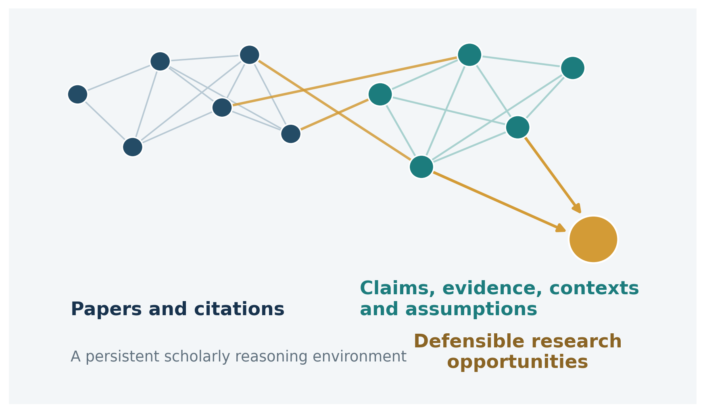
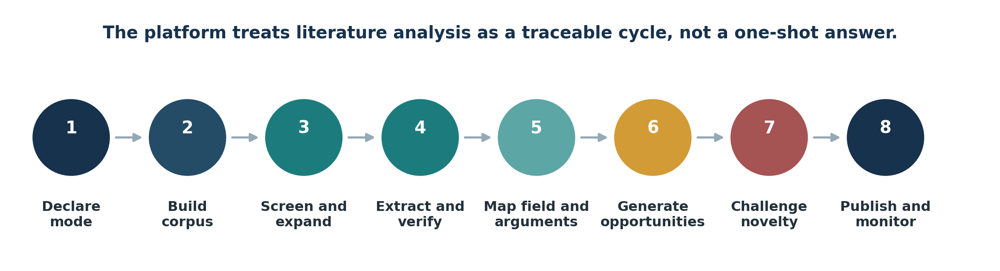
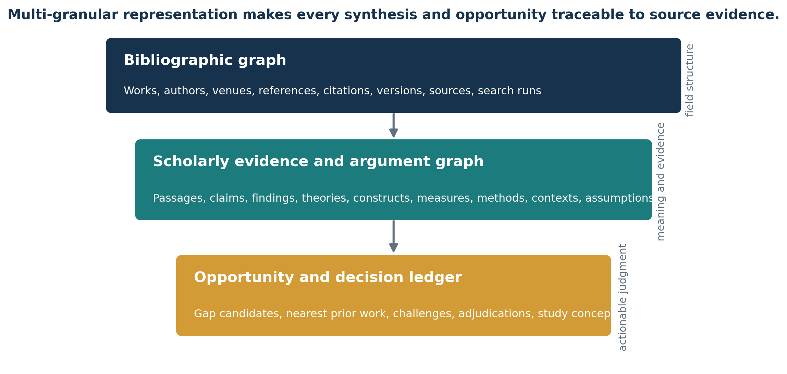
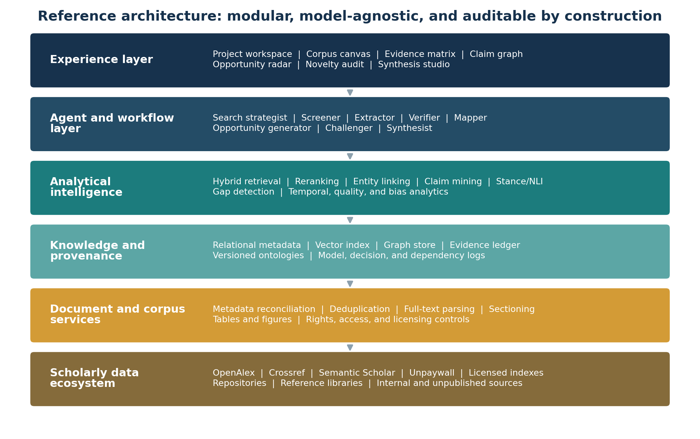
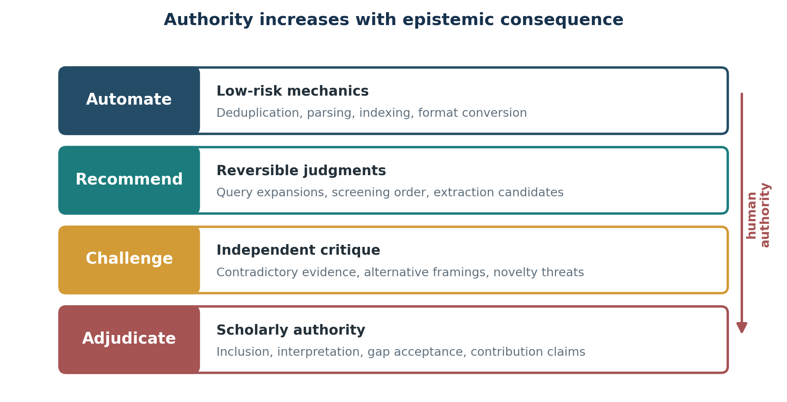

# Research Observatory: Vision for an AI Research Development and Literature Analysis Platform



The platform connects field-level structure to source-grounded scholarly judgment.

<table>
<colgroup>
<col style="width: 50%" />
<col style="width: 50%" />
</colgroup>
<thead>
<tr class="header">
<th></th>
<th><p><strong>Vision in one sentence</strong></p>
<p>Create a persistent scholarly reasoning and research-production environment that moves from literature discovery and evidence mapping through research opportunity, empirical study design, article architecture, verified result integration, source-grounded drafting, adversarial reviewer simulation, revision, and living research memory.</p></th>
</tr>
</thead>
<tbody>
</tbody>
</table>

Landscape snapshot: August 7, 2026 \| Product and design-science vision \| Version 1.3

EXECUTIVE SUMMARY

# A scholarly reasoning environment, not another search chatbot

AI-supported literature work has advanced rapidly. Current products can search semantically, follow citation networks, screen records, extract structured fields, generate cited syntheses, and monitor emerging work. Recent research systems additionally demonstrate agentic literature synthesis, contradiction discovery, research-idea generation, literature-grounded novelty assessment, implicit gap inference, topological gap detection, and human-centered review environments \[3-15\].

The remaining opportunity is not to reproduce those capabilities in one more interface. It is to turn them into an integrated, persistent, and contestable scholarly work system. Most tools remain paper-centric, task-specific, or optimized for rapid answers. They rarely maintain a researcher-controlled representation of claims, evidence, methods, contexts, constructs, assumptions, and unresolved disputes across projects. They also tend to treat a research gap as a generic absence rather than as one of several theoretically distinct opportunity types.

<table>
<colgroup>
<col style="width: 50%" />
<col style="width: 50%" />
</colgroup>
<thead>
<tr class="header">
<th></th>
<th><p><strong>Strategic thesis</strong></p>
<p>The defensible product and research opportunity is an evidence-first platform that helps scholars build and challenge interpretations of a field and then carry validated opportunities into research design and publication work. The platform should generate candidate opportunities, independently try to disprove them, propose inspectable study alternatives, integrate only verified study results, draft against an approved article blueprint, and subject drafts to independent reviewer roles. It must support empirical, systematic, technical, theoretical, hermeneutic, and critical modes without imposing one epistemology on all research.</p></th>
</tr>
</thead>
<tbody>
</tbody>
</table>

## The platform will unify four persistent representations

<table>
<colgroup>
<col style="width: 50%" />
<col style="width: 50%" />
</colgroup>
<thead>
<tr class="header">
<th><strong>1</strong></th>
<th><p><strong>A bibliographic and semantic field graph</strong></p>
<p>Papers, authors, outlets, references, citations, concepts, versions, sources, search runs, and discovery pathways.</p></th>
</tr>
</thead>
<tbody>
</tbody>
</table>

<table>
<colgroup>
<col style="width: 50%" />
<col style="width: 50%" />
</colgroup>
<thead>
<tr class="header">
<th><strong>2</strong></th>
<th><p><strong>A claim-evidence-context-assumption graph</strong></p>
<p>Theories, constructs, definitions, operationalizations, methods, findings, claims, boundary conditions, assumptions, stakeholders, and source passages.</p></th>
</tr>
</thead>
<tbody>
</tbody>
</table>

<table>
<colgroup>
<col style="width: 50%" />
<col style="width: 50%" />
</colgroup>
<thead>
<tr class="header">
<th><strong>3</strong></th>
<th><p><strong>An opportunity and decision ledger</strong></p>
<p>Gap candidates, nearest prior work, disconfirming evidence, novelty challenges, human adjudications, research concepts, and later field developments.</p></th>
</tr>
</thead>
<tbody>
</tbody>
</table>

<table>
<colgroup>
<col style="width: 50%" />
<col style="width: 50%" />
</colgroup>
<thead>
<tr class="header">
<th><strong>4</strong></th>
<th><p><strong>A study, result, manuscript, review, and revision graph</strong></p>
<p>Study designs, protocols, measures, samples, analyses, ethics and validity decisions, technical reports, verified result records, article blueprints, manuscript claims, citations, tables, figures, reviewer comments, author dispositions, revisions, and responses.</p></th>
</tr>
</thead>
<tbody>
</tbody>
</table>

## What makes the vision distinctive

| **Dimension** | **Conventional research assistant**                    | **Research Observatory vision**                                                                                                               |
|---------------|--------------------------------------------------------|-----------------------------------------------------------------------------------------------------------------------------------------------|
| Primary unit  | Paper, passage, or generated answer                    | Claims, evidence, contexts, assumptions, and scholarly decisions linked back to papers                                                        |
| Gap logic     | Sparse topics or author-stated future research         | Plural opportunity ontology: contradiction, boundary, measurement, bridge, assumption, stakeholder silence, temporal change, and more         |
| Novelty       | Similarity search or a persuasive score                | Bounded novelty claim with documented search scope, nearest prior work, counterevidence, and an independent challenge workflow                |
| Research mode | Usually one workflow, often systematic-review inspired | Fourteen objective-specific workflows spanning evidence aggregation, theory and critical inquiry, study design, empirical/theory/critical article development, and manuscript review/revision |
| Human role    | Approve or edit AI output                              | Set epistemic mode, govern delegation, inspect evidence, adjudicate meaning, and own the final scholarly claim                                |
| Memory        | Project files or chat history                          | Versioned research memory spanning literature, designs, verified results, manuscripts, reviews, revisions, decisions, and monitored updates |

## Recommended initial scope

> • Build and validate the complete Windows PC/lab evidence foundation, research workbench, claim/evidence graph, and disciplined novelty comparison first; qualify the same local desktop on macOS and Linux next; then add study design, research-result integration, manuscript production, and reviewer simulation before institutional or cloud delivery.
>
> • Integrate mature commodity components for metadata, native/Docling document parsing, hybrid retrieval, active-learning screening, and model inference behind replaceable interfaces rather than recreating them.
>
> • Treat the opportunity engine, adversarial novelty protocol, critical problematization mode, and mode-sensitive delegation design as the principal differentiating assets.
>
> • Evaluate the artifact as both a technical system and an information-systems design-science contribution, including longitudinal effects on actual research projects.

Evidence-status note: This document distinguishes peer-reviewed research, preprints, commercial product documentation, and infrastructure documentation in the reference list. Frontier capabilities should be treated as promising rather than settled where validation remains early or domain-specific. This Vision governs product intent and non-goals; the companion Document Governance and Repository/Architecture Setup Guide defines authority and conflict resolution across the document set.

# Contents

> **1** [<u>Context and opportunity</u>](#context-and-opportunity)
>
> **2** [<u>Vision, mission, and boundaries</u>](#vision)
>
> **3** [<u>Design principles</u>](#design-principles)
>
> **4** [<u>Users and research modes</u>](#users-and-research-modes)
>
> **5** [<u>End-to-end scholarly workflow</u>](#end-to-end-scholarly-workflow)
>
> **6** [<u>Capability model</u>](#capability-model)
>
> **7** [<u>Knowledge representation and ontology</u>](#knowledge-representation-and-ontology)
>
> **8** [<u>AI and technical architecture</u>](#ai-and-technical-architecture)
>
> **9** [<u>Human-AI agency and interaction model</u>](#human-ai-agency-and-interaction-model)
>
> **10** [<u>Research opportunity and novelty engine</u>](#research-opportunity-and-novelty-engine)
>
> **11** [<u>Product experience and core workspaces</u>](#product-experience-and-core-workspaces)
>
> **12** [<u>Trust, governance, and responsible use</u>](#trust-governance-and-responsible-use)
>
> **13** [<u>Design-science research agenda</u>](#design-science-research-agenda)
>
> **14** [<u>Phased roadmap and release gates</u>](#phased-roadmap-and-release-gates)
>
> **15** [<u>Success measures</u>](#success-measures)
>
> **16** [<u>Strategic build-versus-integrate boundary</u>](#strategic-build-versus-integrate-boundary)
>
> **17** [<u>Risks and open questions</u>](#risks-and-open-questions)
>
> **18** [<u>Conclusion</u>](#conclusion)
>
> **Appendix A** [<u>Current landscape and feature lineage</u>](#appendix-a.-current-landscape-and-feature-lineage)
>
> **Appendix B** [<u>Reference implementation options</u>](#appendix-b.-reference-implementation-options)
>
> **Appendix C** [<u>Research opportunity dossier schema</u>](#appendix-c.-research-opportunity-dossier-schema)
>
> **References** [<u>Evidence base</u>](#references.-evidence-base)

# 1. Context and opportunity

The market has moved from isolated search utilities toward increasingly capable evidence agents. The next platform opportunity lies in the scholarly structures and governance that current tools only partially address.

## 1.1 The mature foundation

Several capabilities should now be considered table stakes. Active-learning screening is established in ASReview \[3\]. Scite publishes citation-context classifications that distinguish supporting, contrasting, and mentioning citations \[4\]. OpenScholar and PaperQA2 demonstrate high-quality retrieval-augmented synthesis and contradiction-oriented literature analysis \[5,6\]. Commercial products such as Elicit and Undermind combine semantic search, structured extraction, cited reports, novelty exploration, and monitoring in increasingly integrated workflows \[13-15\].

## 1.2 The emerging frontier

Recent research extends beyond retrieval and summarization. ResearchAgent uses academic graphs and collaborative reviewing agents for idea generation \[7\]. The Idea Novelty Checker grounds novelty judgments in retrieved prior work \[8\]. GAPMAP distinguishes explicit gaps from implicit, context-inferred gaps \[9\]. ROAD-tv combines semantic representations, topological gap detection, and adversarial multi-model validation \[10\]. Arc and LitPilot emphasize integrated workflows, transparency, strategic exploration, and researcher agency \[11,12\]. EvidenceNet and the Graph of AI Ideas further illustrate evidence-centric and idea-centric knowledge graph approaches \[22,23\].

## 1.3 The unresolved problem class

Despite this progress, current systems remain fragmented across discovery, screening, extraction, synthesis, ideation, and novelty assessment. Their internal representation often stops at the paper, abstract, passage, or task-specific structured field. This makes it difficult to compare definitions, distinguish construct variants, normalize claims across contexts, identify why findings conflict, or trace a proposed contribution to the assumptions and evidence on which it depends.

The problem is also epistemic. Systematic evidence aggregation, theory synthesis, hermeneutic interpretation, and critical problematization are not interchangeable tasks. A single automation policy or gap definition can distort the research process. IS design research already identifies comprehensiveness, precision, reproducibility, and controlled delegation as core concerns for literature-support systems \[1,2\]. The opportunity is to extend these principles into a full literature-analysis and research-opportunity environment.

<table>
<colgroup>
<col style="width: 50%" />
<col style="width: 50%" />
</colgroup>
<thead>
<tr class="header">
<th></th>
<th><p><strong>Opportunity statement</strong></p>
<p>Researchers need a platform that preserves the scale advantages of modern AI while making every consequential scholarly judgment traceable, contestable, mode-sensitive, and open to disconfirmation.</p></th>
</tr>
</thead>
<tbody>
</tbody>
</table>

## 1.4 Why a persistent observatory matters

A one-time answer becomes stale as new studies appear, terminology shifts, or a nearby literature is discovered. A persistent observatory stores the corpus, the search logic, the semantic and argument structures, the unresolved disputes, and the researcher decisions. New publications can then be evaluated as changes to an existing knowledge state: Which claims are strengthened? Which opportunities are narrowed? Which novelty assertions are invalidated? Which definitions or methods have drifted?

# 2. Vision, mission, and boundaries

The platform is designed to improve scholarly judgment and research opportunity formulation, not to replace scholarly authorship or certify universal novelty.

## 2.1 Vision

<table>
<colgroup>
<col style="width: 50%" />
<col style="width: 50%" />
</colgroup>
<thead>
<tr class="header">
<th></th>
<th><p><strong>Vision</strong></p>
<p>A world in which researchers can inspect the structure, evidence, assumptions, and unresolved tensions of a field at scale - and can formulate research contributions that are more consequential, more defensible, and less likely to rest on false novelty.</p></th>
</tr>
</thead>
<tbody>
</tbody>
</table>

## 2.2 Mission

Build an extensible AI literature-analysis platform that converts heterogeneous scholarly sources into a versioned evidence and argument environment; supports multiple forms of review and theorizing; generates candidate research opportunities; and subjects each candidate to explicit novelty and validity challenges before it is accepted by the researcher.

## 2.3 Desired user outcomes

> • Find relevant work that uses unfamiliar terminology or sits in adjacent disciplines without losing the reproducibility of the search process.
>
> • Move from paper summaries to a comparable map of constructs, theories, claims, contexts, methods, measures, and evidence.
>
> • Understand whether apparent contradictions reflect real disagreement, different operationalizations, different populations, or different boundary conditions.
>
> • Generate research opportunities that have clear theoretical or substantive leverage rather than merely occupying sparse topic combinations.
>
> • Defend a contribution using a documented novelty audit, closest-prior-work comparison, and bounded uncertainty statement.
>
> • Maintain a living research memory that can support manuscripts, grants, courses, laboratories, and research programs over time.

## 2.4 Explicit non-goals

| **The platform will not**                                           | **Reason**                                                                                                                                 |
|---------------------------------------------------------------------|--------------------------------------------------------------------------------------------------------------------------------------------|
| Claim that no prior work exists anywhere                            | Novelty can only be assessed relative to a documented corpus, terminology set, source scope, and cutoff date.                              |
| Replace expert inclusion, interpretation, or contribution judgments | These decisions have epistemic consequences and remain the researcher’s responsibility.                                                    |
| Treat LLM explanations as sufficient transparency                   | The system exposes evidence, transformations, alternatives, and decision criteria rather than relying on unverifiable internal rationales. |
| Automate one review method and label it universal                   | Different research modes require different forms of search, coding, stopping, validation, and authority.                                   |
| Become a general-purpose manuscript ghostwriter                     | Writing support may be included, but the platform’s core value is evidence structure and scholarly reasoning.                              |
| Redistribute paywalled content without permission                   | Full-text access, storage, sharing, and model use must honor licenses and institutional entitlements.                                      |

# 3. Design principles

The product should embody prescriptive design knowledge that can guide both implementation and design-science evaluation.

<table>
<colgroup>
<col style="width: 50%" />
<col style="width: 50%" />
</colgroup>
<thead>
<tr class="header">
<th><strong>DP1</strong></th>
<th><p><strong>Declare the epistemic mode</strong></p>
<p>Every project begins with a review and reasoning mode, intended contribution, corpus boundary, stopping logic, and autonomy profile. Defaults change accordingly.</p></th>
</tr>
</thead>
<tbody>
</tbody>
</table>

<table>
<colgroup>
<col style="width: 50%" />
<col style="width: 50%" />
</colgroup>
<thead>
<tr class="header">
<th><strong>DP2</strong></th>
<th><p><strong>Evidence before prose</strong></p>
<p>Generated synthesis, gap claims, and recommendations are downstream of evidence records. Every material statement must resolve to one or more source passages.</p></th>
</tr>
</thead>
<tbody>
</tbody>
</table>

<table>
<colgroup>
<col style="width: 50%" />
<col style="width: 50%" />
</colgroup>
<thead>
<tr class="header">
<th><strong>DP3</strong></th>
<th><p><strong>Represent scholarship at multiple granularities</strong></p>
<p>Maintain links among works, sections, passages, claims, constructs, methods, contexts, assumptions, and field-level patterns.</p></th>
</tr>
</thead>
<tbody>
</tbody>
</table>

<table>
<colgroup>
<col style="width: 50%" />
<col style="width: 50%" />
</colgroup>
<thead>
<tr class="header">
<th><strong>DP4</strong></th>
<th><p><strong>Separate generation from challenge</strong></p>
<p>The agent that proposes an opportunity cannot be the only agent that evaluates it. Independent retrieval and adversarial roles search for invalidating evidence.</p></th>
</tr>
</thead>
<tbody>
</tbody>
</table>

<table>
<colgroup>
<col style="width: 50%" />
<col style="width: 50%" />
</colgroup>
<thead>
<tr class="header">
<th><strong>DP5</strong></th>
<th><p><strong>Bound novelty explicitly</strong></p>
<p>Novelty statements must state the databases, corpora, dates, terminology, disciplines, and document types considered, along with residual uncertainty.</p></th>
</tr>
</thead>
<tbody>
</tbody>
</table>

<table>
<colgroup>
<col style="width: 50%" />
<col style="width: 50%" />
</colgroup>
<thead>
<tr class="header">
<th><strong>DP6</strong></th>
<th><p><strong>Make AI judgments contestable</strong></p>
<p>Users can inspect evidence, edit schemas, reject interpretations, compare alternatives, and record adjudication rationales without losing the original machine output.</p></th>
</tr>
</thead>
<tbody>
</tbody>
</table>

<table>
<colgroup>
<col style="width: 50%" />
<col style="width: 50%" />
</colgroup>
<thead>
<tr class="header">
<th><strong>DP7</strong></th>
<th><p><strong>Match authority to consequence</strong></p>
<p>Low-risk mechanics may be automated; reversible analytical judgments are recommended; consequential interpretive and contribution judgments require human approval.</p></th>
</tr>
</thead>
<tbody>
</tbody>
</table>

<table>
<colgroup>
<col style="width: 50%" />
<col style="width: 50%" />
</colgroup>
<thead>
<tr class="header">
<th><strong>DP8</strong></th>
<th><p><strong>Preserve epistemic plurality</strong></p>
<p>The core ontology is extensible and versioned. Critical, interpretive, technical, and evidence-aggregative projects can add domain and method packs rather than conform to one universal schema.</p></th>
</tr>
</thead>
<tbody>
</tbody>
</table>

<table>
<colgroup>
<col style="width: 50%" />
<col style="width: 50%" />
</colgroup>
<thead>
<tr class="header">
<th><strong>DP9</strong></th>
<th><p><strong>Expose corpus and model uncertainty</strong></p>
<p>The platform reports missing full text, source coverage, language and outlet distributions, extraction confidence, model version, and known blind spots.</p></th>
</tr>
</thead>
<tbody>
</tbody>
</table>

<table>
<colgroup>
<col style="width: 50%" />
<col style="width: 50%" />
</colgroup>
<thead>
<tr class="header">
<th><strong>DP10</strong></th>
<th><p><strong>Treat research memory as a durable asset</strong></p>
<p>Corpora, ontologies, extraction decisions, opportunity dossiers, and monitoring rules persist across projects and can be reused with provenance.</p></th>
</tr>
</thead>
<tbody>
</tbody>
</table>

<table>
<colgroup>
<col style="width: 50%" />
<col style="width: 50%" />
</colgroup>
<thead>
<tr class="header">
<th><strong>DP11</strong></th>
<th><p><strong>Design for recalculation</strong></p>
<p>When a source, extraction, model, or inclusion decision changes, affected graphs, syntheses, and opportunity claims are marked stale and recomputed.</p></th>
</tr>
</thead>
<tbody>
</tbody>
</table>

<table>
<colgroup>
<col style="width: 50%" />
<col style="width: 50%" />
</colgroup>
<thead>
<tr class="header">
<th><strong>DP12</strong></th>
<th><p><strong>Evaluate scholarly consequences, not only speed</strong></p>
<p>Success includes retrieval and extraction quality, but also false-novelty reduction, idea diversity, theoretical leverage, confidence calibration, agency, and reviewer defensibility.</p></th>
</tr>
</thead>
<tbody>
</tbody>
</table>

## 3.1 Workflow and research-production principles

- **DP13 — Organize by objective and stage.** Project use case determines the ordered primary workflow; supporting tools remain accessible without erasing the current stage.
- **DP14 — Design before prose.** A study protocol, theory/critical argument architecture, and article blueprint precede long-form drafting.
- **DP15 — Separate literature evidence from study evidence.** Each claim exposes which source class supports it and how the sources were verified.
- **DP16 — Never infer missing results.** “Not reported,” “not calculated,” and “cannot verify” are first-class states.
- **DP17 — Preserve authorship and interpretive authority.** AI drafts from researcher-approved objects and never silently overwrites human text, decisions, or normative interpretation.
- **DP18 — Review independently before synthesis.** Reviewer roles complete separate assessments before an editor role clusters and reconciles them.
- **DP19 — Treat revision as provenance.** Comments, dispositions, manuscript diffs, evidence changes, responses, and re-review remain linked.
- **DP20 — Preserve cross-platform scholarly parity.** Operating-system differences may affect packaging and acceleration, not project semantics, evidence, workflows, or outputs.

# 4. Users and research modes

A central product decision is to organize the platform around forms of scholarly work rather than around a generic chat interface.

## 4.1 Primary users

| **User** | **Core need** | **Platform value** |
|---|---|---|
| Senior researcher or theorist | Integrate literatures, challenge assumptions, develop a defensible contribution, and carry it into an article | Theory/construct maps, critical readings, opportunity dossiers, article blueprints, source-grounded drafting, reviewer simulation, and revision lineage |
| Empirical researcher | Find comparable studies, design a stronger study, integrate completed results, and prepare a defensible empirical article | Evidence matrices, design alternatives, sampling/measurement/analysis plans, technical-report verification, manuscript drafting, reporting checks, and review simulation |
| Technical AI researcher | Audit baselines, compute, datasets, evaluation designs, and generalization; document experiments for publication | Benchmark lineage, ablation/external-validity gaps, technical study designs, result reconciliation, reproducibility packages, and empirical manuscript production |
| Critical or interpretive researcher | Preserve evolving readings, challenge assumptions and exclusions, and develop an accountable argument | Hermeneutic search-reading cycles, researcher memos, critical coding, alternative framings, critical article blueprints, and role-separated review |
| Doctoral student | Learn a field without being trapped by initial vocabulary and understand the sequence from question to publication | Guided use-case workflows, concept history, evidence-linked synthesis, study/article scaffolding, transparent checks, and contextual explanations |
| Research librarian or review methodologist | Maintain comprehensive, rights-aware, and reproducible search and evidence processes | Source adapters, query translation, coverage diagnostics, deduplication, screening audits, PRISMA support, provenance, and export manifests |
| Research group, center, or R&D team | Build cumulative research intelligence and coordinate evidence, studies, manuscripts, and reviews | Shared ontologies, adjudication, private reports, project portfolio memory, role-based access, authorship records, review rounds, and living impact analysis |

## 4.2 Objective-specific workflows

A project begins with one primary use case. That choice versions the Research Intent Contract and determines the recommended order, checkpoints, expected outputs, and default AI authority. All tools remain accessible, but the selected path is visually primary and preserves the current stage when a supporting workspace is opened.

| **Use case** | **Purpose** | **Default process** | **Primary output** |
|---|---|---|---|
| Rapid field orientation | Establish vocabulary, seminal work, schools, and current debates | Broad semantic/citation expansion, field mapping, targeted close reading | Field map, reading path, contested claims |
| Systematic or scoping review | Construct a reproducible evidence corpus | Protocol, exact queries, screening, extraction, audit, synthesis | Review corpus, evidence table, synthesis, reproducibility bundle |
| Living review | Maintain an existing evidence synthesis | Scheduled differential search, triage, impact analysis, reassessment | Change report, updated synthesis, stale-claim alerts |
| Theory synthesis | Clarify constructs, mechanisms, relationships, and boundaries | Theory/definition extraction, lineage, comparison, integration | Theory architecture, construct map, integration opportunity |
| Hermeneutic inquiry | Deepen understanding as reading reshapes searching | Iterative search-read-interpret cycles, memos, evolving questions | Interpretive map, memos, rationale trail |
| Critical problematization | Surface assumptions, power relations, exclusions, and alternative framings | Plural search, critical coding, competing readings, problematization | Problematization dossier and alternative framings |
| Technical landscape / benchmark audit | Assess methods, baselines, datasets, compute, and evaluation quality | Domain extraction, comparability, benchmark/ablation/external-validity analysis | Benchmark map, missing controls, technical study opportunities |
| Novelty and research-opportunity audit | Test a proposed contribution against the closest prior work | Facet decomposition, broad retrieval, nearest-prior comparison, adversarial challenge | Bounded novelty statement and opportunity dossier |
| Empirical study design | Convert an opportunity into a defensible protocol | Literature-grounded alternatives, validity/ethics challenge, analysis and reproducibility planning | Study-design dossier and protocol skeleton |
| Empirical study to article | Move from opportunity through design and verified results to publication | Evidence, novelty, design, blueprint, report verification, drafting, review, revision | Protocol, verified results, full empirical article, review/revision bundle |
| Empirical results to article | Begin from completed study reports and produce a literature-grounded article | Report/result verification, context search, contribution audit, blueprint, drafting, review | Verified result package and empirical article |
| Theory article development | Build and publish a theoretical contribution | Field/theory architecture, argument graph, novelty, blueprint, drafting, review | Full theory manuscript with evidence and review lineage |
| Critical article development | Build and publish a critical contribution | Plural corpus, close reading, memos, problematization, argument, blueprint, drafting, review | Full critical manuscript with interpretive and review lineage |
| Manuscript review and revision | Challenge an uploaded or generated draft and govern revision | Draft intake, omitted-literature/novelty challenge, independent reviews, editorial synthesis, response, re-review | Review package, revised manuscript, response, audit bundle |

<table>
<colgroup><col style="width: 50%" /><col style="width: 50%" /></colgroup>
<thead><tr class="header"><th></th><th><p><strong>Research intent contract</strong></p>
<p>At project creation, the researcher records the primary use case, research objective and type, unit and level of analysis, source and private-report scope, acceptable evidence, intended study or article output, venue constraints where known, novelty standard, AI autonomy and egress policy, reviewer configuration, and stopping logic. The contract may evolve, but every revision and workflow change is versioned.</p></th></tr></thead><tbody></tbody></table>

# 5. End-to-end scholarly workflow

The flagship lifecycle moves from intentional corpus construction to validated opportunities and, when selected, onward through study or argument design, article architecture, verified result integration, source-grounded drafting, independent review, revision, and living impact. Each objective-specific workflow selects and orders only the relevant stages while preserving all intermediate decisions.



Figure 1. End-to-end literature analysis and opportunity-validation cycle.

## 5.1 Declare purpose and mode

The user defines the research problem, intended contribution, epistemic mode, corpus boundaries, source priorities, terminology known so far, and delegation profile. The system proposes alternative formulations but does not silently redefine the problem.

## 5.2 Build and reconcile the corpus

The platform executes structured, semantic, and citation-based searches across open and licensed sources; imports reference-manager libraries; reconciles identifiers; deduplicates versions; resolves lawful full text; and records how each item entered the corpus.

## 5.3 Screen and expand

Active learning prioritizes likely relevant records while random audits, citation-neighbor checks, and uncertainty sampling test for false negatives. Search expansion remains visible as a versioned tree rather than disappearing into an opaque agent session.

## 5.4 Extract and verify

Schema-constrained extractors create evidence records. Independent verifiers test whether each field and claim is entailed by the cited passage. The system uses “not reported,” “unclear,” and “inferred” as first-class states.

## 5.5 Map the field and its arguments

Citation, semantic, theory, construct, measure, method, claim, evidence, context, stakeholder, and assumption views are generated from the same underlying graph. Researchers can move from a cluster to a claim and then to the exact page passage.

## 5.6 Generate candidate opportunities

Multiple detectors propose explicit gaps, contradictions, boundary conditions, measurement problems, bridges, replications, temporal shifts, missing controls, assumption challenges, and stakeholder silences. Candidates remain hypotheses, not conclusions.

## 5.7 Challenge novelty and significance

A separate challenger workflow searches alternative terminology, older vocabulary, adjacent disciplines, preprints, dissertations, proceedings, patents where relevant, and semantic nearest neighbors. It explains how each candidate prior work could narrow or defeat the proposed contribution.

## 5.8 Produce, monitor, and learn

The researcher adjudicates the opportunity and either exports a dossier or explicitly hands it to a study-design, theory-article, or critical-article workflow. Alerts evaluate later publications against accepted and rejected opportunity claims, study assumptions, manuscript claims, and review decisions, creating a learning loop for both researcher and system.

## 5.9 Design the study or scholarly argument

Empirical projects compare evidence-grounded study alternatives and create a human-approved protocol. Theory and critical projects develop an approved construct, mechanism, argument, or problematization architecture. Methodological, ethical, feasibility, validity, and interpretive decisions remain inspectable and contestable.

## 5.10 Blueprint and draft the article

The researcher chooses an empirical, theory, or critical article type and creates a versioned blueprint with section purposes, claims, evidence requirements, word budgets, exhibits, venue/reporting constraints, and unresolved prerequisites. Long-form drafting proceeds section by section only from approved literature evidence, verified study results where applicable, and researcher-owned interpretation.

## 5.11 Review, revise, disclose, and monitor

Independent simulated reviewer roles assess an immutable draft snapshot before editorial synthesis. The researcher adjudicates every issue, links revisions and responses to comments and evidence, runs targeted re-review when useful, exports authorship/AI/provenance disclosures, and monitors later evidence that could make the study, manuscript, or contribution stale.

# 6. Capability model

The product should deliberately distinguish inherited capabilities, frontier capabilities, and the capabilities that constitute the principal platform contribution.

## 6.1 Foundation capabilities to integrate

| **Capability family** | **Baseline requirements**                                                                                                            |
|-----------------------|--------------------------------------------------------------------------------------------------------------------------------------|
| Federated discovery   | Boolean and fielded search, semantic search, citation chasing, related-paper recommendations, saved searches, alerts                 |
| Corpus management     | DOI and identifier reconciliation, exact and fuzzy deduplication, version linking, library import, tags, teams, role-based decisions |
| Screening             | Active-learning prioritization, dual review, exclusion reasons, conflict adjudication, random audits, stopping diagnostics           |
| Full-text processing  | Native XML/HTML first, structured PDF parsing, section and reference extraction, tables and figures where feasible, page anchors     |
| Structured extraction | Custom schemas, evidence spans, “not reported” states, batch extraction, verification samples, coder comparison                      |
| Evidence synthesis    | Passage-grounded question answering, cited summaries, evidence tables, narrative synthesis, exportable reports                       |
| Citation intelligence | Citation context, supporting and contrasting signals, reference and citer navigation, retraction and correction status               |
| Reproducibility       | Search logs, query versions, corpus snapshots, model and prompt versions, PRISMA-style flow data, export manifests                   |

## 6.2 Frontier capabilities to incorporate

| **Frontier capability**                | **Platform interpretation**                                                                                                                                                          |
|----------------------------------------|--------------------------------------------------------------------------------------------------------------------------------------------------------------------------------------|
| Agentic synthesis                      | Iterative retrieval, passage selection, self-critique, citation verification, and long-form synthesis, following the direction demonstrated by OpenScholar and PaperQA2 \[5,6\].     |
| Graph-grounded ideation                | Use academic graphs and shared knowledge entities to generate and iteratively review research ideas \[7,23\].                                                                        |
| Literature-grounded novelty assessment | Retrieve broadly, rerank by idea facets, compare the proposed contribution with nearest prior work, and present evidence-grounded novelty reasoning \[8\].                           |
| Explicit and implicit gap inference    | Extract declared limitations and infer context-dependent missing knowledge using structured inference schemes \[9\].                                                                 |
| Structural opportunity detection       | Analyze low-density, bridge, and topological structures in semantic spaces, then validate candidate interpretations \[10\].                                                          |
| Human-centered strategic exploration   | Make iterative query refinement, screening rationales, and AI recommendations visible while preserving researcher agency \[11,12\].                                                  |
| Evidence-centric knowledge graphs      | Represent experimentally or empirically grounded findings with provenance, study context, and quantitative support rather than flattening knowledge into unqualified triples \[22\]. |
| Living impact analysis                 | When new work arrives, identify which prior claims, syntheses, gaps, and research concepts are affected rather than merely issuing a keyword alert.                                  |

## 6.3 Differentiating capability set

| **Differentiator**                        | **Value**                                                                                                                                                                        |
|-------------------------------------------|----------------------------------------------------------------------------------------------------------------------------------------------------------------------------------|
| Multi-granular scholarly argument graph   | Unifies bibliographic relationships with source passages, claims, evidence, constructs, measures, methods, contexts, assumptions, and decisions.                                 |
| Plural research-opportunity ontology      | Treats gaps as different phenomena with different evidence and contribution logics rather than as one generic low-density score.                                                 |
| Critical problematization workspace       | Supports evidence-linked candidate readings of assumptions, authority, dependency, stakeholder exclusion, normative commitments, and alternatives rendered difficult to imagine. |
| Reproducible adversarial novelty protocol | Separates opportunity generation from invalidation; records search variants, closest prior work, counterarguments, scope limits, and human adjudication.                         |
| Mode-sensitive delegation                 | Changes AI authority, validation, stopping, and output structures according to the declared research mode.                                                                       |
| Corpus reflexivity and bias diagnostics   | Shows the consequences of database, language, geography, outlet, open-access, citation, and temporal coverage choices.                                                           |
| Opportunity portfolio and outcome memory  | Tracks proposed ideas, why they were accepted or rejected, what studies followed, what reviewers challenged, and how the field later evolved.                                    |
| Research-method packs                     | Allows fields and methods to define reusable ontologies, extraction schemas, comparability rules, evaluation criteria, and opportunity detectors.                                |


### Research-production frontier capabilities

| **Capability** | **Platform interpretation** |
|---|---|
| Evidence-grounded study design | Generate multiple typed empirical design alternatives, challenge validity/ethics/feasibility, and require human protocol approval. |
| Private report and result integration | Parse and reconcile technical reports, tables, figures, methods, deviations, and results while preserving exact anchors and “not reported” states. |
| Article architecture and constrained drafting | Bind research type and verified venue constraints to a blueprint, then draft only from approved claims, literature evidence, verified results, and researcher-owned interpretation. |
| Independent reviewer simulation | Freeze a manuscript snapshot, run role-separated evidence-linked reviews, preserve disagreement, synthesize editorial issues only afterward, and govern revision/response. |
| Cross-platform local research production | Preserve project, evidence, manuscript, review, and output semantics across Windows, macOS, Linux x86_64, and Linux ARM64. |

# 7. Knowledge representation and ontology

The platform’s central technical and conceptual asset is a versioned, provenance-aware representation that connects field structure to the internal evidence and argument structure of papers.



Figure 2. Three linked representations form the durable research memory.

## 7.1 Core entities

| **Layer**              | **Illustrative entities**                                                                                                                           |
|------------------------|-----------------------------------------------------------------------------------------------------------------------------------------------------|
| Scholarly record       | Work, version, author, institution, source, venue, funder, dataset, code artifact, patent, trial, retraction or correction                          |
| Document structure     | Section, paragraph, sentence, table, figure, footnote, reference, citation context, page coordinate                                                 |
| Conceptual structure   | Theory, construct, definition, proposition, mechanism, level of analysis, unit of analysis, ontology term, synonym                                  |
| Empirical structure    | Research question, hypothesis, population, context, sample, data source, method, measure, analytical technique, result, effect, limitation          |
| Argument structure     | Claim, evidence, warrant, qualification, rebuttal, support, contradiction, extension, replication, boundary condition                               |
| Critical structure     | Assumption, stakeholder, authority arrangement, dependency, benefit, burden, normative commitment, excluded alternative, system boundary            |
| Process and governance | Search run, query, inclusion decision, extraction, verification, confidence, model version, human adjudication, disclosure                          |
| Opportunity structure  | Gap candidate, opportunity type, nearest prior work, novelty challenge, theoretical leverage, feasibility, unresolved uncertainty, research concept |

## 7.2 Core relations

Important relations include CITES, SUPPORTS, CONTRADICTS, QUALIFIES, EXTENDS, REPLICATES, TESTS, OPERATIONALIZES_AS, DEFINES, APPLIES_IN, DEPENDS_ON, ASSUMES, EXCLUDES, BENEFITS, BURDENS, USES_DATASET, USES_MEASURE, INVALIDATES, NARROWS, and NEAREST_PRIOR_TO. Relations are typed, directional, source-grounded, and allowed to be disputed.

## 7.3 Evidence record

<table>
<colgroup>
<col style="width: 50%" />
<col style="width: 50%" />
</colgroup>
<thead>
<tr class="header">
<th></th>
<th><p><strong>Minimum evidence record</strong></p>
<p>Each extracted statement stores: canonical work and version; section, page, and passage; entity and relation schema; extraction model and prompt version; confidence and calibration band; verifier result; human review status; and links to any synthesis, graph edge, or opportunity claim that depends on it.</p></th>
</tr>
</thead>
<tbody>
</tbody>
</table>

## 7.4 Status model

| **Status**  | **Meaning**                                                 | **Allowed use**                                                      |
|-------------|-------------------------------------------------------------|----------------------------------------------------------------------|
| Observed    | Directly present in a source passage                        | May support evidence tables and synthesis, subject to source quality |
| Extracted   | Machine-structured from observed text                       | Usable with confidence and verifier metadata                         |
| Inferred    | Analytical relation not explicitly stated by the source     | Must be labeled and is not treated as direct evidence                |
| Verified    | Independent model or human confirmed entailment and mapping | May support higher-confidence claims                                 |
| Disputed    | Conflicting extraction, interpretation, or evidence exists  | Displayed with alternatives; cannot silently collapse to consensus   |
| Adjudicated | A researcher recorded a decision and rationale              | Used in project outputs; original alternatives remain available      |
| Stale       | Underlying source, model, schema, or decision changed       | Affected outputs require recalculation before reuse                  |

## 7.5 Extensible ontology packs

The platform should provide a small, stable core ontology and allow versioned domain packs. An information-systems theory pack might emphasize theory use, constructs, mechanisms, organizational context, control, governance, and sociotechnical outcomes. A technical ML pack might emphasize model family, adaptation regime, training sequence, compute budget, dataset, baseline, benchmark, ablation, external evaluation, and reproducibility. A critical research pack might emphasize authority, ownership, participation, contestability, exit, dependency, affected stakeholders, ecological boundaries, and normative commitments.

# 8. AI and technical architecture

The architecture should be modular and model-agnostic so that data, evidence, and design knowledge outlast any particular LLM, embedding model, or commercial API.



Figure 3. Layered reference architecture.

## 8.1 Scholarly data ecosystem

OpenAlex can provide an open scholarly graph backbone; Crossref can reconcile DOI and publication metadata; Semantic Scholar can contribute graph and recommendation services; and Unpaywall can resolve lawful open-access locations \[16-19\]. Licensed databases, publisher platforms, disciplinary indexes, institutional repositories, Zotero or RIS libraries, and internal documents enter through adapters that preserve source-specific permissions.

## 8.2 Corpus and document services

A canonicalization service reconciles identifiers, titles, authors, versions, retractions, and corrections. Native structured full text is preferred; scholarly PDF parsing supplies section, reference, and layout structure when necessary. The document layer retains page and coordinate anchors so users can inspect tables, figures, and passages in their original context. Copyright and entitlement metadata travel with every document and derived record.

## 8.3 Retrieval and ranking

Retrieval should be hybrid by default: lexical search for exact terminology and reproducibility; dense scientific representations for conceptual similarity; citation and bibliographic-coupling traversal for intellectual lineage; graph expansion for adjacent work; and cross-encoder or LLM reranking for project-specific relevance. Retrieval ensembles and their weights are logged by search run.

## 8.4 Extraction, normalization, and verification

Schema-constrained extraction services populate the evidence graph. Entity linking normalizes authors, theories, constructs, methods, datasets, and measures while retaining author-specific wording. A verifier checks passage entailment, schema fit, and unsupported inference. Comparability clustering groups studies before contradiction analysis so that differences in population, construct definition, measure, method, and time are not mistaken for substantive disagreement.

## 8.5 Analytical services

> • Topic, concept, citation, and temporal mapping.
>
> • Claim and argument mining with source-level evidence.
>
> • Definition, operationalization, and measurement-variation analysis.
>
> • Support, contradiction, qualification, replication, and boundary-condition detection.
>
> • Coverage, bridge, structural, temporal, and explicit-future-work gap detection.
>
> • Assumption, stakeholder, authority, dependency, and normative-framing candidate detection.
>
> • Novelty retrieval, nearest-prior-work comparison, and disconfirmation search.
>
> • Corpus bias diagnostics and missingness analysis.

## 8.6 Agent orchestration

Agents are specialized roles with explicit tools, evidence budgets, permissions, and success criteria. They operate over the shared graph and ledger rather than through isolated chat histories. The orchestration layer enforces separation between opportunity generation and challenge, routes low-confidence cases to humans, and records the state transitions that produced each output.

## 8.7 Storage and observability

A reference implementation can combine relational storage for canonical records and workflow state, a vector index for semantic retrieval, a graph database for typed relations, an object store for documents and snapshots, and an append-only provenance ledger. Model calls, prompt templates, token and cost use, latency, errors, evaluation results, and data lineage should be observable by project and institution.

# 9. Human-AI agency and interaction model

The system should automate mechanics, recommend reversible judgments, independently challenge interpretations, and reserve consequential scholarly authority for researchers.



Figure 4. Delegation is governed by the epistemic consequence of the task.

## 9.1 Agent roles

| **Role**              | **Responsibility**                                                                                                                                 |
|-----------------------|----------------------------------------------------------------------------------------------------------------------------------------------------|
| Search Strategist     | Proposes vocabulary, database-specific queries, adjacent disciplines, and search branches; records alternatives and expected coverage.             |
| Corpus Scout          | Retrieves records, follows citation paths, identifies seed papers and near-duplicate versions, and flags missing sources.                          |
| Screening Prioritizer | Ranks likely relevant records, selects uncertainty and audit samples, and estimates discovery saturation without making final inclusion decisions. |
| Evidence Extractor    | Populates structured fields and candidate relations with exact source spans.                                                                       |
| Evidence Verifier     | Checks entailment, schema fit, page anchors, and unsupported inference; compares alternative extractions.                                          |
| Field Mapper          | Builds topic, citation, theory, construct, method, temporal, stakeholder, and argument views.                                                      |
| Opportunity Generator | Runs multiple detector families and drafts candidate contribution mechanisms.                                                                      |
| Novelty Challenger    | Searches to invalidate or narrow the opportunity, ranks nearest prior work, and produces counterarguments.                                         |
| Synthesis Curator     | Assembles evidence-grounded narratives and tables after project decisions, preserving dissent and uncertainty.                                     |
| Monitor               | Evaluates new publications against accepted claims, gaps, and research concepts and marks affected outputs stale.                                  |

## 9.2 Authority matrix

| **Task**                                              | **AI authority**                                          | **Human gate**                                                 |
|-------------------------------------------------------|-----------------------------------------------------------|----------------------------------------------------------------|
| Identifier reconciliation and exact duplicate removal | Automate with audit and reversible merge                  | Review ambiguous record clusters                               |
| Query expansion and adjacent-discipline suggestions   | Recommend alternatives with rationale and expected effect | Approve branches and corpus boundaries                         |
| Screening order                                       | Automate prioritization                                   | Humans decide inclusion or approve validated stopping rules    |
| Structured extraction                                 | Generate candidate records and verifier results           | Audit samples and adjudicate contested or consequential fields |
| Contradiction and gap detection                       | Generate and rank candidates                              | Determine comparability, importance, and theoretical meaning   |
| Critical assumption interpretation                    | Offer evidence-linked candidate readings                  | Researcher owns interpretation and normative claim             |
| Novelty assessment                                    | Search, compare, and challenge                            | Researcher approves only a bounded novelty statement           |
| Final synthesis and contribution language             | Draft from accepted evidence and decisions                | Named authors review, revise, and assume responsibility        |

## 9.3 Interaction pattern: inspect, contest, adjudicate

Every analytical surface should permit a three-step interaction. Inspect reveals the underlying source and transformation. Contest allows the user to propose an alternative coding, comparison set, relation, or framing. Adjudicate records the decision, rationale, author, date, and downstream consequences. The original machine suggestion and competing interpretations remain available for audit.

## 9.4 Avoiding performative transparency

The platform should not equate transparency with displaying long model rationales. Useful transparency consists of inspectable sources, explicit queries, alternative retrieval paths, typed transformations, confidence and missingness, comparison criteria, model versions, and human decisions. This supports verification without encouraging users to mistake fluent internal narratives for evidence.

# 10. Research opportunity and novelty engine

The opportunity engine generates several types of candidate contribution, assembles supporting and disconfirming evidence, and produces a dossier rather than a generic “gap score.”

## 10.1 Opportunity taxonomy

| **Type**                            | **Signal**                                                                                                    | **Principal false positive**                                                |
|-------------------------------------|---------------------------------------------------------------------------------------------------------------|-----------------------------------------------------------------------------|
| Explicit gap                        | Authors directly state missing knowledge, limitations, or future research                                     | Boilerplate language; later work may already address it                     |
| Coverage gap                        | A theoretically meaningful combination of construct, context, method, population, or outcome is underexamined | Sparse does not imply important or feasible                                 |
| Contradiction                       | Comparable studies make incompatible claims or report divergent findings                                      | Apparent conflict may reflect different measures, contexts, or time periods |
| Boundary-condition gap              | Claims are generalized beyond the populations, settings, levels, or technologies studied                      | Broader scope may be theoretical rather than empirical                      |
| Measurement gap                     | Construct definitions and operationalizations diverge, or findings depend on measurement choice               | Measures may intentionally represent distinct construct variants            |
| Replication and robustness gap      | Central claims rely on narrow designs, single datasets, weak controls, or limited external validation         | Replication may add little without theoretical leverage                     |
| Bridge or fragmentation opportunity | Semantically related literatures rarely cite or integrate one another                                         | Separation may be appropriate because phenomena differ                      |
| Temporal or institutional shift     | Foundational claims predate material technological, regulatory, organizational, or social change              | Mature claims may remain stable despite contextual change                   |
| Method, data, or benchmark gap      | Important questions lack suitable methods, datasets, controls, baselines, or evaluation criteria              | Method novelty alone may not create substantive contribution                |
| Theory integration opportunity      | Constructs or mechanisms are distributed across literatures but could explain a shared phenomenon             | Forced integration can reduce conceptual precision                          |
| Assumption challenge                | A literature relies on contestable ontological, causal, managerial, or normative assumptions                  | The assumption may be explicit and justified within scope                   |
| Stakeholder or silence gap          | Affected actors, harms, benefits, capabilities, dependencies, or ecological effects are systematically absent | Absence can reflect defensible delimitation rather than exclusion           |

## 10.2 Candidate-generation pipeline

<table>
<colgroup>
<col style="width: 50%" />
<col style="width: 50%" />
</colgroup>
<thead>
<tr class="header">
<th><strong>1</strong></th>
<th><p><strong>Normalize comparison sets</strong></p>
<p>Group studies by construct meaning, unit and level of analysis, population, context, time, measure, method, and outcome before computing disagreement or absence.</p></th>
</tr>
</thead>
<tbody>
</tbody>
</table>

<table>
<colgroup>
<col style="width: 50%" />
<col style="width: 50%" />
</colgroup>
<thead>
<tr class="header">
<th><strong>2</strong></th>
<th><p><strong>Run detector families independently</strong></p>
<p>Use explicit-language extraction, tensor sparsity, graph bridges, topological structure, temporal drift, NLI and stance, measurement mapping, future-work aggregation, and critical coding prompts as complementary signals.</p></th>
</tr>
</thead>
<tbody>
</tbody>
</table>

<table>
<colgroup>
<col style="width: 50%" />
<col style="width: 50%" />
</colgroup>
<thead>
<tr class="header">
<th><strong>3</strong></th>
<th><p><strong>Assemble an evidence packet</strong></p>
<p>For each candidate, collect supporting passages, the closest studies, disconfirming studies, source-coverage diagnostics, and unresolved extraction or interpretation disputes.</p></th>
</tr>
</thead>
<tbody>
</tbody>
</table>

<table>
<colgroup>
<col style="width: 50%" />
<col style="width: 50%" />
</colgroup>
<thead>
<tr class="header">
<th><strong>4</strong></th>
<th><p><strong>Draft the contribution mechanism</strong></p>
<p>Explain why resolving the opportunity could change theory, method, practice, policy, or understanding - not merely that a cell is empty.</p></th>
</tr>
</thead>
<tbody>
</tbody>
</table>

<table>
<colgroup>
<col style="width: 50%" />
<col style="width: 50%" />
</colgroup>
<thead>
<tr class="header">
<th><strong>5</strong></th>
<th><p><strong>Launch independent challenge</strong></p>
<p>A separate workflow seeks terminology variants, historical framings, adjacent fields, non-journal sources, semantic nearest neighbors, and citations that could invalidate or narrow the candidate.</p></th>
</tr>
</thead>
<tbody>
</tbody>
</table>

<table>
<colgroup>
<col style="width: 50%" />
<col style="width: 50%" />
</colgroup>
<thead>
<tr class="header">
<th><strong>6</strong></th>
<th><p><strong>Human adjudication and bounded statement</strong></p>
<p>The researcher classifies the result as unsupported, apparent, bounded, integrative, contradiction-resolving, assumption-challenging, or provisionally corroborated.</p></th>
</tr>
</thead>
<tbody>
</tbody>
</table>

## 10.3 Adversarial novelty protocol

<table>
<colgroup>
<col style="width: 50%" />
<col style="width: 50%" />
</colgroup>
<thead>
<tr class="header">
<th></th>
<th><p><strong>Required novelty statement form</strong></p>
<p>“Within the documented corpus and search scope through [cutoff date], we did not locate prior work that combines or resolves X, Y, and Z in the proposed manner. The closest studies are A, B, and C. The contribution differs in the following dimensions. Residual uncertainty remains because of the following coverage and terminology limits.”</p></th>
</tr>
</thead>
<tbody>
</tbody>
</table>

The challenger must be optimized to defeat the claim, not to help write a persuasive introduction. It generates synonyms, older and disciplinary vocabulary, plausible alternative framings, and a facet decomposition of the proposed idea. It searches review articles, proceedings, dissertations, working papers, preprints, patents, and policy or technical reports when appropriate to the mode. It then presents the nearest prior studies in order of threat and explains precisely which facet each overlaps.

## 10.4 Multi-objective ranking

Opportunities should be Pareto-ranked on separate dimensions rather than collapsed immediately into a single opaque score: evidence that the opportunity exists; theoretical leverage; substantive importance; distance from nearest prior work; robustness to challenge; empirical tractability; data and method access; ethical acceptability; timeliness; and fit with the researcher’s program. Users may later apply explicit weights, but the unweighted dimensions and uncertainty remain visible.

## 10.5 Research opportunity dossier

The core output is a dossier containing the candidate question, opportunity type, significance mechanism, evidence packet, closest prior studies, disconfirming evidence, relevant theories, available data and methods, proposed design options, likely contribution under supporting and null findings, bounded novelty language, search manifest, corpus cutoff, human validation state, and unresolved uncertainties. Appendix C provides a detailed schema.

# 11. Product experience and core workspaces

The user experience should make complex scholarly structures navigable without reducing the platform to chat or overwhelming users with an undifferentiated graph.

| **Workspace** | **Primary functions** |
|---|---|
| Project home | Current objective and stage, ordered workflow, progress, corpus, decisions, readiness, activity, and next handoff |
| Projects / New Project | Local project lifecycle, use-case selection, cross-platform project compatibility, backup/transfer/recovery |
| Research Intent Contract | Objective, research type, scope, output, venue, evidence classes, autonomy/egress, reviewer roles, and stopping logic |
| Search Studio / Source Manager | Multi-source discovery, search branches, licensed/local/private sources, coverage and rights diagnostics |
| Ingestion & Reconciliation / Corpus Canvas | Canonical records, versions, duplicates, corrections/retractions, discovery paths, clusters, and boundary sensitivity |
| Screening | Active-learning order, human inclusion authority, exclusions, audit samples, conflicts, and stopping diagnostics |
| Document Reader / Parsing Quality | Secure source inspection, structure, page/table/figure anchors, correction, and selective reprocessing |
| Research Notebook | Researcher-owned memos, evolving questions, alternative readings, decisions, and interpretive lineage |
| Evidence Matrix / Schema Manager | Custom fields, literature/result evidence, verification, comparability, disputes, adjudication, and ontology evolution |
| Claim & Argument Graph / Theory Map | Claims, evidence, warrants, contradictions, mechanisms, constructs, operationalizations, boundaries, and alternatives |
| Critical Lens | Assumptions, authority, dependency, stakeholders, benefits/burdens, silences, and competing framings |
| Opportunity Radar / Novelty Audit | Typed opportunities, nearest-prior comparison, adversarial challenge, transparent ranking, bounded novelty, and dossier approval |
| Study Design Studio | Research questions, alternatives, sampling, measures, procedure, analysis, validity, ethics, data management, and protocol approval |
| Manuscript Blueprint | Article type/venue contract, section purposes, claim/evidence plan, word budgets, exhibits, checklists, and unresolved gates |
| Technical Reports & Results | Private report intake, method/result extraction, protocol deviations, table/figure linking, verification, and result evidence graph |
| Manuscript Studio | Uploaded-draft intake, section-scoped source-grounded drafting, claim/citation/result validation, author editing, and exports |
| Reviewer Simulation | Independent reviewer-role configuration, evidence-linked reports, disagreement, omitted-literature search, and editorial synthesis |
| Revision & Response | Issue triage, author dispositions, manuscript diffs, evidence changes, response text, and targeted re-review |
| Synthesis Studio / Living Monitor | Evidence-grounded synthesis and change impact across claims, designs, manuscripts, reviews, and opportunity dossiers |
| Audit & Lineage / Model & Privacy / Settings | Reproducibility, disclosures, model/egress policy, rights/privacy, project configuration, and support evidence |

## 11.1 Progressive disclosure

The default view should communicate the field and the next decisions, while deeper evidence, graph structure, model metadata, and source text remain one or two interactions away. Novice researchers can use guided sequences and explanations; expert users can directly query the graph, edit schemas, and configure detectors.

## 11.2 Researcher-owned memos

Human memos are first-class objects linked to claims, clusters, searches, and opportunity candidates. The system may summarize or suggest connections, but it never silently overwrites the researcher’s evolving interpretation. Memos can be marked private, team-visible, or publishable and can be compared across time.

## 11.3 Collaboration and adjudication

Teams can assign screening, coding, verification, and critical-reading roles; measure agreement; discuss contested records and relations; and record adjudications. The platform should distinguish consensus from unresolved plurality. An unresolved disagreement may itself become a theoretically useful object rather than a workflow error to eliminate.

## 11.4 Export and interoperability

Outputs include RIS, BibTeX, CSL JSON, CSV, JSON-LD or graph formats, evidence/result tables, PRISMA-compatible flow data, study-design dossiers, protocol and preregistration skeletons, structured opportunity dossiers, manuscript blueprints, DOCX/LaTeX/Markdown manuscripts, tables/figures and appendices, simulated review packages, response-to-reviewers documents, AI/authorship disclosures, and reproducibility manifests. Zotero integration and stable identifiers allow the platform to complement rather than replace established reference-management and authoring practices.

# 12. Trust, governance, and responsible use

Trust should arise from verifiable system behavior and bounded claims, not from brand confidence or fluent output.

## 12.1 Provenance and reproducibility

> • Every item records its source, query or discovery path, retrieval date, version, and access status.
>
> • Every extracted field and graph edge resolves to a source span and extraction record.
>
> • Every synthesis and opportunity records its dependent evidence and human decisions.
>
> • Every project can export a reproducibility package containing search, corpus, schema, model, decision, and analysis manifests.

## 12.2 Corpus reflexivity

A corpus dashboard reports coverage by database, year, discipline, venue type, language, geography, population, method, open-access status, and full-text availability. It also shows source overlap, citation concentration, missing abstracts or references, and records excluded by model prioritization. Researchers can test how conclusions change under alternative corpus boundaries.

## 12.3 Uncertainty and calibration

Confidence is decomposed rather than presented as one model probability. The system distinguishes retrieval uncertainty, source-quality uncertainty, extraction uncertainty, comparability uncertainty, interpretation uncertainty, and corpus-coverage uncertainty. It reports why an output is uncertain and what evidence or action would reduce that uncertainty.

## 12.4 Integrity controls

| **Risk**                                  | **Control**                                                                                                                                 |
|-------------------------------------------|---------------------------------------------------------------------------------------------------------------------------------------------|
| Fabricated or mismatched citations        | Only cite canonical records retrieved into the project; require passage entailment checks; flag citations that do not support the sentence. |
| False novelty                             | Mandatory nearest-prior-work set, adversarial search, bounded language, and human approval.                                                 |
| Automation bias                           | Show alternatives and counterevidence first; sample low-ranked records; require explicit decisions on consequential claims.                 |
| Idea homogenization                       | Use diversity-aware retrieval and ideation; compare ideas across theoretical lenses; measure convergence in evaluation.                     |
| Opaque model change                       | Pin model versions for reproducible runs; regression-test extraction and synthesis after upgrades.                                          |
| Ontology reification                      | Version schemas, preserve original wording, allow competing definitions and relations, and support domain packs.                            |
| Sensitive unpublished material            | Private projects, encryption, retention controls, model-provider restrictions, and self-hosted or institution-hosted deployment.            |
| Copyright and database-license violations | Carry rights metadata, enforce access controls, restrict redistributable exports, and separate indexes from source files.                   |

## 12.5 Publication disclosure

The platform should generate a project-specific disclosure statement describing which AI functions were used for search, screening, extraction, synthesis, or ideation; which models and versions were involved; what human validation occurred; and where the audit materials can be found. The disclosure should be editable to match journal and institutional requirements.

# 13. Design-science research agenda

The platform can support a cumulative design-science program if the research contribution is framed around epistemically accountable scholarly support rather than around the mere integration of AI features.

## 13.1 Artifact class

The artifact is an AI-supported scholarly reasoning and research-opportunity system. It extends systematic search systems \[1\] and agency-aware AI literature-review design \[2\] by adding a multi-granular scholarly representation, plural opportunity ontology, adversarial novelty protocol, and mode-sensitive support for empirical, theoretical, hermeneutic, and critical work. The DSR program should produce both a functioning artifact and generalizable design knowledge \[24,25\].

## 13.2 Candidate research questions

<table>
<colgroup>
<col style="width: 50%" />
<col style="width: 50%" />
</colgroup>
<thead>
<tr class="header">
<th><strong>RQ1</strong></th>
<th><p><strong>Traceability and contestability</strong></p>
<p>How can AI literature-analysis systems represent claims, evidence, contexts, and assumptions so that generated syntheses and research opportunities remain traceable and contestable?</p></th>
</tr>
</thead>
<tbody>
</tbody>
</table>

<table>
<colgroup>
<col style="width: 50%" />
<col style="width: 50%" />
</colgroup>
<thead>
<tr class="header">
<th><strong>RQ2</strong></th>
<th><p><strong>Mode-sensitive agency</strong></p>
<p>How should AI authority, validation, stopping rules, and interaction mechanisms vary across systematic review, theory synthesis, technical landscape, hermeneutic, and critical problematization modes?</p></th>
</tr>
</thead>
<tbody>
</tbody>
</table>

<table>
<colgroup>
<col style="width: 50%" />
<col style="width: 50%" />
</colgroup>
<thead>
<tr class="header">
<th><strong>RQ3</strong></th>
<th><p><strong>Adversarial novelty</strong></p>
<p>How does a reproducible, adversarial novelty-audit protocol affect false novelty, confidence calibration, contribution specificity, and reviewer defensibility?</p></th>
</tr>
</thead>
<tbody>
</tbody>
</table>

<table>
<colgroup>
<col style="width: 50%" />
<col style="width: 50%" />
</colgroup>
<thead>
<tr class="header">
<th><strong>RQ4</strong></th>
<th><p><strong>Critical scholarly support</strong></p>
<p>How can an AI artifact surface assumptions, exclusions, and alternative framings without reifying a fixed ontology or displacing the researcher’s interpretive authority?</p></th>
</tr>
</thead>
<tbody>
</tbody>
</table>

<table>
<colgroup>
<col style="width: 50%" />
<col style="width: 50%" />
</colgroup>
<thead>
<tr class="header">
<th><strong>RQ5</strong></th>
<th><p><strong>Longitudinal scholarly consequences</strong></p>
<p>How does persistent AI-supported research memory affect idea diversity, interdisciplinary discovery, research productivity, theoretical leverage, and cumulative program development over time?</p></th>
</tr>
</thead>
<tbody>
</tbody>
</table>

## 13.3 Evaluation program

| **Evaluation layer**      | **Measures and methods**                                                                                                                                             |
|---------------------------|----------------------------------------------------------------------------------------------------------------------------------------------------------------------|
| Formative problem study   | Interviews, diary studies, contextual inquiry, workflow shadowing, and artifact co-design with researchers, doctoral students, librarians, and review methodologists |
| Retrieval and corpus      | Recall at k, known-item coverage, hidden-relevant-paper recovery, source overlap, citation-neighbor recovery, cross-disciplinary discovery, false-negative audits    |
| Extraction and graph      | Field-level precision/recall, relation accuracy, passage entailment, entity-link accuracy, human agreement, graph consistency, stale-dependency detection            |
| Synthesis                 | Claim correctness, citation correctness, citation completeness, disagreement preservation, uncertainty calibration, expert preference and error analysis             |
| Opportunity detection     | Expert validity of opportunity type, theoretical leverage, substantive importance, false-positive rate, diversity, and comparability of supporting studies           |
| Novelty audit             | Coverage of human-identified nearest prior work, proportion of claims narrowed or defeated, expert agreement, actionability, residual false novelty                  |
| Human consequences        | Workload, cognitive load, trust calibration, reliance, agency, learning, idea convergence or diversity, and quality of researcher decisions                          |
| Naturalistic outcomes     | Use in live manuscripts and grants, reviewer novelty challenges, revisions, project continuation, publication outcomes, and changes to research programs             |
| Retrospective forecasting | Freeze a historical corpus, generate opportunities, and evaluate whether later consequential publications pursued or invalidated them                                |

## 13.4 Comparative baselines

Artifact evaluation should compare individual functions and end-to-end workflows against conventional database searching, unaided review, and relevant current systems such as Elicit, Undermind, ASReview, scite, citation-mapping tools, and open research agents. The purpose is not to declare one system universally best, but to test which design mechanisms improve which scholarly outcomes under which modes.

## 13.5 Expected research outputs

> • A validated meta-requirement and design-principle set for epistemically accountable research-opportunity systems.
>
> • A reusable core ontology and method-specific extension packs.
>
> • A reference artifact and open interfaces for search, evidence, graph, opportunity, and audit components.
>
> • Benchmark corpora for claim-evidence-context extraction, opportunity typing, nearest-prior-work retrieval, and novelty challenge.
>
> • Validated interaction patterns for contestability, mode-sensitive delegation, and unresolved scholarly disagreement.
>
> • Longitudinal evidence about effects on real research questions, manuscripts, reviews, and research programs.

# 14. Phased roadmap and release gates

The roadmap follows a strict product sequence. W0-W5 deliver the complete Windows local baseline. W6 qualifies the same desktop and project format on macOS and Linux. W7-W8 add research-production capabilities. W9 and W10 may proceed as parallel advanced-intelligence and university tracks after the end-to-end research-production gate. W11 adds managed cloud only after the university gate.

| Wave | Product outcome | Release gate |
|---|---|---|
| W0 | Repository, architecture guardrails, capability-campaign automation, fixtures, and approved experience reference | G0 executable engineering baseline |
| W1 | Durable Windows desktop, local project home, provenance, workflows, protected data, and recovery | G1 durable Windows application core |
| W2 | Inspectable Windows corpus, canonical records, lawful documents, parsing, anchors, and rights | G2 inspectable corpus |
| W3 | Windows search, screening, governed AI, evidence extraction, verification, and matrices | G3 local evidence workbench |
| W4 | Scholarly graph, synthesis, nearest-prior comparison, and bounded novelty | G4 minimum compelling scholarly-reasoning product |
| W5 | Production Windows PC/lab installer, security, performance, accessibility, backup/restore, and pilot validation | G5 Windows PC/lab 1.0 |
| W6 | Equivalent macOS Apple Silicon, Linux x86_64, and Linux ARM64 local desktop behavior and packages | G6 cross-platform desktop 1.0 |
| W7 | Production critical/hermeneutic support, empirical study design, protocol development, article blueprints, and venue/research-type skeletons | G7 study-design and manuscript foundation |
| W8 | Private report/result integration, full empirical/theory/critical drafting, reviewer simulation, revision, and response | G8 end-to-end research-production desktop |
| W9 | Advanced opportunity detectors, transparent portfolio ranking, convergence monitoring, and living impact | G9 advanced research-intelligence preview |
| W10 | Institution-controlled services, identity, collaboration, licensed sources, and a complete research-production pilot | G10 university pilot |
| W11 | Tenant control plane, regional isolation, metering, residency, and managed operations | G11 cloud limited availability |

## 14.1 Minimum compelling product

The minimum compelling product is a production-quality Windows PC/lab evidence and reasoning workbench: versioned corpus, transparent search evolution, schema-constrained extraction, passage verification, claim-evidence-context graph, evidence-grounded synthesis, and disciplined nearest-prior/novelty comparison. It is complete without a hosted account or server. Advanced opportunity detectors remain a later research-intelligence preview.

## 14.2 Research-first sequence

Adversarial nearest-prior and bounded novelty comparison are part of the Windows local MVP because they shape the ontology, audit model, and agency framework. Production critical and hermeneutic support enters W7 before critical/theory article blueprints and drafting. More speculative detector ensembles, portfolio ranking, convergence monitoring, and living impact mature in W9 after the end-to-end research-production gate.

# 15. Success measures

The north-star outcome is not the number of papers processed or words generated. It is improved scholarly judgment under documented evidence and bounded uncertainty.

<table>
<colgroup>
<col style="width: 50%" />
<col style="width: 50%" />
</colgroup>
<thead>
<tr class="header">
<th></th>
<th><p><strong>North-star measure</strong></p>
<p>The proportion of research opportunities, study designs, manuscript claims, and revisions that remain specific, evidence-grounded, methodologically or theoretically defensible, and traceable after independent challenge and expert review—achieved with less avoidable labor while preserving authorship, researcher agency, interpretive plurality, and idea diversity.</p></th>
</tr>
</thead>
<tbody>
</tbody>
</table>

| **Outcome family**  | **Illustrative measures**                                                                                                                                      |
|---------------------|----------------------------------------------------------------------------------------------------------------------------------------------------------------|
| Corpus quality      | Recall on gold sets; coverage of known seminal and nearest-prior work; false-negative audit rate; source and language coverage; duplicate and version accuracy |
| Evidence quality    | Extraction F1; passage-entailment accuracy; human agreement; unresolved-dispute rate; proportion of synthesis claims with complete support                     |
| Opportunity quality | Expert-rated validity, novelty, theoretical leverage, importance, tractability, and diversity; false-opportunity rate by type                                  |
| Novelty robustness  | Nearest-prior retrieval recall; percentage of claims narrowed or invalidated by challenge; bounded-language quality; reviewer challenge survival               |
| Human performance   | Time and cognitive load; confidence calibration; correction rate; reliance behavior; learning; researcher sense of control and authorship                      |
| Longitudinal value  | Reuse of research memory; update responsiveness; idea-to-study conversion; manuscript and grant use; changes after new evidence                                |
| Study-design quality | Expert-rated design validity, completeness, feasibility, ethics, analysis alignment, robustness, and protocol traceability |
| Result integrity | Report-to-result extraction accuracy; table/figure fidelity; protocol-deviation visibility; unreported-value preservation; reproducible calculations |
| Manuscript quality | Unsupported-claim and fabricated-citation rate; claim-to-literature/result traceability; blueprint coverage; structure, coherence, and reporting completeness |
| Review and revision | Reviewer-role independence; issue validity/diversity; omitted-literature recovery; disposition and revision closure; response and re-review traceability |
| Cross-platform parity | Project portability; identical domain/workflow outputs; installer/update/recovery success; platform-specific defect and performance rates |
| Platform health     | Latency, reliability, cost per validated evidence record, model regression rate, audit completeness, security and rights incidents                             |

# 16. Strategic build-versus-integrate boundary

The platform should own the scholarly representation, governance, and opportunity logic while integrating mature infrastructure and interchangeable models.

| **Integrate or procure**                                   | **Build and own**                                                                                          |
|------------------------------------------------------------|------------------------------------------------------------------------------------------------------------|
| Bibliographic metadata and scholarly graph feeds           | Canonical data model, provenance ledger, cross-source reconciliation policy                                |
| Open-access resolution and licensed-source connectors      | Rights-aware corpus governance and project-specific access enforcement                                     |
| PDF/XML parsing engines                                    | Page-anchored evidence record and document-to-graph lineage                                                |
| Embedding, reranking, NLI, and foundation models           | Evaluation harness, routing policy, calibration, fallback, and model-agnostic interfaces                   |
| Vector, relational, graph, and object-storage technologies | Multi-granular ontology, status model, dependency graph, and stale-output propagation                      |
| Reference-manager and export standards                     | Research intent contract, mode-specific workflows, contestability and adjudication experience              |
| Commodity active-learning algorithms                       | Screening audits, stopping governance, and integration with corpus reflexivity                             |
| Generic report generation                                  | Opportunity ontology, novelty challenger, critical problematization, bounded claims, and research dossiers |

## 16.1 Defensible proprietary or research assets

> • The multi-granular scholarly ontology and mappings from source text to contested graph structures.
>
> • The labeled corpora and evaluation sets for evidence extraction, comparability, opportunity typing, and novelty challenge.
>
> • The mode-sensitive agency framework and interaction patterns for inspect, contest, and adjudicate.
>
> • The plural opportunity detector ensemble and evidence assembly logic.
>
> • The reproducible adversarial novelty protocol and bounded novelty language generator.
>
> • Longitudinal outcome data connecting system use to research decisions, manuscripts, reviews, and later field developments.

# 17. Risks and open questions

The most important risks are epistemic and sociotechnical, not merely computational.

| **Risk**                        | **Failure mode**                                                                                | **Mitigation**                                                                                                           |
|---------------------------------|-------------------------------------------------------------------------------------------------|--------------------------------------------------------------------------------------------------------------------------|
| False comprehensiveness         | A large corpus can still miss key terminology, languages, databases, or nontraditional sources. | Coverage dashboards, multiple retrieval modes, expert seed sets, random audits, and bounded claims.                      |
| False contradiction             | Models may compare studies that use different constructs, measures, contexts, or levels.        | Comparability clustering and human confirmation before contradiction is promoted.                                        |
| Ontology lock-in                | A fixed schema may shape the field it claims to describe.                                       | Versioned core plus domain packs, original-language preservation, competing codings, and schema critique.                |
| Automation bias and de-skilling | Researchers may accept rankings and interpretations without sufficient reading.                 | Source-first interface, required adjudication for consequential steps, training mode, uncertainty and counterevidence.   |
| Idea convergence                | Common models and corpora may generate similar “novel” ideas across users.                      | Diversity-aware retrieval and ideation, private research memory, alternative theoretical lenses, convergence monitoring. |
| Critical-analysis overreach     | AI may label assumptions or exclusions without adequate contextual interpretation.              | Present candidates as provocations, require passages and alternatives, reserve final interpretation for researchers.     |
| Model and vendor volatility     | APIs, prices, models, or product access may change.                                             | Model gateway, pinned runs, open fallbacks, regression tests, and durable data formats.                                  |
| Rights and confidentiality      | Full text and unpublished materials may be mishandled.                                          | Rights metadata, access control, data isolation, configurable providers, retention policy, private deployment.           |
| Evaluation circularity          | LLMs may judge outputs produced by related LLMs, overstating performance.                       | Human expert benchmarks, blinded comparisons, task-specific objective metrics, and external replication.                 |
| Goodhart effects                | Optimizing novelty or gap scores may reward unusual but unimportant combinations.               | Multi-objective evaluation, theoretical-leverage review, null-result value, and longitudinal outcomes.                   |

## 17.1 Open design questions

> • What is the smallest core ontology that enables cross-domain reasoning without flattening disciplinary differences?
>
> • How should the system distinguish useful unresolved plurality from extractive or coding error?
>
> • Which novelty facets generalize across fields, and which must be discipline-specific?
>
> • How can a critical mode support surprise and alternative imagination rather than merely classify known critical concepts?
>
> • What evidence should be sufficient for an AI-generated graph edge, and when should the platform refuse to create one?
>
> • How should source quality, evidence strength, and citation prestige be represented without reproducing existing hierarchy and citation bias?
>
> • How can long-term outcomes be measured when publication, review, and field development occur over extended and uneven cycles?

# 18. Conclusion

The platform should be judged by whether it improves the quality and defensibility of scholarly judgment, not by how completely it automates literature work.

Modern AI can already search, screen, extract, synthesize, trace citations, identify candidate contradictions, generate ideas, and assess novelty with increasing competence. These capabilities make an integrated platform feasible, but they also reduce the novelty of building another literature assistant. The strategic opportunity is to redesign the scholarly work system around persistent evidence, multi-granular representations, plural research modes, contestability, and deliberate disconfirmation.

Research Observatory is therefore envisioned as an epistemically accountable platform: a place where a corpus becomes a field map; a field map becomes an evidence and argument structure; that structure yields several types of candidate opportunities; and every opportunity is challenged before it becomes a research claim. The researcher remains the interpreter, adjudicator, and author. AI provides scale, structured memory, alternative readings, and a disciplined adversary.

<table>
<colgroup>
<col style="width: 50%" />
<col style="width: 50%" />
</colgroup>
<thead>
<tr class="header">
<th></th>
<th><p><strong>Recommended positioning</strong></p>
<p>Do not position the platform as “AI that finds research gaps.” Position it as an evidence and reasoning infrastructure that helps researchers discover, differentiate, challenge, and defend consequential research opportunities across multiple scholarly traditions.</p></th>
</tr>
</thead>
<tbody>
</tbody>
</table>

# 19. Research-production scope: from evidence to study, article, and review

Version 1.3 extends the observatory without changing its evidence-first thesis. Literature analysis remains the epistemic foundation; the platform now carries approved evidence into study design and article production while preserving provenance, uncertainty, authorship, privacy, and human authority.

## 19.1 Fourteen objective-specific project workflows

Project creation asks what the researcher is trying to accomplish and stores the selected workflow in the versioned Research Intent Contract. The selected workflow orders primary navigation, stage rationale, checkpoints, previous/next actions, and expected outputs. All other workspaces remain accessible as supporting tools.

| Family | Workflow | Primary output |
|---|---|---|
| Explore and synthesize | Rapid field orientation | Field map, reading path, vocabulary, and contested claims |
| Explore and synthesize | Systematic / scoping review | Reproducible corpus, evidence table, synthesis, and audit bundle |
| Explore and synthesize | Living review | Change report, updated synthesis, and affected-claim alerts |
| Explore and synthesize | Theory synthesis | Theory architecture, construct map, and integration opportunities |
| Explore and synthesize | Hermeneutic inquiry | Interpretive map, evolving questions, and rationale trail |
| Explore and synthesize | Critical problematization | Problematization dossier and competing framings |
| Explore and synthesize | Technical landscape / benchmark audit | Benchmark map, missing controls, and study-design opportunities |
| Explore and synthesize | Novelty & research-opportunity audit | Bounded novelty statement and opportunity dossier |
| Design and publish | Empirical study design | Study-design dossier, protocol skeleton, validity/ethics review, and analysis plan |
| Design and publish | Empirical study to article | Protocol, verified result package, full empirical manuscript, reviews, revision, and audit |
| Design and publish | Empirical results to article | Verified result package and literature-grounded empirical article |
| Design and publish | Theory article development | Theory architecture, full theory manuscript, reviews, and revision |
| Design and publish | Critical article development | Critical problematization, full critical manuscript, reviews, and revision |
| Design and publish | Manuscript review & revision | Independent review package, editorial synthesis, revised manuscript, and response |

## 19.2 Research lifecycle

The expanded flagship path is:

```text
Research intent and use case
        ↓
Literature and source program
        ↓
Evidence, field structure, opportunity, and novelty challenge
        ↓
Study design or theory/critical argument architecture
        ↓
Article blueprint and evidence/claim plan
        ↓
Verified technical reports and result records where applicable
        ↓
Source-grounded manuscript drafting
        ↓
Independent reviewer simulation and editorial synthesis
        ↓
Researcher adjudication, revision, response, and targeted re-review
        ↓
Publication package, disclosure, audit, and living monitoring
```

The path is not universally linear. Hermeneutic, critical, living-review, study-design, and revision workflows may revisit earlier stages. Every return creates a new version or pass rather than overwriting scholarly history.

## 19.3 Empirical study-design support

The system proposes multiple study alternatives rather than one supposedly optimal method. Each alternative includes the research question and contribution mechanism; unit and level of analysis; population and context; sampling and recruitment; constructs and measures; procedure or intervention; data and analysis plan; power or precision logic where appropriate; validity threats; robustness checks; ethics, consent, privacy, and data management; preregistration or registered-report options; feasibility; and literature evidence supporting or challenging each choice.

Study designs remain proposals until approved by named researchers. The platform does not provide institutional ethics approval, guarantee feasibility, or treat model-generated methodological language as sufficient justification.

## 19.4 Article blueprints and drafting

The platform supports generic and verified venue-aware skeletons for empirical, theory, and critical conference or journal articles. A blueprint specifies section purposes, word budgets, contribution movement, planned claims, required literature or result evidence, counterarguments, tables, figures, appendices, disclosure requirements, and unresolved prerequisites.

Full drafting occurs only against an approved blueprint and accepted evidence packets. Empirical drafting may use verified result records from uploaded technical reports. Theory drafting uses approved conceptual architecture and claim relations. Critical drafting uses evidence-linked problematization, alternative readings, and researcher-owned normative interpretation. The system visibly blocks or qualifies claims without adequate support and never invents citations, methods, data, statistics, results, participant details, or reviewer responses.

## 19.5 Technical reports and study results

Researchers may upload private technical reports, statistical outputs, tables, figures, analysis memos, and method/protocol records. The system preserves document versions, access policy, parser provenance, exact anchors, and study-run relationships. Extracted results are independently verified or marked disputed. Unreported values remain “not reported”; calculations are permitted only when inputs and methods are explicit and reproducible.

Null, mixed, contradictory, and adverse results are first-class. Protocol deviations and analytical changes are recorded rather than silently normalized to the original plan. Literature evidence and study results remain distinct source classes even when used in the same manuscript claim.

## 19.6 Extended reviewer simulation

Reviewer simulation operates on an immutable manuscript snapshot. Independent role configurations may include methodological, statistical, theoretical, critical, domain, reporting, reproducibility, contribution/novelty, omitted-literature, ethics, and editorial reviewers. Each role produces evidence-linked comments before editorial synthesis. Reviewer disagreement is preserved.

The system does not impersonate named real reviewers, predict acceptance probability, or represent simulated comments as journal decisions. Researchers adjudicate each issue, record accept/partial/decline decisions and rationales, revise linked passages, draft responses, and may run targeted re-review over the revised snapshot.

## 19.7 Design-principle integration

The expanded workflow and research-production principles are defined in section 3.1 as DP13-DP20 and apply throughout the capability, architecture, experience, and evaluation models.


## 19.8 Explicit non-goals

The platform will not conduct a study, recruit participants, collect data, approve ethics, certify statistical correctness, fabricate missing results, guarantee publication, predict journal acceptance, impersonate a real reviewer, or replace accountable authorship. It may assist with manuscript generation only when the claims, evidence, results, decisions, and AI contributions remain inspectable and approved by named researchers.

## 19.9 Expanded success measures

In addition to retrieval, evidence, novelty, agency, and longitudinal research-memory measures, evaluation now includes study-design completeness and expert validity; protocol-to-report consistency; result-extraction and table/figure accuracy; unsupported-claim and fabricated-citation rates; claim-to-literature/result traceability; manuscript structure and argument coherence; reviewer issue validity, independence, diversity, and calibration; revision closure and response traceability; author control; and cross-platform project equivalence.

# Appendix A. Current landscape and feature lineage

This snapshot distinguishes public product capabilities from published research mechanisms. It is not a complete market inventory.

| **Capability**                                      | **Examples**                                                 | **Published or documented mechanism**                                                       | **Platform position**                       |
|-----------------------------------------------------|--------------------------------------------------------------|---------------------------------------------------------------------------------------------|---------------------------------------------|
| Federated and systematic search                     | LitSonar design principles; Elicit systematic review; Arc    | Comprehensiveness, query iteration, reproducibility, multi-database integration \[1,11,14\] | Foundation                                  |
| Semantic discovery and citation expansion           | Undermind; Semantic Scholar; citation mapping products       | Agentic semantic search, citation traversal, related-paper recommendation \[15,18\]         | Foundation                                  |
| Active-learning screening                           | ASReview                                                     | Transparent prioritization and simulation for systematic screening \[3\]                    | Foundation                                  |
| Structured extraction and evidence tables           | Elicit; LitPilot                                             | Custom fields, full-text coding, transparent interaction \[12-14\]                          | Foundation                                  |
| Citation context and contradiction signals          | scite; PaperQA2                                              | Citation stance and literature contradiction discovery \[4,6\]                              | Foundation plus improved comparability      |
| Citation-backed synthesis                           | OpenScholar; PaperQA2; Elicit                                | Retrieval-augmented, citation-grounded scientific synthesis \[5,6,13\]                      | Foundation                                  |
| Research idea generation                            | ResearchAgent; Graph of AI Ideas                             | Academic and idea graphs plus multi-agent review \[7,23\]                                   | Frontier                                    |
| Novelty assessment                                  | Idea Novelty Checker; Undermind                              | Facet retrieval and literature-grounded comparison \[8,15\]                                 | Frontier                                    |
| Explicit and implicit gaps                          | GAPMAP                                                       | Declared and context-inferred gap identification \[9\]                                      | Frontier                                    |
| Structural gap detection and adversarial validation | ROAD-tv                                                      | Topological opportunity detection and multi-model challenge \[10\]                          | Frontier                                    |
| Human-centered review workflow                      | Arc; LitPilot; ECIS agency framework                         | Strategic exploration, transparency, controlled delegation \[2,11,12\]                      | Foundation and governance                   |
| Evidence-centric scholarly graph                    | EvidenceNet and scholarly KG research                        | Finding-centered graphs with provenance, study context, and quantitative support \[22\]     | Frontier and architectural foundation       |
| Critical problematization                           | No mature end-to-end system located in this landscape review | Assumption challenge, stakeholder silence, authority and dependency analysis                | Primary differentiation and research agenda |
| Persistent adversarial novelty ledger               | Partial mechanisms across novelty and gap systems            | Reproducible generator-challenger separation, human adjudication, longitudinal validation   | Primary differentiation and research agenda |

## Interpretive caution

Commercial tools change quickly and do not always expose their full internal architecture. Product documentation supports claims about available functions, while peer-reviewed and preprint research supports claims about evaluated mechanisms. A capability shown in a research prototype may not be production-ready, and a commercial product may implement undocumented techniques. The platform should maintain a living competitive and research landscape rather than treating this appendix as permanent.

# Appendix B. Reference implementation options

Technology examples in this Vision are illustrative options only. Accepted ADRs and the Systems Design baseline govern actual choices. Implementations remain replaceable behind stable domain interfaces, and benchmark-dependent choices are not presumed by this appendix.

| **Layer**              | **Illustrative options**                                                                                                 |
|------------------------|--------------------------------------------------------------------------------------------------------------------------|
| Metadata backbone      | OpenAlex API or snapshot; Crossref metadata; Semantic Scholar Academic Graph; discipline-specific and licensed adapters  |
| Open-access resolution | Unpaywall and repository links; institutional link resolver                                                              |
| Reference integration  | Zotero API and exports; RIS, BibTeX, CSL JSON, DOI lists                                                                 |
| Document parsing       | Native JATS, TEI, HTML, or XML where available; GROBID-style scholarly PDF parsing; targeted table and figure extraction |
| Canonical store        | PostgreSQL for records, workflow state, decisions, and schema versions                                                   |
| Search                 | OpenSearch or Elasticsearch for lexical and fielded retrieval                                                            |
| Vector retrieval       | pgvector, Qdrant, or another replaceable vector service                                                                  |
| Graph                  | Neo4j, Memgraph, or RDF/OWL infrastructure where semantic-web interoperability is required                               |
| Object storage         | S3-compatible storage for permitted documents, page images, snapshots, and exports                                       |
| Workflow orchestration | Durable workflow engine with explicit state, retries, human tasks, and audit events                                      |
| Model gateway          | Provider-neutral routing for embeddings, rerankers, extraction models, NLI, and LLMs; local and private-model options    |
| Evaluation             | Versioned benchmark registry, model regression tests, prompt and schema tests, human adjudication sampling               |
| Identity and security  | Institutional SSO, role-based access, project isolation, encryption, retention and deletion controls                     |
| Observability          | Trace IDs from output to model call and evidence; latency, cost, failure, drift, and audit-completeness dashboards       |

## Suggested internal service boundaries

Stable services should include ScholarlyRecord, Corpus, SearchRun, Document, EvidenceRecord, Ontology, GraphRelation, ScreeningDecision, OpportunityCandidate, NoveltyAudit, Synthesis, and MonitoringEvent. Each service publishes versioned events so downstream outputs can be invalidated and recomputed when evidence or decisions change.

# Appendix C. Research opportunity dossier schema

The dossier is the unit that moves a candidate from algorithmic signal to a reviewer-defensible scholarly opportunity.

| **Dossier section**         | **Required content**                                                                                                                  |
|-----------------------------|---------------------------------------------------------------------------------------------------------------------------------------|
| Identity                    | Candidate title; project; owner; version; date; status; opportunity type                                                              |
| Research question           | Question, phenomenon, unit and level of analysis, proposed context, intended contribution                                             |
| Why it matters              | Substantive problem, theoretical leverage, affected stakeholders, consequences of remaining uncertainty                               |
| Mechanism                   | Proposed explanation, construct relationships, assumptions, boundary conditions, alternative mechanisms                               |
| Evidence of opportunity     | Source-grounded signals, density or graph evidence, contradictions, measurement variation, explicit gaps, critical annotations        |
| Closest prior work          | Ranked studies, facet overlap, similarities, differences, and threat level                                                            |
| Disconfirming evidence      | Studies or arguments that narrow, invalidate, or reduce the significance of the candidate                                             |
| Search manifest             | Sources, queries, semantic prompts, citation paths, vocabulary variants, dates, document types, exclusions                            |
| Corpus diagnostics          | Coverage, missingness, language and disciplinary scope, full-text availability, source overlap, bias warnings                         |
| Novelty statement           | Bounded wording, cutoff date, residual uncertainty, prohibited overclaims                                                             |
| Study options               | Potential data, setting, methods, measures, controls, benchmarks, collaborations, ethics and feasibility                              |
| Contribution under outcomes | Value if supported, not supported, mixed, or context-dependent                                                                        |
| Scoring vector              | Evidence strength, theoretical leverage, importance, distance, robustness, tractability, data access, ethics, timeliness, program fit |
| Human adjudication          | Decision, rationale, reviewers, disagreements, required follow-up, approval status                                                    |
| Monitoring                  | Queries and graph conditions that would trigger re-review; later papers that changed the assessment                                   |

<table>
<colgroup>
<col style="width: 50%" />
<col style="width: 50%" />
</colgroup>
<thead>
<tr class="header">
<th></th>
<th><p><strong>Dossier acceptance rule</strong></p>
<p>A candidate should not be labeled a validated gap. It may be accepted as a provisionally corroborated, bounded research opportunity only after the nearest prior work, disconfirming evidence, corpus limits, and human adjudication are complete.</p></th>
</tr>
</thead>
<tbody>
</tbody>
</table>

# References. Evidence base

Peer-reviewed research, preprints, product documentation, and infrastructure documentation used to ground the landscape and design vision.

**\[1\]** Sturm, B., & Sunyaev, A. (2019). Design principles for systematic search systems: A holistic synthesis of a rigorous multi-cycle design science research journey. Business & Information Systems Engineering, 61. *\[Peer reviewed\]* [<u>Source</u>](https://doi.org/10.1007/s12599-018-0569-6)

**\[2\]** Tavakoligargari, M., Bertram, M., & von Korflesch, H. F. O. (2026). A framework for designing AI-supported literature reviews under varying agency roles: A design science research approach. ECIS 2026 Proceedings. *\[Peer reviewed conference\]* [<u>Source</u>](https://aisel.aisnet.org/ecis2026/litrev/litrev/23/)

**\[3\]** van de Schoot, R., de Bruin, J., Schram, R., et al. (2021). An open source machine learning framework for efficient and transparent systematic reviews. Nature Machine Intelligence, 3(2), 125-133. *\[Peer reviewed\]* [<u>Source</u>](https://doi.org/10.1038/s42256-020-00287-7)

**\[4\]** Nicholson, J. M., Mordaunt, M., Lopez, P., et al. (2021). scite: A smart citation index that displays the context of citations and classifies their intent using deep learning. Quantitative Science Studies, 2(3), 882-898. *\[Peer reviewed\]* [<u>Source</u>](https://doi.org/10.1162/qss_a_00146)

**\[5\]** Asai, A., He, J., Shao, R., et al. (2026). Synthesizing scientific literature with retrieval-augmented language models. Nature, 650, 857-863. *\[Peer reviewed\]* [<u>Source</u>](https://doi.org/10.1038/s41586-025-10072-4)

**\[6\]** Skarlinski, M. D., Cox, S., Laurent, J. M., et al. (2024). Language agents achieve superhuman synthesis of scientific knowledge. *\[Preprint / open system\]* [<u>Source</u>](https://arxiv.org/abs/2409.13740)

**\[7\]** Baek, J., Jauhar, S. K., Cucerzan, S., & Hwang, S. J. (2025). ResearchAgent: Iterative research idea generation over scientific literature with large language models. NAACL 2025, 6709-6738. *\[Peer reviewed conference\]* [<u>Source</u>](https://doi.org/10.18653/v1/2025.naacl-long.342)

**\[8\]** Shahid, S., Radensky, M., Fok, R., Siangliulue, P., Weld, D. S., & Hope, T. (2025). Literature-grounded novelty assessment of scientific ideas. Proceedings of the Fifth Workshop on Scholarly Document Processing, 96-113. *\[Peer reviewed workshop\]* [<u>Source</u>](https://doi.org/10.18653/v1/2025.sdp-1.9)

**\[9\]** Salem, N. M., White, E., Bada, M., & Hunter, L. (2025). GAPMAP: Mapping scientific knowledge gaps in biomedical literature using large language models. *\[Preprint\]* [<u>Source</u>](https://arxiv.org/abs/2510.25055)

**\[10\]** Afifi, B., Abu-Elkheir, M., & Abdennadher, S. (2026). ROAD-tv: Research opportunity discovery via topological data analysis and adversarial multi-LLM validation. Procedia Computer Science, 275, 293-300. *\[Peer reviewed conference proceedings\]* [<u>Source</u>](https://doi.org/10.1016/j.procs.2026.01.036)

**\[11\]** Ye, R., Sibia, N., Zavaleta Bernuy, A., Zhu, T., Nobre, C., Pammer-Schindler, V., & Liut, M. (2026). From toil to thought: Designing for strategic exploration and responsible AI in systematic literature reviews. IUI 2026. *\[Peer reviewed conference\]* [<u>Source</u>](https://doi.org/10.1145/3742413.3789079)

**\[12\]** Pei, B., Sun, X., Guo, R., & Zhang, Z. (2026). LitPilot: A human-centered platform for transparent and interactive systematic literature reviews. International Journal of Human-Computer Interaction. *\[Peer reviewed\]* [<u>Source</u>](https://doi.org/10.1080/10447318.2026.2646419)

**\[13\]** Elicit. (2026). Introducing Elicit Research Agent: Rigor that powers decisions. Accessed August 6, 2026. *\[Product documentation\]* [<u>Source</u>](https://elicit.com/blog/introducing-elicit-research-agent)

**\[14\]** Elicit. (2026). Systematic Literature Reviews and PRISMA 2020 support. Accessed August 6, 2026. *\[Product documentation\]* [<u>Source</u>](https://elicit.com/solutions/systematic-review)

**\[15\]** Undermind. (2026). AI co-researcher for the literature: novelty, gap identification, cross-disciplinary discovery, and monitoring. Accessed August 6, 2026. *\[Product documentation\]* [<u>Source</u>](https://www.undermind.ai/)

**\[16\]** OpenAlex. (2026). OpenAlex API documentation. Accessed August 6, 2026. *\[Infrastructure documentation\]* [<u>Source</u>](https://developers.openalex.org/)

**\[17\]** Crossref. (2026). REST API metadata retrieval documentation. Accessed August 6, 2026. *\[Infrastructure documentation\]* [<u>Source</u>](https://www.crossref.org/documentation/retrieve-metadata/rest-api/)

**\[18\]** Semantic Scholar. (2026). Academic Graph and Recommendations API documentation. Accessed August 6, 2026. *\[Infrastructure documentation\]* [<u>Source</u>](https://www.semanticscholar.org/product/api)

**\[19\]** Unpaywall. (2026). REST API for open-access status and locations. Accessed August 6, 2026. *\[Infrastructure documentation\]* [<u>Source</u>](https://unpaywall.org/products/api)

**\[20\]** Alvesson, M., & Sandberg, J. (2011). Generating research questions through problematization. Academy of Management Review, 36(2), 247-271. *\[Peer reviewed\]* [<u>Source</u>](https://doi.org/10.5465/amr.2009.0188)

**\[21\]** Boell, S. K., & Cecez-Kecmanovic, D. (2014). A hermeneutic approach for conducting literature reviews and literature searches. Communications of the Association for Information Systems, 34, 257-286. *\[Peer reviewed\]* [<u>Source</u>](https://doi.org/10.17705/1CAIS.03412)

**\[22\]** Zong, C., Lv, S., Xue, S.-t., Zheng, H., Wan, J., & Zhang, L. (2026). Building evidence-based knowledge graphs from full-text literature for disease-specific biomedical reasoning. *\[Preprint\]* [<u>Source</u>](https://arxiv.org/abs/2603.28325)

**\[23\]** Gao, X., Zhang, Z., Xie, M., Liu, T., & Fu, Y. (2025). Graph of AI Ideas: Leveraging knowledge graphs and LLMs for AI research idea generation. *\[Preprint\]* [<u>Source</u>](https://arxiv.org/abs/2503.08549)

**\[24\]** Hevner, A. R., March, S. T., Park, J., & Ram, S. (2004). Design science in information systems research. MIS Quarterly, 28(1), 75-105. *\[Peer reviewed\]* [<u>Source</u>](https://doi.org/10.2307/25148625)

**\[25\]** Peffers, K., Tuunanen, T., Rothenberger, M. A., & Chatterjee, S. (2007). A design science research methodology for information systems research. Journal of Management Information Systems, 24(3), 45-77. *\[Peer reviewed\]* [<u>Source</u>](https://doi.org/10.2753/MIS0742-1222240302)

**\[26\]** Page, M. J., McKenzie, J. E., Bossuyt, P. M., et al. (2021). The PRISMA 2020 statement: An updated guideline for reporting systematic reviews. BMJ, 372, n71. *\[Peer reviewed\]* [<u>Source</u>](https://doi.org/10.1136/bmj.n71)

Landscape cutoff: August 6, 2026. Frontier work labeled as a preprint should be rechecked for later peer-reviewed versions before publication or funding use.
